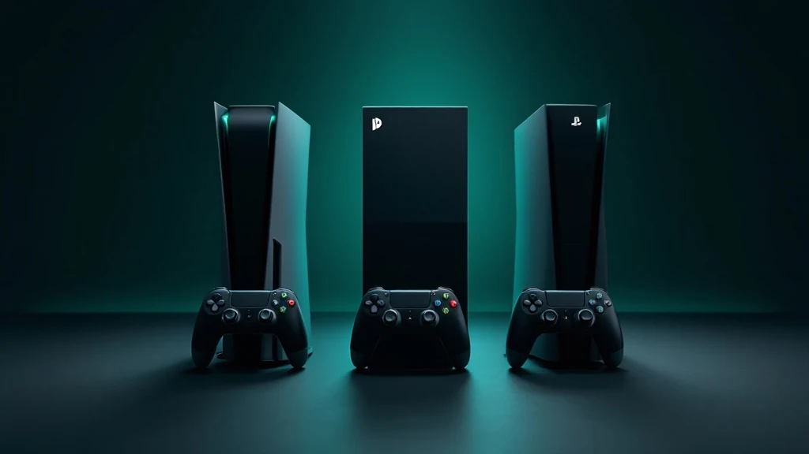

📌 3줄 요약
콘솔 게임 추천의 핵심은 기기 스펙이 아니라 "누구와, 어떤 게임을 할지"를 먼저 정하는 겁니다. 그다음 PS5·스위치2·엑스박스 중 하나로 자연스럽게 좁혀집니다.

혼자 서사에 빠질 거면 PS5, 가족·휴대·파티는 스위치2, 다다익선 가성비는 엑스박스 게임패스가 정답에 가깝습니다.

세 콘솔의 대표 게임·가격·장단점을 비교표로 묶고, 2026년 신작과 입문자가 가장 많이 묻는 질문까지 정리했습니다.

"콘솔 하나 사려는데 뭐가 좋아?"라는 질문을 받으면 저도 늘 되묻게 됩니다. 콘솔 게임 추천은 결국 기기 추천이 아니라 "어떤 게임을, 누구와 하고 싶은가"에서 갈리기 때문입니다. 결론부터 말하면요, 스펙표부터 비교하면 오히려 헤맵니다. 저도 처음엔 그렇게 접근했다가 한참 돌아왔거든요. 그래서 이 글은 PS5·닌텐도 스위치2·엑스박스를 "이런 사람에겐 이 콘솔"로 정리하고, 각 기기에서 꼭 해볼 게임까지 직접 찾아 함께 담았습니다.

## 콘솔 게임 추천, 뭐부터 정해야 하나요?

기기보다 **세 가지 질문**을 먼저 정하면 선택이 훨씬 쉬워집니다. 여기서 많이들 헷갈리는데, 스펙은 그다음입니다.

**첫째, 누구와 할지 정합니다.** 혼자 깊게 몰입할 거라면 독점 서사 게임이 강한 쪽이, 가족·친구와 거실에서 웃고 떠들 거라면 파티 게임이 많은 쪽이 유리합니다. 이 하나만 정해도 후보가 절반으로 줍니다.

**둘째, 어떤 장르를 좋아하는지 봅니다.** 액션·RPG·레이싱·파티 등 즐기는 장르에 따라 콘솔별 독점작 매력이 달라집니다. 장르 자체가 헷갈린다면 [게임 장르 완벽 가이드](/game-genre-guide/)를 먼저 보고 오면 감이 잡힙니다.

**셋째, 예산과 휴대 여부를 정합니다.** 집에서 큰 화면으로만 할지, 침대나 외출 중에도 들고 다닐지에 따라 거치형과 휴대형이 갈립니다. 이 세 가지를 정한 뒤 아래 플랫폼별 설명을 읽으면 답이 보입니다.

## PlayStation 5 — 혼자 즐기는 서사·독점작이 강점

**혼자서 영화 같은 대작을 깊게 즐기고 싶다면 PS5가 1순위입니다.** 소니의 독점작 라인업이 콘솔 입문자에게 가장 강력한 이유입니다.

스파이더맨, 갓 오브 워, 호라이즌 같은 소니 독점 대작은 다른 기기에서 쉽게 접하기 어렵습니다. 2026년에는 인섬니악의 마블 울버린 같은 PS5 독점작에 더해, 펄어비스의 붉은사막이나 인왕 3 같은 멀티플랫폼 기대작도 PS5로 함께 즐길 수 있습니다. 독점작만 따로 표로 묶어보니 "혼자 하는 대작" 기준에서는 PS5의 무게감이 확실히 컸습니다. 그래픽과 몰입감을 최우선으로 친다면 후회가 적은 선택입니다.

현재 PS5는 기본형과 성능 강화판인 PS5 프로로 나뉩니다. 프로는 PSSR이라는 업스케일링 기술로 화질·프레임을 끌어올린 상위 모델이지만, 입문이라면 기본형으로 충분합니다. 최신 타이틀과 가격은 [PlayStation 공식 사이트](https://www.playstation.com/)에서 확인하는 게 가장 정확합니다.

💡 PS5 기본형 vs 프로
프로는 4K·고프레임을 더 매끄럽게 뽑아주는 고급형입니다. 큰 TV에 예민한 게 아니라면 입문은 기본형으로 시작하고, 나중에 필요를 느끼면 갈아타도 늦지 않습니다. 프로 전용 독점 게임이 따로 있는 건 아니라 초반에 무리할 이유는 없습니다.

## 닌텐도 스위치 2 — 가족·파티·휴대의 정답

**아이부터 어른까지, 여럿이 함께 혹은 들고 다니며 하고 싶다면 스위치2가 답입니다.** 2025년 6월 출시된 스위치2는 구형 스위치의 성능 한계를 풀고 휴대·거치 겸용이라는 정체성은 그대로 가져왔습니다.

젤다의 전설, 마리오 카트, 포켓몬, 동물의 숲처럼 남녀노소가 함께 즐기는 독점작은 여전히 스위치만의 무기입니다. 조이콘을 나눠 쥐고 바로 2인 플레이가 되는 접근성 덕분에 파티·협동에 특히 강합니다. 여럿이 할 게임을 더 찾는다면 [스위치 2인 게임 추천](/switch-2player-games/)과 [2026 스위치 게임 추천](/switch-game-recommendations-2026/) 글에 실명 게임을 정리해 뒀습니다.

가격은 2026년 기준 한국 정발 기본 모델이 대략 64만 원대, 마리오 카트 월드가 포함된 번들이 약 68만 원대로 형성돼 있습니다. 번들이 게임값만큼 이득이라 첫 구매라면 번들 쪽이 합리적입니다. 다만 인기 기종이라 시기에 따라 시세가 오르내리니 정확한 값은 [닌텐도 공식 사이트](https://www.nintendo.com/)에서 확인하세요.

💡 구형 스위치를 지금 사도 되나요?
신작 성능이 당장 필요 없다면 구형도 괜찮습니다. 더 저렴하고 명작 풀이 방대하며, 사둔 게임 상당수가 스위치2에서 하위호환으로 돌아갑니다. 다만 앞으로 나올 스위치2 전용·강화 타이틀을 놓치기 싫다면 스위치2로 시작하는 편이 오래 갑니다.

## Xbox Series X·S — 게임패스 구독이 곧 가성비

**게임을 하나하나 사기보다 다양하게 많이 즐기고 싶다면 엑스박스와 게임패스가 가성비 정답입니다.** 엑스박스의 핵심 가치는 기기 자체보다 게임패스라는 구독 서비스에 있습니다.

저도 처음엔 게임패스 등급이 여러 개라 헷갈려서 직접 정리해봤는데, 핵심은 최상위 등급입니다. 최상위 등급을 구독하면 수백 개 게임을 자유롭게 즐기고, 엑스박스 신작 상당수를 출시 당일부터 추가 비용 없이 플레이할 수 있습니다. 타이틀 하나에 8만~9만 원을 쓰는 대신 월 구독으로 폭넓게 굴리는 방식이라, 여러 장르를 두루 파는 사람에게 특히 유리합니다. 구독 등급과 가격은 시기별로 바뀌니 결제 전 공식 안내를 확인하는 게 안전합니다.

콘솔은 고성능 상위 모델인 시리즈 X와, 더 저렴하고 작은 시리즈 S로 나뉩니다. 4K 대응 큰 화면이면 시리즈 X, 가볍게 시작하거나 예산을 아끼려면 시리즈 S가 맞습니다. 최근에는 엑스박스 독점작도 다른 기기로 확대되는 추세라, "게임패스로 폭넓게 즐긴다"는 목적이 뚜렷할 때 값어치가 큽니다.

## 스팀덱·PC 휴대기 — 콘솔 대신 고려할 대안

**PC 게임을 들고 다니며 하고 싶다면 스팀덱 같은 휴대형 PC가 콘솔의 대안이 됩니다.** 엄밀히는 콘솔이 아니지만, "휴대로 게임한다"는 목적에서 스위치2와 자주 비교됩니다.

스팀덱은 스팀에 사둔 방대한 PC 게임을 휴대기에서 돌릴 수 있다는 게 최대 강점입니다. 세일이 잦은 스팀 특성상 게임을 싸게 채우기 좋고, 콘솔 독점작이 아니라 PC 라이브러리를 그대로 쓴다는 점이 다릅니다. 다만 기기 설정이나 게임별 호환성을 직접 챙겨야 해서, 켜면 바로 되는 콘솔보다는 손이 갑니다.

정리하면 "완전 초보이고 신경 안 쓰고 게임만 하고 싶다"면 콘솔이, "PC 게임 자산이 많고 만지는 걸 즐긴다"면 스팀덱류가 맞습니다. 저도 처음엔 휴대기면 다 비슷한 줄 알았는데, 콘솔이냐 PC냐에 따라 쓰는 결이 꽤 달랐습니다.

## 2026년 콘솔 신작 — 지금 기대할 게임들

**콘솔을 고르는 김에 곧 나올 신작까지 보면 선택에 확신이 생깁니다.** 2026년은 대형 타이틀이 몰려 있는 해입니다.

PS5로 즐길 만한 기대작은 인섬니악의 마블 울버린 같은 독점작과, 붉은사막·인왕 3·레지던트 이블 레퀴엠·007 퍼스트 라이트처럼 PC나 다른 기종에서도 나오는 멀티플랫폼 대작이 섞여 있습니다. 여기서 헷갈리기 쉬운데, 이 중 진짜 PS5 전용은 일부이고 나머지는 다른 기기로도 나오니 "이 게임 하려면 무조건 PS5"라고 단정하진 마세요. 스위치2는 포켓몬·마리오 계열 강화 라인업으로 초반 흥행을 이어가는 중이고, 앞서 출시된 몬스터 헌터 와일즈나 발더스 게이트류 대작은 여러 플랫폼에서 함께 즐길 수 있습니다.

여기서 하나 짚자면, 요즘은 크로스플랫폼이 표준이 되면서 "이 게임은 이 기기에서만"이라는 독점의 벽이 예전보다 낮아졌습니다. 그래서 신작 목록만 보고 조급하게 기기를 정하기보다, 앞서 정한 "누구와·어떤 장르" 기준을 우선하는 편이 실패가 적습니다. 출시일과 가격 같은 세부는 시기마다 바뀌니 공식 발표 기준으로 확인하세요.

## 상황별 콘솔 게임 추천 — 한눈에 정리

**바쁘다면 이 표만 봐도 됩니다.** 지금까지 내용을 상황별로 압축하면 아래와 같습니다.

| 이런 사람이라면 | 추천 콘솔 | 대표 게임 방향 |
| --- | --- | --- |
| 혼자 영화 같은 대작에 몰입 | PlayStation 5 | 스파이더맨·갓 오브 워·호라이즌 |
| 가족·친구와 거실 파티 | 닌텐도 스위치 2 | 마리오 카트·젤다·동물의 숲 |
| 휴대하며 아무 데서나 | 스위치 2 / 스팀덱 | 파티·인디·PC 라이브러리 |
| 다양한 게임을 저렴하게 많이 | Xbox + 게임패스 | 구독으로 수백 종 순환 |
| PC 게임 자산이 이미 많음 | 스팀덱류 휴대 PC | 스팀 세일로 채운 라이브러리 |

핵심 스펙·가격도 한눈에 비교하면 이렇습니다. 가격은 2026년 기준 대략값이라 시세에 따라 달라집니다.

| 항목 | PS5 | 스위치 2 | Xbox Series X·S |
| --- | --- | --- | --- |
| 성격 | 거치형 고성능 | 휴대·거치 겸용 | 거치형(X)·소형(S) |
| 강점 | 독점 서사 대작 | 가족·파티·휴대 | 게임패스 구독 |
| 가격대(정발) | 70만 원대~ | 64만~68만 원대 | 시리즈 S 저가~X 고가 |
| 이런 사람에게 | 몰입형 1인 게이머 | 남녀노소·다인 | 다다익선 가성비형 |

## 자주 묻는 질문 (FAQ)

**Q. 콘솔 게임 입문, 첫 기기로 뭘 추천하나요?** 혼자 대작 위주면 PS5, 가족·친구와 함께나 휴대 중심이면 스위치2를 첫 콘솔로 추천합니다. "누구와 어떤 게임을 할지"를 먼저 정하면 둘 중 하나로 대개 좁혀집니다.

**Q. PS5랑 스위치2 중에 뭐가 더 나아요?** 우열이 아니라 용도가 다릅니다. 그래픽·서사 몰입은 PS5가, 휴대성과 다 함께 즐기는 파티·가족 게임은 스위치2가 앞섭니다. 둘 다 장점이 뚜렷해 "내 플레이 스타일"로 골라야 후회가 없습니다.

**Q. 엑스박스 게임패스가 그렇게 가성비인가요?** 여러 게임을 두루 즐긴다면 그렇습니다. 월 구독으로 수백 종과 엑스박스 신작 상당수를 출시일부터 즐길 수 있어, 타이틀을 자주 사는 사람일수록 이득이 큽니다. 반대로 특정 대작 한두 개만 파는 사람에겐 매력이 덜합니다.

**Q. 게임용으로 콘솔이 나아요, PC가 나아요?** 켜면 바로 되고 관리가 편한 걸 원하면 콘솔, 자유로운 확장·모드·고사양을 원하면 PC가 맞습니다. 요즘은 메모리 값 상승으로 PC 조립 비용이 올라 콘솔 가성비가 상대적으로 좋아진 점도 참고하세요.

## 마무리

자, 이거 하나만 기억하면 돼요. 콘솔 게임 추천의 정답은 스펙표가 아니라 "누구와, 어떤 게임을 할지"에 있습니다. 혼자 깊게 빠질 서사라면 PS5, 가족·친구와 웃고 떠들거나 들고 다닐 거면 스위치2, 다양한 게임을 저렴하게 굴릴 거면 엑스박스 게임패스. 이 갈래만 정하면 나머지는 자연스럽게 따라옵니다. 기기를 정한 다음엔 [RPG 게임 추천](/rpg-game-recommendations/)이나 [2026 스위치 게임 추천](/switch-game-recommendations-2026/) 글에서 실제로 할 게임을 골라보세요. 즐거운 콘솔 게임 라이프 되시길 바랍니다. 🎮

---

**관련 키워드** — #콘솔게임추천 #콘솔게임기추천 #PS5게임추천 #스위치2게임추천 #엑스박스게임패스 #콘솔입문 #플스5추천 #닌텐도스위치2 #스팀덱 #콘솔게임순위 #콘솔신작2026 #게임기추천
