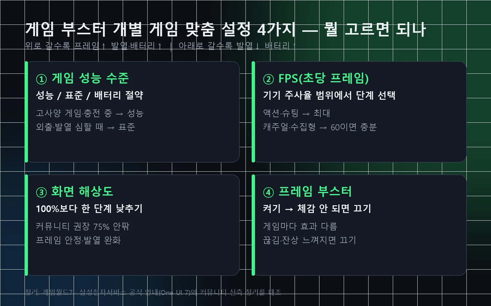

게임 부스터 설정은 게이밍 허브 앱의 "옵션 더 보기 → 게임 부스터"에서 들어가고, 핵심은 "개별 게임 맞춤 설정"의 4가지 항목(게임 성능 수준·FPS·화면 해상도·프레임 부스터)을 게임마다 다르게 두는 겁니다. 결론부터 말하면요, 고사양 게임은 성능 모드에 FPS 최대, 발열이 걱정되면 해상도를 한 단계 낮추는 조합이 가장 무난해요. 저도 처음엔 메뉴가 One UI 버전마다 자리를 옮겨 다녀서 한참 헤맸거든요. 그래서 삼성전자서비스 공식 안내와 커뮤니티 실측 글을 대조해 2026년 9월 기준으로 한 번에 정리했습니다.

📌 3줄 요약 (2026년 9월 기준)
들어가는 길은 <b>게이밍 허브 → 옵션 더 보기 → 게임 부스터</b>, 또는 <b>설정 앱 → 유용한 기능 → 게임 부스터</b>입니다.

개별 게임 맞춤 설정 4가지 중 <b>프레임에 가장 크게 영향을 주는 건 성능 수준과 FPS</b>, 발열을 가장 쉽게 잡는 건 <b>해상도 한 단계 낮추기</b>예요.

방해 금지·밝기 같은 몰입 설정은 <b>설정 → 모드 및 루틴 → 게임</b>으로 옮겨갔습니다(One UI 7부터).

## 게임 부스터는 뭐고, 게임 부스터 플러스와 뭐가 다른가요?

게임 부스터는 갤럭시에 기본으로 들어 있는 게임 도우미이고, 게임 부스터 플러스는 굿락에서 따로 설치하는 심화 도구입니다. 삼성전자서비스 안내 기준으로 게임 부스터는 "게임 플레이 패턴을 분석해 배터리·성능·온도의 균형을 맞추고" 게임 중 알림 잠금 같은 몰입 기능을 제공하는 기본 앱이에요. 게임을 실행하면 자동으로 켜지고, 내비게이션 바 버튼이나 스와이프 제스처로 패널을 불러옵니다.

검색하면 "게임 부스터 플러스가 없다"는 글이 잔뜩 나오죠. 그건 기본 앱이 아니라 굿락(Good Lock) 안의 별도 앱이기 때문이에요. 디지털포커스 보도 기준으로 게임 부스터 플러스는 2025년 8월 One UI 8 지원 버전(v1.0.01.6)이 배포됐고, 갤럭시 S25·S24 시리즈와 Z 폴드7·플립7·폴드6·플립6를 지원합니다. 기능은 게임별 GPU 성능 조정, 게임패드 키 리매핑, 배터리·발열 관리예요.

이름이 같은 게 둘이라 더 헷갈립니다. 삼성전자서비스 안내 기준으로 One UI 6까지 "게임 플러그인" 안에 있던 게임 부스터 플러스 항목은 One UI 7에서 기본 게임 부스터의 "개별 게임 맞춤 설정"으로 흡수됐고, 지금 굿락에서 설치하는 게임 부스터 플러스는 그것과 이름만 같은 별도 앱이에요. 정리하면 이렇습니다. **기본 게임 부스터**로 대부분은 해결되고, CPU·GPU 클럭까지 만지고 싶을 때만 굿락의 **게임 부스터 플러스**를 설치하면 됩니다. 이 글은 기본 게임 부스터 중심이고, 플러스는 뒤에서 따로 짚을게요.

## 게임 부스터 설정은 어디서 들어가나요? (One UI 버전별)

One UI 7 이후 기준으로 게임 부스터 설정은 게이밍 허브 앱에서 "옵션 더 보기(오른쪽 상단) → 게임 부스터"로 들어갑니다. 삼성전자서비스 공식 안내에 적힌 경로이고, 게이밍 허브 7.0 이하 옛 버전은 "더 보기" 아이콘이 홈 화면 오른쪽 하단에 있어요. 설정 앱에서 가는 길도 있습니다. 갤럭시 S25 사용자 팁 글 기준으로 "설정 → 유용한 기능 → 게임 부스터"예요.

| One UI 버전 | 게임 부스터 성능 설정 | 방해 금지·밝기 같은 몰입 설정 |
|---|---|---|
| One UI 6 이하 | 게이밍 허브 → 더 보기 → 게임 부스터 / 게임 플러그인 → 게임 부스터 플러스 | 게임 부스터 안 |
| One UI 7 | 게이밍 허브 → 옵션 더 보기 → 게임 부스터 → 개별 게임 맞춤 설정 | 설정 → 모드 및 루틴 → 게임 |
| One UI 8·8.5 | 게이밍 허브 → 옵션 더 보기 → 게임 부스터, 또는 설정 → 유용한 기능 → 게임 부스터 (S25 사용자 팁·커뮤니티 기준) | 설정 → 모드 및 루틴 → 게임 (해상도도 여기 게임 탭에 노출) |

One UI 7에서 바뀐 게 세 가지예요. 삼성 안내 기준으로 예전 "게임 부스터 플러스" 항목이 "개별 게임 맞춤 설정"으로 이동했고, 고성능 모드 선택은 게임 부스터 메뉴 맨 위로 올라왔으며, 설정 앱의 모드 및 루틴에 "게임" 모드가 새로 추가됐습니다. One UI 8.5에서는 커뮤니티 정리 글 기준으로 게임 설정이 여러 메뉴로 흩어졌어요. 갤럭시 갤러리의 2026년 5월 정리 글은 게임을 다시 시작하지 않아도 설정이 바로 적용되게 바뀐 점을 꼽았고, 명조 커뮤니티 정리 글은 해상도 조절이 설정 앱의 모드 및 루틴 → 게임 탭에도 노출된다고 정리했습니다. 8·8.5 경로는 커뮤니티 정리 기준이라 기기마다 다를 수 있어요. 메뉴가 안 보이면 게이밍 허브 앱 업데이트부터 확인하는 게 빠릅니다.

💡 메뉴가 안 보일 때
기능과 화면은 기기·소프트웨어·앱 버전에 따라 다르다고 삼성이 명시하고 있어요. 갤럭시 스토어에서 <b>게이밍 허브</b>를 업데이트하고, 그래도 없으면 설정 앱 검색창에 "게임 부스터"를 쳐보세요.

## 개별 게임 맞춤 설정 4가지, 뭘 골라야 하나요?

개별 게임 맞춤 설정은 게임 성능 수준·FPS·화면 해상도·프레임 부스터 4가지를 게임별로 저장하는 메뉴이고, 프레임에 가장 크게 영향을 주는 건 앞의 두 개예요. 삼성 안내는 "맞춤 설정할 게임을 선택한 뒤 항목별 값을 고르고 저장"하라고만 적혀 있어서, 뭘 골라야 하는지는 제가 커뮤니티 실측 글 3편을 대조해 표로 묶어봤습니다.

| 항목 | 선택지 | 프레임 우선이라면 | 발열·배터리 우선이라면 |
|---|---|---|---|
| ① 게임 성능 수준 | 성능 / 표준 / 배터리 절약 (버전에 따라 "균형"으로 표기) | 성능 | 표준 |
| ② FPS(초당 프레임 수) | 기기 주사율까지 단계 선택 (단계 표기는 기기마다 달라 폰에서 직접 확인 권장) | 최대(120Hz 기기는 120) | 60 |
| ③ 화면 해상도 | 100%부터 단계별 낮춤 (S24 이상은 75% 단계가 있다는 커뮤니티 정리) | 100% | 한 단계 아래(커뮤니티 권장 75% 안팎) |
| ④ 프레임 부스터 | 켬 / 끔 | 켬 | 체감 없으면 끔 |

**게임 성능 수준**은 삼성 안내 기준으로 성능은 "가장 최적화된 게임 경험"이지만 배터리 소모가 빠르고, 배터리 절약은 일부 기능 성능이 제한될 수 있습니다. 표준이 그 사이 균형이에요. **FPS**는 게임이 낼 수 있는 상한을 정하는 값이라, 게임 자체 그래픽 설정의 프레임 옵션과 둘 다 높아야 실제로 올라갑니다. 한쪽만 120으로 두면 낮은 쪽에 묶여요.

**화면 해상도**는 발열을 잡는 가장 확실한 손잡이입니다. 젠레스 존 제로 커뮤니티의 갤럭시 최적화 정리 글은 성능 영향도를 "프레임 = 그래픽 품질 = 해상도 = 절전 모드 > 안티앨리어싱 = 렌더링"으로 매겼고, 명조 커뮤니티의 One UI 8.5 정리 글은 S24 이상에서 QHD+ 대신 75% 해상도(실제 FHD+ 수준)를 권했어요. 폰 화면 크기에서는 75%로 낮춰도 눈에 잘 안 띄는데 GPU 부담은 확 줄어듭니다. **프레임 부스터**는 갤럭시 S25 사용자 팁 글에서 켜기를 권했지만, 게임마다 체감이 달라서 잔상이나 끊김이 느껴지면 끄는 쪽이 맞아요.

## 게임 부스터 설정으로 프레임을 올리려면 어떻게 하나요?

프레임을 올리는 순서는 "게임 성능 수준을 성능으로 → FPS 상한을 최대로 → 게임 안 그래픽 설정도 같은 프레임으로 → 그래도 부족하면 해상도를 낮추기"입니다. 저도 처음엔 게임 부스터만 만지면 되는 줄 알았거든요. 그런데 찾아보니 게임 부스터의 FPS는 상한선일 뿐이라, 게임 안에서 60프레임으로 잠겨 있으면 게임 부스터를 120으로 둬도 60에서 멈춰요.

세 가지를 같이 확인하세요. 첫째, 디스플레이 설정의 화면 주사율이 "적응형" 또는 120Hz인지. 둘째, 절전 모드가 켜져 있지 않은지(절전 모드는 기본값으로 주사율을 60Hz로 제한하는 옵션이 켜져 있습니다). 셋째, 게임 자체 설정의 프레임 옵션. 이 셋 중 하나라도 60이면 결과는 60이에요.

프레임 최적화를 더 밀어붙이고 싶다면 게이밍 허브 "옵션 더 보기 → 실험실"의 게임 퍼포먼스 관리를 켜보는 방법도 커뮤니티에서 많이 권합니다. 다만 실험실 기능은 이름 그대로 실험 단계라 기기와 버전에 따라 없을 수 있고, 켠 뒤 오히려 불안정하면 바로 끄는 게 맞아요.

## 발열 줄이는 게임 부스터 설정 조합은 뭔가요?

발열을 줄이는 조합은 "성능 수준 표준 + 해상도 한 단계 낮춤 + FPS 60 + 충전 중이면 USB PD 충전 일시정지 켜기"입니다. 게임 부스터는 삼성 안내대로 온도·배터리·성능의 균형을 자동으로 맞추지만, 그 균형점을 어디에 둘지는 이 4가지 값이 정해요.

한 가지 오해를 짚고 갈게요. 최적화 설정은 발열 자체를 없애는 게 아닙니다. 젠레스 존 제로 커뮤니티 정리 글도 "같은 발열 안에서 더 높은 성능을 내는 것"이 목표이지 발열을 줄이는 게 아니라고 못 박았어요. 발열을 줄이려면 결국 GPU가 할 일을 줄여야 하고, 그게 해상도와 FPS 상한입니다.

충전하면서 게임할 때는 갤럭시 S25 사용자 팁 글이 권한 **USB PD 충전 일시정지**가 유용해요. 게임 중 충전을 잠시 멈춰 칩셋 발열과 배터리 부담을 함께 줄이는 기능입니다. 발열의 원인부터 냉각까지 전체 그림은 [핸드폰 게임 발열 줄이기 8가지](/mobile-game-overheating-fix/)에서 순서대로 정리해 뒀으니 함께 보세요.

## 게임 모드·방해 금지·팝업은 어디서 설정하나요?

게임 중 알림 차단·밝기 고정·빅스비 잠금·엣지 패널 잠금은 One UI 7부터 "설정 → 모드 및 루틴 → 게임"에서 설정합니다. 삼성전자서비스 안내 기준으로 게임 전체에 적용하거나 특정 게임만 골라 적용할 수 있어요. 예전처럼 게임 부스터 안에서 찾으면 안 보이니, 여기부터 확인하세요.

게임 중 화면에 뜨는 게임 부스터 팝업이 거슬린다면, 커뮤니티·블로그 정리 기준으로 게임 화면의 컨트롤러 아이콘을 눌러 "설정 → 게임 부스터 팝업 표시"를 끄면 됩니다(삼성 공식 안내에는 이 경로가 따로 적혀 있지 않아 버전에 따라 위치가 다를 수 있어요). 인게임 패널은 내비게이션 바 버튼으로 불러오며, 여기서 RAM 사용량 확인과 빠른 설정 변경이 가능해요.

⚠️ 게임 부스터 끄기·삭제하려는 분께
게임 부스터는 기본 앱이라 완전 삭제보다 <b>비활성화</b>를 권합니다. 방법은 세 가지예요. ① 게이밍 허브에서 바로가기 바 끄기 ② 설정 → 애플리케이션 → 게임 부스터 알림 끄기 ③ "다른 앱 위에 표시" 권한 해제. 삭제 도구를 쓰라는 광고성 글이 많은데, 이 세 가지면 팝업과 간섭은 사라집니다.

## 게임 부스터 플러스는 언제 쓰나요?

게임 부스터 플러스는 기본 4가지 설정으로 부족할 때, 게임별로 CPU·GPU 클럭과 그래픽 품질을 직접 제한하고 싶을 때 쓰는 굿락 앱입니다. 설치는 갤럭시 스토어 → 메뉴 → 업데이트, 또는 굿락 앱의 업데이트 메뉴에서 해요. 커뮤니티 정리 글 기준으로 자동 모드를 끄고 직접 설정 모드로 바꾼 뒤, 성능 옵션은 성능 우선, 그래픽 품질은 슬라이더 4분의 1 지점, 최대 FPS는 최대로 두는 조합이 많이 쓰입니다.

주의할 점이 하나 있어요. 명조 커뮤니티의 One UI 8.5 정리 글은 게임 부스터 플러스의 "회전 최적화" 기능이 업데이트 직후 게임 크래시를 자주 일으켜 일단 꺼두라고 했습니다. 새 기능은 안정화될 때까지 끄고, 기본 4가지 설정으로 먼저 잡는 게 안전해요.

| 구분 | 게임 부스터(기본) | 게임 부스터 플러스(굿락) |
|---|---|---|
| 설치 | 기본 내장 | 굿락에서 별도 설치 |
| 조절 항목 | 성능 수준·FPS·해상도·프레임 부스터 | GPU·CPU 클럭, 그래픽 품질, 키 리매핑 |
| 지원 기기 | 대부분의 갤럭시 | S25·S24, Z 폴드7·플립7·폴드6·플립6 (One UI 8 지원 기준) |
| 추천 대상 | 대부분의 사용자 | 게임별로 세밀하게 튜닝하고 싶은 사용자 |

## 게임 종류별 추천 세팅 한눈에 보기

게임 장르에 따라 게임 부스터의 성능 수준·FPS·해상도·프레임 부스터 4가지 값을 다르게 두면 되는데, 표로 묶어보면 이렇습니다. 값은 커뮤니티 실측과 삼성 안내를 바탕으로 한 출발점이고, 본인 기기 발열을 보면서 한 칸씩 조정하는 게 정답이에요.

| 게임 유형 | 성능 수준 | FPS | 해상도 | 프레임 부스터 |
|---|---|---|---|---|
| 슈팅·격투 (배그 모바일·발로란트 모바일) | 성능 | 최대 | 100% 또는 한 단계 아래 | 켬 |
| 오픈월드 RPG (원신·명조·젠레스 존 제로) | 성능 | 60 | 한 단계 아래(75% 안팎) | 켬 → 잔상 시 끔 |
| MOBA (모바일 레전드·와일드 리프트) | 성능 | 최대 | 100% | 켬 |
| 캐주얼·수집형 (퍼즐·방치형) | 표준 | 60 | 한 단계 아래 | 끔 |
| 외출 중·배터리 아낄 때 | 배터리 절약 | 60 | 한 단계 아래 | 끔 |

찾아보니 원신 같은 오픈월드 RPG는 게임 자체 설정의 상한이 낮은 경우가 많아, 게임 부스터만 올려도 체감이 없어서 저도 표를 만들며 한 번 더 확인했어요. 모바일 레전드처럼 프레임이 승패를 가르는 게임은 FPS를 최대로 두는 게 우선이고, 게임 자체 설정도 같이 올려야 한다는 걸 잊지 마세요. 시작하는 분은 [모바일 레전드 초보 가이드](/mobile-legends-bang-bang-guide/)에서 기본기를 먼저 잡아도 좋아요. 게임 부스터의 공식 안내는 [삼성전자서비스 공식 안내](https://www.samsungsvc.co.kr/solution/3187947)에서 버전별로 확인할 수 있습니다.

## 자주 묻는 질문 (FAQ)

**Q. 갤럭시 게임 부스터 설정은 어디서 하나요?** 게이밍 허브 앱에서 "옵션 더 보기 → 게임 부스터"로 들어가거나, 설정 앱에서 "유용한 기능 → 게임 부스터"로 들어갑니다. 방해 금지·밝기 같은 몰입 설정은 One UI 7부터 "설정 → 모드 및 루틴 → 게임"으로 옮겨갔어요.

**Q. 게임 부스터 성능 수준은 성능·표준·배터리 절약 중 뭘 골라야 하나요?** 고사양 게임이나 충전 중이면 성능, 발열이 심하거나 외출 중이면 표준이 무난합니다. 삼성 안내 기준으로 성능 모드는 배터리 소모가 빠르고, 배터리 절약 모드는 일부 기능 성능이 제한될 수 있어요.

**Q. 게임 부스터 FPS를 120으로 뒀는데 왜 프레임이 안 올라가나요?** 게임 부스터의 FPS는 상한선이라, 게임 자체 설정의 프레임 옵션과 디스플레이 주사율도 함께 올려야 합니다. 절전 모드도 기본값으로 주사율을 60Hz로 제한하는 옵션이 켜져 있어 확인이 필요해요.

**Q. 프레임 부스터는 켜는 게 좋나요?** 일단 켜보고 잔상이나 끊김이 느껴지면 끄는 게 맞습니다. 갤럭시 S25 사용자 팁에서는 켜기를 권했지만, 게임마다 체감이 달라서 정답이 하나가 아니에요.

**Q. 게임 부스터 팝업은 어떻게 끄나요?** 커뮤니티·블로그 정리 기준으로 게임 중 화면의 컨트롤러 아이콘을 눌러 "설정 → 게임 부스터 팝업 표시"를 끄면 됩니다. 버전에 따라 위치가 다를 수 있어요. 앱 자체를 없애고 싶다면 삭제보다 비활성화(바로가기 바 끄기·알림 끄기·다른 앱 위에 표시 해제)를 권해요.

**Q. 게임 부스터 플러스가 안 보이는데 어떻게 설치하나요?** 기본 앱이 아니라 굿락 안의 별도 앱이라 갤럭시 스토어 → 메뉴 → 업데이트, 또는 굿락 앱 업데이트 메뉴에서 설치합니다. 디지털포커스 보도 기준으로 One UI 8 지원 기기는 S25·S24, Z 폴드7·플립7·폴드6·플립6예요.

## 마무리

이거 하나만 기억하면 돼요. 게임 부스터 설정의 4가지 값 중 프레임은 "성능 수준과 FPS", 발열은 "해상도"가 손잡이입니다. 프레임이 안 나오면 게임 안 설정과 주사율까지 셋을 같이 보고, 뜨거우면 해상도부터 한 칸 내리세요. 메뉴 위치는 One UI 버전마다 옮겨 다니니 게이밍 허브를 먼저 업데이트하고, 안 보이면 설정 앱 검색창에 "게임 부스터"를 치면 됩니다. 발열이 계속 문제라면 [핸드폰 게임 발열 줄이기](/mobile-game-overheating-fix/) 글에서 냉각까지 이어서 보세요. 🎮

---

**관련 키워드** — #게임부스터설정 #갤럭시게임부스터 #게임부스터플러스 #프레임부스터 #게임부스터FPS #게임부스터끄기 #게임부스터팝업 #게이밍허브설정 #갤럭시게임최적화 #게임부스터해상도 #OneUI8게임설정 #모드및루틴게임
