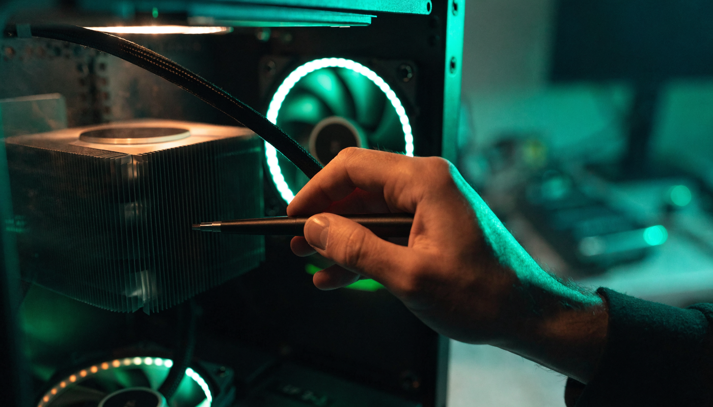

**게임 프레임 드랍 해결** 방법을 검색하면 "드라이버 업데이트해라, 백그라운드 꺼라" 같은 팁만 스무 개씩 나오는데, 정작 **내 드랍이 어떤 종류인지 알아내는 방법**은 아무도 안 알려주죠. 저도 처음엔 원인도 모른 채 아무 팁이나 눌러보다 시간만 날렸거든요. 결론부터 말하면요, 프레임 드랍은 **증상이 세 갈래**고 갈래마다 원인이 다릅니다. 항상 낮으면 사양·설정, 하다 보면 점점 떨어지면 발열, 특정 순간만 뚝 끊기면 메모리·로딩 문제일 가능성이 높아요. 이 글은 드랍 종류를 구분하는 것부터 시작해서, 갈래별 처방을 순서대로 정리했습니다.

📌 3줄 요약
먼저 <b>Win+G 게임바나 스팀 오버레이로 프레임을 띄워</b> 내 드랍이 어떤 패턴인지 확인하세요. 진단 없이 팁부터 적용하면 뭐가 효과였는지도 모릅니다.

증상 3갈래 — <b>항상 낮다=사양·설정 문제, 시간이 지나며 떨어진다=발열 스로틀링, 특정 순간만 뚝 끊긴다=VRAM·로딩·셰이더</b> 문제일 확률이 높습니다.

평균 프레임 자체를 올리는 세팅(업스케일링·옵션 조정)은 <b>성능 최적화 글</b>에서 따로 다룹니다. 이 글은 "갑자기 뚝 끊기는" 문제 전용이에요.

## 게임 프레임 확인은 어떻게 하나요?

**윈도우 키 + G를 눌러 Xbox 게임 바의 성능 위젯을 고정하는 게 가장 빠릅니다.** 별도 설치 없이 윈도우 10부터 기본 내장돼 있고, FPS뿐 아니라 CPU·GPU·램 사용률까지 같이 보여줘요. 성능 창의 고정핀 아이콘을 누르면 게임 화면 구석에 계속 떠 있게 할 수 있습니다.

다른 방법도 있습니다. 스팀 게임이라면 설정 → 게임 중 메뉴에서 FPS 카운터를 켜면 화면 모서리에 작게 표시되고, 지포스 그래픽카드 사용자는 [NVIDIA 앱](https://www.nvidia.com/ko-kr/software/nvidia-app/)의 오버레이로 실시간 FPS와 성능 통계를 띄울 수 있어요. 더 정밀하게 보고 싶으면 MSI 애프터버너 같은 모니터링 프로그램이 정석인데, 입문 단계에선 게임 바로 충분합니다.

여기서 많이들 헷갈리는데, 확인할 건 평균 FPS 숫자가 아니라 **떨어지는 패턴**입니다. 숫자가 늘 낮은지, 시간이 지나며 내려가는지, 평소엔 멀쩡한데 특정 순간만 반토막 나는지를 봐야 다음 단계로 갈 수 있어요.

💡 프레임타임이라는 개념
같은 60FPS라도 <b>한 프레임 한 프레임이 고르게 나오는지</b>가 체감을 가릅니다. 평균은 높은데 순간순간 튀는 걸 프레임타임 스파이크라고 하고, "숫자는 괜찮은데 뚝뚝 끊기는" 느낌의 정체가 대부분 이겁니다.

## 프레임 드랍인지 렉(핑)인지부터 구분하세요

**화면 자체가 뚝뚝 끊기면 프레임 드랍, 내 조작만 늦게 반영되면 네트워크 렉입니다.** 이 둘은 원인도 처방도 완전히 달라서, 구분을 안 하면 엉뚱한 데 시간을 씁니다. 온라인 게임에서 캐릭터가 순간이동하거나 스킬이 늦게 나가는 건 핑 문제라 PC를 아무리 만져도 소용없어요.

구분법은 간단합니다. 게임 바나 오버레이로 FPS를 띄웠을 때 **끊기는 순간에 FPS 숫자도 같이 떨어지면 프레임 드랍**, FPS는 멀쩡한데 조작 반응만 늦으면 네트워크 쪽입니다. 대부분의 온라인 게임은 설정에서 핑 표시를 켤 수 있으니 같이 띄워두면 한 번에 구분돼요.

네트워크 쪽이라면 유선 연결 전환, 공유기 재부팅, 같은 회선을 쓰는 다른 기기의 다운로드 중단부터 확인하는 게 순서입니다. 이 글의 나머지는 FPS가 실제로 떨어지는 경우, 즉 진짜 프레임 드랍을 다룹니다.

## 증상별 원인 — 내 드랍은 어느 갈래인가요?

**드랍 패턴을 알면 원인 후보가 절반 이하로 줄어듭니다.** 상위 글 여덟 개를 직접 열어보니 다들 원인을 나열만 하지, 어떤 증상이 어떤 원인과 짝인지 이어주는 글이 없더라고요. 그래서 제가 표로 묶어봤습니다.

| 증상 패턴 | 유력 원인 | 먼저 볼 것 |
| --- | --- | --- |
| 처음부터 끝까지 항상 낮다 | 사양 부족·그래픽 옵션 과함 | 옵션 낮추기·업스케일링 |
| 시작은 쾌적한데 하다 보면 점점 떨어진다 | 발열 스로틀링 | CPU·GPU 온도 |
| 특정 순간(전투·맵 이동)만 뚝 끊긴다 | VRAM 부족·로딩·셰이더 컴파일 | VRAM 사용량·저장장치 |
| 게임은 멀쩡한데 조작만 늦다 | 네트워크(핑) | 핑·패킷 손실 표시 |

항상 낮은 경우는 엄밀히 말해 드랍이 아니라 성능 부족이라, 처방이 "평균 프레임 올리기"입니다. 이건 [게임 성능 최적화 방법 글](/game-performance-optimization/)에서 업스케일링부터 순서대로 정리해뒀으니 그쪽을 보시면 되고, 아래에서는 나머지 두 갈래를 파봅니다.

## 하다 보면 떨어진다 — 발열 스로틀링은 어떻게 확인하나요?

**게임을 20~30분 하고 나서 CPU·GPU 온도를 확인하면 됩니다.** CPU는 제조사와 모델마다 다르지만 대체로 90도 안팎부터 부품 보호를 위해 스스로 성능을 낮추고, GPU도 80도대에 들어서면 클럭을 낮추는 경우가 많아요. 이게 발열 스로틀링이고, "시작은 쾌적했는데 점점 버벅인다"의 주범입니다.

온도는 아까 띄운 게임 바 성능 위젯이나 모니터링 프로그램으로 볼 수 있습니다. 게임 시작 직후와 30분 뒤 온도를 비교해서, 온도가 치솟는 시점과 프레임이 떨어지는 시점이 겹치면 발열이 맞습니다. 저도 이걸 확인 안 하고 드라이버만 세 번 재설치했던 적이 있어서, 순서를 발열 먼저로 바꿨어요.

처방은 바람길 확보입니다. 본체 내부 먼지 청소, 흡기·배기 팬 방향 확인, 케이스 주변 통풍 공간 확보가 기본이고, 조립 후 몇 년 지났다면 CPU 서멀구리스가 말라 열전달이 안 되는 경우도 흔합니다. 노트북은 구조상 발열에 더 취약해서 쿨링 패드와 받침대로 바닥 흡기를 틔워주는 것만으로도 차이가 나요.

⚠️ 팬 소음이 갑자기 조용해졌다면
팬이 고장 나면 소음이 줄어 오히려 좋아졌다고 착각하기 쉽습니다. 온도가 전보다 높게 유지되는데 팬 소리가 안 난다면 <b>팬 고장·정지</b>부터 의심하세요.

## 특정 순간만 뚝 — VRAM 부족이면 어떤 증상이 나타나나요?

**대규모 전투나 화려한 이펙트 순간마다 끊기면 VRAM(그래픽 메모리) 부족을 의심하세요.** VRAM이 꽉 차면 그래픽카드가 느린 시스템 램을 빌려 쓰기 시작하는데, 이때 프레임타임이 크게 튀면서 순간 드랍이 생깁니다. 요즘 게임은 고해상도 텍스처가 VRAM을 많이 먹어서, 옵션 한 칸 차이로 증상이 갈리기도 해요.

확인은 게임 바나 모니터링 프로그램의 VRAM 사용량으로 합니다. 내 그래픽카드 용량에 거의 붙어 있다면 **텍스처 품질을 한 단계만 낮춰서** 여유를 만들어보세요. 다른 옵션보다 텍스처가 VRAM에 직결이라, 이것만 낮춰도 순간 끊김이 잡히는 경우가 많습니다.

맵 이동이나 새 지역 진입 때만 멈칫한다면 저장장치 쪽입니다. 게임이 새 데이터를 읽어오는 속도를 못 따라가는 건데, 게임을 HDD에 설치했다면 SSD로 옮기는 게 처방이에요. 처음 보는 이펙트나 구간에서 잠깐 얼어붙는 셰이더 컴파일 끊김도 있는데, 이건 최신 대작에서 흔한 현상이고 보통 한 번 겪은 구간에선 다시 안 생깁니다. 게임 첫 실행 때 "셰이더 준비 중" 화면이 있다면 끝까지 기다렸다 시작하는 게 좋아요.

## 윈도우 설정에서 손볼 것 — 오버레이·전체 화면 최적화

**의외로 게임 밖 프로그램이 순간 드랍의 범인인 경우가 많습니다.** 디스코드 오버레이, 캡처 프로그램, 브라우저 탭 수십 개 같은 백그라운드가 CPU를 순간순간 뺏어가면 프레임타임이 튑니다. 녹화 기능인 게임 바의 백그라운드 녹화(DVR)도 켜져 있으면 부담이 되니, 녹화를 안 쓴다면 설정 → 게임 → 캡처에서 꺼두세요. FPS 표시 위젯은 그대로 쓸 수 있습니다.

전체 화면 최적화 해제도 시도해볼 만합니다. 게임 실행 파일 우클릭 → 속성 → 호환성 탭에서 전체 화면 최적화 사용 중지를 체크하는 건데, 일부 게임에서 창 처리 방식이 바뀌며 끊김이 줄어드는 사례가 보고돼 있어요. 게임마다 효과가 갈리니 하나씩 켜고 끄며 비교해보세요.

전원 옵션 고성능 전환, 드라이버 업데이트, 고성능 GPU 지정 같은 기본 세팅도 순간 끊김 완화에 보탬이 되는데, 이 부분은 [게임 성능 최적화 방법 글](/game-performance-optimization/)에 경로까지 자세히 적어뒀으니 겹치는 설명은 생략합니다.

## 그래도 안 잡히면 — 마지막 점검 순서

**남은 카드는 드라이버 클린 설치 → 게임 재설치 → 부품 의심 순서입니다.** 그래픽 드라이버는 단순 업데이트가 아니라 클린 설치 옵션으로 기존 설정을 밀고 새로 까는 게 확실하고, 특정 게임에서만 드랍이 생기면 게임 파일 무결성 검사(스팀 기준 속성 → 설치된 파일)나 재설치로 게임 쪽 문제를 배제합니다.

여기까지 다 했는데도 잡히지 않으면 하드웨어를 의심할 차례입니다. 램 용량이 부족해 가상 메모리를 긁고 있진 않은지, 저장장치 사용률이 게임 중 100%에 붙어 있진 않은지 작업 관리자로 확인해보세요. 몇 년 된 시스템이라면 파워서플라이 노후로 전력 공급이 출렁이는 경우도 있는데, 이건 개인이 진단하기 어려우니 수리점 점검이 안전합니다.

솔직히 말하면 프레임 드랍은 원인이 하나로 딱 떨어지지 않는 경우도 많습니다. 다만 위 순서대로 하나씩 배제해가면 최소한 "뭘 해도 안 된다"는 막막함은 사라져요. 제가 이 순서로 정리한 이유도, 아무 팁이나 손대다 뭐가 효과였는지 모르게 되는 걸 막기 위해서입니다.

## 한눈에 정리 — 게임 프레임 드랍 해결 순서표

**진단 먼저, 처방은 그다음입니다.** 전체 흐름을 표 하나로 정리하면 이렇습니다.

| 순서 | 할 일 | 도구·경로 |
| --- | --- | --- |
| 1 | FPS·온도·VRAM 표시 띄우기 | Win+G 게임 바, 스팀 오버레이, NVIDIA 앱 |
| 2 | 드랍인지 핑인지 구분 | FPS와 핑 동시 표시 |
| 3 | 증상 패턴 파악 | 항상/점점/순간 3갈래 |
| 4 | 점점 떨어지면 발열 점검 | 온도 확인 → 청소·통풍·서멀 |
| 5 | 순간만 끊기면 VRAM·로딩 점검 | 텍스처 한 단계↓·SSD 이동 |
| 6 | 백그라운드·오버레이 정리 | 게임 바 DVR·디스코드 오버레이 끄기 |
| 7 | 그래도 안 되면 | 드라이버 클린 설치 → 게임 재설치 → 부품 점검 |

이거 하나만 기억하면 돼요. **프레임을 띄워서 패턴을 보고, 패턴에 맞는 처방만 골라 쓰는 것.** 평균 프레임 자체를 끌어올리고 싶다면 [게임 성능 최적화 방법](/game-performance-optimization/)을, FPS 게임 감도·설정 기본기는 [FPS 설정 가이드](/fps-settings-basics/)를 이어서 보시면 됩니다.

## 자주 묻는 질문 (FAQ)

**Q. 고사양 컴퓨터인데 게임 프레임 드랍이 왜 생기나요?** 사양이 높아도 발열 스로틀링, VRAM 부족, 백그라운드 프로그램, 저장장치 병목 때문에 드랍은 생깁니다. 특히 고사양일수록 발열량도 커서 쿨링이 못 따라가면 성능을 스스로 낮춰요. 부품 성능이 아니라 온도와 VRAM 사용량부터 확인하는 게 순서입니다.

**Q. 게임 프레임 드랍은 온도가 몇 도부터 문제인가요?** 모델마다 다르지만 CPU는 대체로 90도 안팎부터 보호를 위해 성능을 낮추고, GPU는 80도대부터 클럭을 낮추는 경우가 많습니다. 정확한 한계 온도는 부품마다 달라 제조사 공식 스펙 확인을 권합니다. 중요한 건 절대 수치보다 "온도가 치솟는 시점과 드랍 시점이 겹치는지"예요.

**Q. 프레임 드랍이랑 렉(핑)은 어떻게 구분하나요?** FPS 표시를 켠 상태에서 끊기는 순간 FPS 숫자도 같이 떨어지면 프레임 드랍, FPS는 그대로인데 조작 반응만 늦으면 네트워크 렉입니다. 온라인 게임은 설정에서 핑 표시를 켜고 둘을 같이 보면 한 번에 구분됩니다.

**Q. 노트북은 게임 프레임 드랍이 왜 더 심한가요?** 같은 이름의 부품이라도 노트북용은 전력·발열 제한이 빡빡하고, 얇은 섀시 탓에 열 배출이 느려 스로틀링이 더 일찍 옵니다. 쿨링 패드로 바닥 흡기를 틔우고, 충전기를 꽂은 상태로 플레이하는 것만으로도 체감이 달라져요.

**Q. 프레임 제한을 걸면 드랍이 줄어드나요?** 줄어드는 경우가 많습니다. 최대 프레임을 모니터 주사율 근처로 제한하면 부품 부하와 발열이 줄고, 프레임타임이 고르게 유지돼 오히려 부드럽게 느껴져요. 평균 숫자는 낮아져도 체감 안정성은 올라가는 대표적인 세팅입니다.

---

**관련 키워드** — #게임프레임드랍 #프레임드랍해결 #프레임드랍원인 #게임프레임확인 #게임프레임표시 #프레임타임 #발열스로틀링 #VRAM부족 #게임끊김해결 #노트북프레임드랍 #프레임제한
