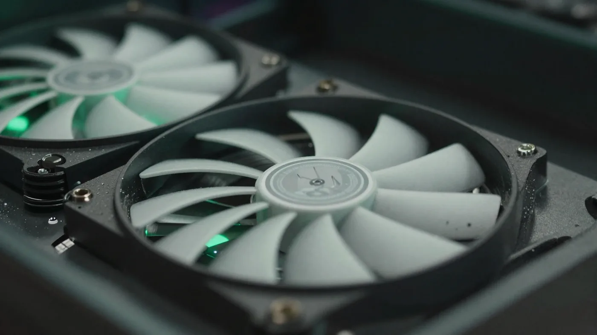

**게임 성능 최적화 방법**을 검색하면 "이거 켜라 저거 꺼라" 목록만 우수수 나오는데, 정작 **뭐부터 해야 효과가 큰지**는 안 알려주죠. 저도 처음엔 팁을 스무 개쯤 긁어모아 아무거나 눌러봤다가 뭐가 효과였는지도 모른 채 끝났거든요. 결론부터 말하면요, 돈 안 들이고 프레임 올리는 건 **① 게임 내 옵션·업스케일링 → ② 드라이버·GPU 지정 → ③ 발열·백그라운드** 이 순서면 됩니다. 순서가 곧 효율이에요. 프레임을 가장 크게 올려주는 건 윈도우 세팅이 아니라 게임 내 옵션과 업스케일링이거든요. 부품 교체 없이 할 수 있는 것만, 효과 큰 순서로 묶었습니다.

📌 3줄 요약
프레임을 가장 크게 올리는 건 <b>DLSS·FSR 업스케일링</b>과 <b>게임 내 옵션 조정</b>입니다. 이 둘이 절반이에요.

그다음이 <b>그래픽 드라이버 최신화</b>와 <b>앱별 고성능 GPU 지정</b>. 전원 옵션·게임 모드 같은 윈도우 세팅은 평균 프레임보다 <b>버벅임(스터터) 완화</b>에 가깝습니다.

마지막이 <b>발열·백그라운드 정리</b>. 여기까지 다 해도 안 잡히면 그때 부품(램·SSD·그래픽카드)을 의심하세요.

## 게임 성능 최적화, 뭐부터 해야 효과가 큰가요?

**게임 내 옵션 조정과 DLSS·FSR 업스케일링이 먼저입니다.** 프레임을 실제로 크게 올려주는 게 이 둘이거든요. 여기서 많이들 헷갈리는데, 전원 옵션이나 게임 모드 같은 윈도우 세팅보다 게임 안에서 만지는 게 체감이 훨씬 큽니다.

물론 윈도우 세팅도 의미는 있습니다. 균형 조정 전원 모드는 전력을 아끼려고 CPU 클럭을 낮게 유지하는데, 이걸 고성능으로 바꾸면 프레임이 순간적으로 끊기는 버벅임이 줄어들어요. 다만 이건 '평균 프레임을 크게 올린다'기보다 '흐름을 매끄럽게 다듬는' 쪽에 가깝습니다. 그래서 순서에서는 뒤로 뒀어요.

그래서 제가 효과와 난이도를 기준으로 순서를 매겨봤습니다. 위에서부터 하나씩 내려가면 됩니다.

| 순위 | 항목 | 난이도 | 효과 |
| --- | --- | --- | --- |
| 1 | DLSS·FSR 업스케일링 | 쉬움 | 매우 큼 |
| 2 | 게임 내 그래픽 옵션 조정 | 쉬움 | 큼 |
| 3 | 그래픽 드라이버 최신화 | 쉬움 | 큼(게임별) |
| 4 | 앱별 고성능 GPU 지정 | 매우 쉬움 | 큼(내장·외장 혼용 시) |
| 5 | 전원 옵션 → 고성능 | 매우 쉬움 | 스터터 완화(상황별) |
| 6 | 윈도우 게임 모드 켜기 | 매우 쉬움 | 작음~중간 |
| 7 | 백그라운드·발열 정리 | 중간 | 상황별 |
| 8 | BIOS(XMP·리사이즈바) | 어려움 | 중간 |

여기서 오해 하나 짚고 갈게요. 저도 전원 옵션이나 게임 모드 같은 윈도우 세팅이 프레임을 왕창 올려주는 줄 알았거든요. 그런데 자료를 뒤져보니, 최신 데스크톱에서 이런 윈도우 설정의 **평균 프레임 이득은 생각보다 작고**, 진짜 큰 건 게임 내 옵션과 업스케일링이더라고요. 그래서 위험도 낮고 효과 확실한 업스케일링·옵션을 맨 위로 올렸습니다.

## 윈도우 전원 옵션은 어떻게 바꾸나요?

**제어판 → 전원 옵션에서 '고성능'을 선택하면 됩니다.** 다만 기대는 정확히 잡으세요. 이건 평균 프레임을 크게 올려주는 항목이 아니라, **프레임이 순간적으로 뚝뚝 끊기는 스터터(버벅임)를 줄여주는** 쪽에 가깝습니다. 특히 CPU를 많이 쓰는 게임에서 체감됩니다. 균형 조정 모드는 전력을 아끼려고 CPU 클럭을 낮게 유지하는데, 게임 도중 이 절전이 작동하면 프레임이 출렁이거든요.

경로는 이렇습니다. 제어판 → 하드웨어 및 소리 → 전원 옵션에서 '고성능'(또는 있으면 '최고 성능')을 고릅니다. 목록에 안 보이면 '추가 전원 관리 옵션'을 펼치면 나와요. 노트북은 배터리 소모가 커지니, 충전기를 꽂았을 때만 고성능으로 두는 걸 권합니다. 클릭 몇 번이면 되고 손해는 없으니 해두면 좋지만, 이거 하나로 프레임이 확 뛸 거라 기대하진 마세요.

한 가지 더. 세부 설정에서 '프로세서 전원 관리 → 최소 프로세서 상태'를 100%로 올려두면 클럭이 더 확실하게 붙습니다. 다만 발열과 소음이 늘 수 있으니, 발열이 걱정되면 이 항목은 건드리지 않아도 됩니다.

## 윈도우 게임 모드는 켜는 게 좋나요?

**켜는 게 좋습니다. 단, 프레임이 크게 뛴다는 기대는 접으세요.** 윈도우 10·11의 게임 모드는 게임을 실행하면 CPU·GPU 자원을 그 게임에 우선 배분하고, 백그라운드 작업이나 드라이버 업데이트를 잠시 미룹니다. 다만 실제 평균 프레임 이득은 미미한 경우가 많아, '켜두면 손해 볼 일 없는' 정도로 보는 게 맞아요. 설정 → 게임 → 게임 모드에서 켜면 끝입니다.

같은 화면에서 하나 더 챙길 게 있습니다. '그래픽 설정'에 들어가 게임 실행 파일을 추가하고 **고성능 GPU**로 지정하는 겁니다. 노트북이나 내장·외장 그래픽이 섞인 PC에서 특히 중요해요. 이걸 안 해두면 게임이 성능 낮은 내장 그래픽으로 돌아가는 어이없는 상황이 생깁니다.

저도 예전에 노트북에서 게임이 유독 버벅여서 한참 헤맸는데, 알고 보니 외장 그래픽이 아니라 내장으로 돌고 있던 경우였어요. GPU 지정 한 줄로 해결되는 문제였습니다.

## 그래픽 드라이버는 꼭 최신으로 해야 하나요?

**네, 최신 드라이버가 프레임에 직접 영향을 줍니다.** 엔비디아·AMD는 신작 게임에 맞춰 성능을 끌어올리는 드라이버를 주기적으로 내놓습니다. 특정 게임에서 프레임이 눈에 띄게 오르는 경우도 많아요.

설치는 공식 앱으로 하는 게 안전합니다. 엔비디아는 앱(구 지포스 익스피리언스), AMD는 아드레날린 소프트웨어에서 자동으로 최신 드라이버를 잡아줍니다. 윈도우 업데이트가 밀어주는 드라이버는 한 박자 늦거나 충돌이 나는 경우가 있으니, 이상 증상이 있으면 공식 앱으로 재설치하는 걸 권합니다.

드라이버가 꼬였다 싶을 땐 완전 삭제 후 재설치가 확실합니다. 다만 이 과정은 초보에겐 번거로우니, 일반적으로는 공식 앱의 '클린 설치' 옵션에 체크하는 정도로 충분합니다. 엔비디아 사용자라면 스케일링·업스케일링 세부 설정은 [엔비디아 스케일링 모드 설정](/nvidia-scaling-mode-override/) 글에 따로 정리해 뒀어요.

## 게임 내 그래픽 옵션은 뭘 먼저 낮춰야 하나요?

**그림자·안티에일리어싱·후처리부터 낮추세요.** 무작정 전부 '낮음'으로 내리면 화질만 버리고 프레임 이득은 애매합니다. 프레임을 많이 먹으면서 체감 화질 차이는 작은 옵션부터 골라 내리는 게 요령이에요.

프레임을 크게 먹는 대표 옵션을 표로 묶어봤습니다. 위쪽일수록 '내렸을 때 프레임 이득 대비 화질 손해가 적은' 항목입니다.

| 옵션 | 프레임 영향 | 낮췄을 때 체감 화질 손해 |
| --- | --- | --- |
| 그림자 품질 | 매우 큼 | 작음 |
| 안티에일리어싱 | 큼 | 중간 |
| 후처리·모션블러 | 큼 | 작음(오히려 선명) |
| 앰비언트 오클루전 | 중간 | 작음 |
| 텍스처 품질 | 작음(VRAM 여유 시) | 큼 |
| 화면 해상도 | 매우 큼 | 큼 |

핵심은 **해상도와 텍스처는 최대한 지키고, 그림자·후처리를 깎는 것**입니다. 해상도를 내리면 프레임은 확 오르지만 화면이 흐려져 손해가 큽니다. 그런데 이 딜레마를 깔끔하게 푸는 방법이 따로 있어요. 바로 다음 항목입니다.

## DLSS와 FSR을 켜면 정말 프레임이 오르나요?

**네, 화질을 크게 해치지 않으면서 프레임을 올리는 가장 효과적인 방법입니다.** 게임 옵션에 DLSS(엔비디아)나 FSR(AMD)이 있으면 이걸 켜는 게 해상도를 통째로 내리는 것보다 훨씬 이득이에요.

원리는 이렇습니다. 게임을 실제로는 낮은 해상도(예: 1080p)로 그린 뒤, 그 화면을 목표 해상도(예: 4K)로 **똑똑하게 복원**합니다. GPU가 무거운 픽셀 연산을 덜 하니 프레임이 오르고, 복원 알고리즘 덕분에 화면은 원래 해상도에 가깝게 유지됩니다. 게임·환경마다 편차가 크지만, 여러 리뷰 벤치마크에서 퀄리티 모드 기준 대략 **30~50% 안팎의 프레임 향상**이 보고돼 이 글의 항목 중 가성비가 가장 좋습니다.

DLSS는 엔비디아 RTX 그래픽카드의 전용 AI 코어를 쓰고, FSR은 (3.1까지는) 전용 하드웨어 없이 폭넓은 그래픽카드에서 돌아간다는 차이가 있어요. 다만 최신 버전은 사정이 좀 다릅니다. FSR도 3.1까지는 넓게 호환됐지만, 2026년 현재 최신 FSR 4는 AI 기반으로 바뀌면서 일부 최신 AMD 그래픽카드에서만 돌아갑니다. 그래서 내 그래픽카드가 어떤 버전을 지원하는지는 게임 옵션에서 직접 확인하는 게 정확해요.

💡 업스케일링 품질 모드
DLSS·FSR에는 '퀄리티 / 밸런스드 / 퍼포먼스' 모드가 있습니다. 화질을 지키고 싶으면 <b>퀄리티</b>, 프레임이 급하면 <b>퍼포먼스</b>를 고르세요. 대개 퀄리티 모드만 켜도 프레임이 눈에 띄게 오릅니다. '프레임 생성' 기능은 중간 프레임을 추가로 만들어 더 부드럽게 보이게 하지만, 입력 지연이 늘 수 있어 경쟁 게임에선 취향을 탑니다.

## 백그라운드 프로그램은 얼마나 정리해야 하나요?

**게임 중 불필요한 백그라운드는 최소한으로 줄이는 게 좋습니다.** 게임 도중 생기는 렉의 상당수가 자원을 갉아먹는 백그라운드 프로세스 때문이에요. 특히 램이 부족하거나 CPU가 약한 PC에서 효과가 큽니다.

가장 흔한 범인은 채팅·런처·클라우드 동기화·브라우저입니다. 크롬 탭 수십 개를 켜둔 채 게임을 돌리면 램을 그쪽에서 다 먹어버려요. 게임 전에 작업 관리자(Ctrl+Shift+Esc)를 열어 메모리·CPU를 많이 먹는 프로그램을 종료하면 됩니다.

시작프로그램도 정리 대상입니다. 작업 관리자의 '시작프로그램' 탭에서 부팅 때 자동 실행되는 앱 중 안 쓰는 것을 '사용 안 함'으로 바꾸면, 평소에도 자원이 덜 물립니다. 다만 백신·그래픽 드라이버 같은 필수 항목은 건드리지 마세요.

⚠️ '최적화 프로그램' 주의
'원클릭 게임 부스터', 'PC 최적화 클리너' 같은 프로그램은 효과가 불확실하고, 일부는 광고·번들을 함께 설치하거나 오히려 시스템을 불안정하게 만듭니다. 윈도우 기본 기능(전원 옵션·게임 모드·작업 관리자)만으로 충분해요. 출처 불명 프로그램은 설치하지 않는 걸 권합니다.

## 발열 관리가 프레임이랑 무슨 상관인가요?

**온도가 높으면 CPU·GPU가 스스로 속도를 낮춰(스로틀링) 프레임이 떨어집니다.** 부품은 과열되면 손상을 막으려고 클럭을 자동으로 내려요. 그래서 한참 게임하다 보면 프레임이 슬금슬금 떨어지는 현상이 생기는데, 이건 성능 부족이 아니라 발열 문제인 경우가 많습니다.

가장 저렴한 해결책은 청소입니다. 케이스 내부와 쿨링팬에 먼지가 쌓이면 냉각 효율이 떨어지니, 압축 공기 등으로 주기적으로 털어주세요. 케이스 통풍이 막혀 있지 않은지, 팬이 제대로 도는지도 확인할 만합니다.

여름철이나 노트북이라면 발열이 더 심합니다. 노트북은 바닥이 막히지 않게 받침대를 쓰거나 쿨링패드를 더하면 도움이 돼요. 온도가 게이밍 중 지속적으로 높다면(대개 CPU·GPU 80~90도 이상 지속), 서멀 재도포나 쿨러 교체까지 고려할 수 있지만 이건 난이도가 높은 영역입니다.

## 부품을 바꾸기 전에 확인할 건 뭔가요?

**소프트웨어 최적화를 다 해봤는데도 프레임이 안 나오면, 그때 하드웨어를 의심하세요.** 순서를 지키는 이유가 이겁니다. 위 7가지를 안 해보고 부품부터 지르면 돈만 쓰고 원인은 그대로일 수 있어요.

가장 흔한 병목은 램 용량과 SSD입니다. 요즘 게임은 16GB를 권장하는 경우가 많고, 게임을 HDD에 깔아두면 로딩과 텍스처 스트리밍에서 손해를 봅니다. SSD는 여유 공간을 15% 정도 남겨두는 게 성능 유지에 좋아요. 램이 듀얼 채널로 꽂혀 있는지도 확인할 만한 포인트입니다.

내 PC가 특정 게임의 권장 사양을 만족하는지 애매하다면, 게임 상점 페이지의 권장 사양과 비교해보는 게 먼저입니다. 그래픽카드가 근본적으로 부족하면 어떤 세팅도 한계가 있어요. 반대로 사양이 충분한데 프레임이 안 나온다면, 십중팔구 이 글의 소프트웨어 항목에서 답이 나옵니다. 자세한 저프레임 진단은 [인텔 게이밍 — 저프레임 해결](https://www.intel.com/content/www/us/en/gaming/resources/how-to-fix-your-low-frame-rate.html) 가이드도 참고할 만합니다.

## 자주 묻는 질문

**Q. 게임 성능 최적화, 뭐부터 하면 되나요?** 게임 옵션에 DLSS·FSR 업스케일링이 있으면 그것부터 켜고, 그림자·후처리 옵션을 낮춘 뒤, 그래픽 드라이버를 최신으로 업데이트하세요. 프레임 이득이 가장 큰 순서입니다. 전원 옵션·게임 모드 같은 윈도우 세팅은 평균 프레임보다 버벅임 완화에 가까워서 그다음에 해도 됩니다.

**Q. 그래픽 옵션을 전부 낮음으로 내리면 되나요?** 그건 화질만 버리고 이득이 애매합니다. 프레임을 많이 먹으면서 체감 화질 손해가 작은 그림자·후처리·안티에일리어싱부터 내리고, 해상도와 텍스처는 최대한 지키는 게 요령입니다. 그리고 해상도를 내리는 대신 DLSS·FSR을 켜는 편이 훨씬 이득이에요.

**Q. DLSS랑 FSR 중 뭘 켜야 하나요?** 엔비디아 RTX 그래픽카드면 DLSS가 대체로 화질이 좋고, 그 외 그래픽카드거나 게임이 DLSS를 지원하지 않으면 FSR을 켜세요. FSR은 전용 하드웨어 없이 폭넓게 돌아갑니다. 둘 다 있으면 DLSS를 먼저 시도하고, 화질이 마음에 안 들면 FSR과 비교해보면 됩니다.

**Q. 최적화 프로그램(게임 부스터) 깔면 프레임이 오르나요?** 대부분 효과가 불확실하고, 일부는 광고·번들을 함께 설치하거나 시스템을 불안정하게 만듭니다. 윈도우 기본 기능(전원 옵션·게임 모드·작업 관리자)만으로 충분하니, 출처 불명의 최적화 프로그램은 설치하지 않는 걸 권합니다.

**Q. 게임하다 보면 프레임이 점점 떨어지는데 왜 그런가요?** 발열 때문일 가능성이 큽니다. 온도가 올라가면 CPU·GPU가 손상을 막으려고 스스로 클럭을 낮춰서 프레임이 떨어져요. 케이스와 쿨링팬 먼지를 청소하고, 통풍이 막히지 않았는지 확인하세요. 노트북은 쿨링패드가 도움이 됩니다.

**Q. 램을 늘리면 게임 프레임이 오르나요?** 램이 부족했다면 오릅니다. 요즘 게임은 16GB를 권장하는 경우가 많은데, 8GB에서 백그라운드까지 겹치면 프레임이 출렁이거든요. 다만 이미 충분하다면 램을 더 늘려도 큰 차이는 없습니다. 부품 교체 전에 이 글의 소프트웨어 항목부터 다 해보는 게 순서예요.

## 정리하면

이거 하나만 기억하면 돼요. **게임 옵션·업스케일링 → 드라이버·GPU 지정 → 발열·백그라운드**, 이 순서입니다. 위쪽일수록 프레임 이득이 크니, 부품 지르기 전에 무조건 여기부터 훑으세요.

돈을 들이지 않고도 대부분의 PC는 체감 개선 여지가 남아 있습니다. 특히 게임 옵션에 DLSS·FSR이 있으면 그것부터 켜보세요. 5분이면 되고 효과는 가장 확실합니다. 전원 옵션이나 게임 모드는 그다음에 손봐도 늦지 않아요.

---

**관련 키워드** — #게임성능최적화 #게임프레임올리기 #PC게임최적화 #FPS올리는법 #게임렉줄이기 #DLSS #FSR #윈도우게임모드 #그래픽드라이버 #전원옵션고성능 #게임발열 #백그라운드정리
