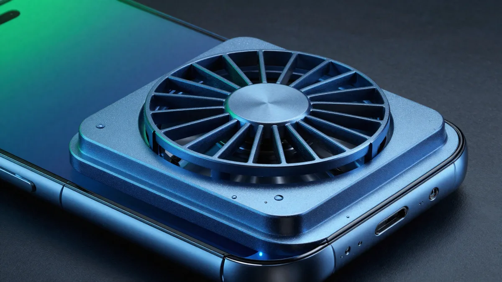

**핸드폰 게임 발열 줄이기**를 검색하면 "밝기 낮춰라, 앱 꺼라" 목록만 우수수 나오는데, 정작 **뭐부터 해야 온도가 실제로 떨어지는지**는 안 알려주죠. 저도 처음엔 팁을 열 개쯤 긁어모아 아무거나 눌러봤다가 폰이 여전히 손난로인 채로 끝났거든요. 결론부터 말하면요, 발열은 **① 게임 안 설정(해상도·주사율) → ② 폰 자체 설정(게임부스터·저전력) → ③ 환경·주변기기(충전·케이스·쿨러)** 이 순서로 잡으면 됩니다. 순서가 곧 효율이에요. 열을 가장 많이 만드는 건 게임의 그래픽 부하 자체라서, 게임 안에서 부하를 낮추는 게 밖에서 식히는 것보다 훨씬 크게 먹히거든요. 게이머 픽셀이 직접 파보고 효과 큰 순서로 묶었습니다.

📌 3줄 요약
발열을 가장 크게 줄이는 건 <b>게임 내 그래픽·해상도·주사율(FPS) 낮추기</b>입니다. 밖에서 식히기 전에 안에서 부하를 줄이는 게 먼저예요.

그다음이 <b>갤럭시 게임부스터·아이폰 저전력 모드</b>로 시스템 차원의 성능·밝기를 억제하고, <b>충전하며 게임하기·두꺼운 케이스</b>를 없애는 것.

<b>쿨링팬(냉각패드)</b>은 확실히 효과가 있지만 결로 위험이 있고, <b>물·냉장고로 식히는 건 절대 금지</b>입니다. 배터리가 부풀거나 경고가 반복되면 그때는 설정이 아니라 AS예요.

## 핸드폰 게임 발열, 뭐부터 잡아야 효과가 큰가요?

**게임 안 그래픽 설정부터 낮추는 게 1순위입니다.** 열을 만드는 주범이 게임의 연산 부하라서, 여기서 부하를 줄이면 온도가 가장 크게 떨어지거든요. 여기서 많이들 헷갈리는데, 쿨링팬을 붙이거나 밝기를 낮추는 건 이미 난 열을 식히거나 조금 덜 나게 하는 쪽이라 체감이 그보다 작습니다.

그래서 제가 효과와 난이도를 기준으로 순서를 매겨봤습니다. 위에서부터 하나씩 내려가면 돼요.

| 순위 | 항목 | 난이도 | 발열 감소 효과 |
| --- | --- | --- | --- |
| 1 | 게임 내 그래픽·해상도 낮추기 | 쉬움 | 매우 큼 |
| 2 | 주사율(FPS) 제한 (120→60) | 쉬움 | 큼 |
| 3 | 갤럭시 게임부스터·아이폰 저전력 | 쉬움 | 큼 |
| 4 | 백그라운드 앱 종료 | 쉬움 | 중간 |
| 5 | 화면 밝기 50~70%로 | 매우 쉬움 | 중간 |
| 6 | 충전 끊고 게임하기 | 매우 쉬움 | 중간~큼 |
| 7 | 두꺼운 케이스 벗기기 | 매우 쉬움 | 중간 |
| 8 | 쿨링팬·냉각패드 | 중간 | 큼(장시간) |

이거 하나만 기억하면 돼요. **밖에서 식히기 전에 안에서 덜 나게** 만드는 게 순서입니다. 아래에서 항목마다 왜 그런지, 어디를 만지는지 풀어볼게요.

## 게임할 때 핸드폰이 왜 이렇게 뜨거워지나요?

**게임이 CPU·GPU·배터리·통신칩·화면을 동시에 풀가동시키기 때문입니다.** 발열은 어느 한 부품 탓이 아니라 이 다섯이 겹쳐서 나요. 화웨이 공식 안내도 게임 중엔 "CPU, GPU, 메모리가 고속으로 실행되고 화면과 스피커가 계속 작동해" 소비 전력이 커진다고 설명합니다.

특히 3D 그래픽이 무거운 게임일수록 프로세서가 쉬지 않고 연산하면서 열을 뿜습니다. 여기에 배터리가 큰 전류를 내보내며 자체 발열하고, 온라인 게임이면 통신 모듈이 데이터를 계속 주고받느라 또 더워지죠. 최대 밝기에 120Hz 주사율이면 화면도 한몫합니다.

저도 예전엔 "폰이 뜨거운 건 그냥 배터리 문제"인 줄 알았거든요. 그런데 원인을 뜯어보니 열이 나는 지점이 제각각이더라고요. 그래서 해결책도 한 방이 아니라 부하를 여러 군데서 조금씩 덜어내는 방식이 맞습니다.

## 발열이 심하면 게임 성능도 떨어지나요?

**네, 그게 바로 발열 스로틀링입니다.** 폰은 칩이 정해진 온도에 도달하면 부품을 보호하려고 스스로 성능을 낮춰요. 그러면 잘 돌던 게임이 갑자기 뚝뚝 끊기고 프레임이 주저앉습니다. 발열을 잡아야 하는 진짜 이유가 이거예요. 온도를 낮추면 게임이 더 부드러워집니다.

여기서 오해 하나 짚고 갈게요. 저도 처음엔 발열은 그냥 "뜨겁다"는 불쾌함 정도인 줄 알았거든요. 그런데 파보니, 랭크 게임 중반부터 렉이 걸리는 흔한 원인이 네트워크가 아니라 **누적된 열로 인한 스로틀링**인 경우가 많더라고요. FPS 표시를 켜두면 온도가 오르는 시점과 프레임이 떨어지는 시점이 겹치는 게 보입니다.

💡 렉인지 발열인지 구분법
게임 내 FPS 표시를 켠 상태에서 <b>끊길 때 FPS 숫자도 같이 떨어지면 발열 스로틀링</b>, FPS는 그대로인데 조작 반응만 늦으면 네트워크 렉입니다. 발열이 원인이면 폰을 잠깐 식힌 뒤 프레임이 회복되는지로도 확인돼요.

PC에서도 원리는 똑같습니다. 발열이 프레임을 떨어뜨리는 메커니즘은 [게임 프레임 드랍 원인과 해결](/game-frame-drop-fix/) 글에 더 자세히 정리해 뒀어요.

## 게임 내 그래픽 설정은 뭘 낮춰야 하나요?

**해상도와 주사율(프레임)을 먼저 낮추세요.** 이 둘이 GPU 부하를 가장 크게 좌우해서, 발열 감소 효과가 제일 큽니다. 대부분의 모바일 게임은 설정 안에 그래픽 품질, 해상도, 프레임(FPS) 항목이 따로 있어요.

우선순위는 이렇습니다. 첫째, **프레임을 120·90에서 60으로** 내립니다. 화면이 초당 두 배로 그려지던 걸 절반으로 줄이니 부하와 발열이 눈에 띄게 빠져요. 둘째, **해상도·그래픽 품질을 한 단계** 내립니다(높음 → 중간). 셋째, 그림자·안티앨리어싱 같은 옵션을 끕니다. 화면 체감은 크게 안 변하는데 열은 확 줄어드는 항목들이에요.

그래서 제가 게임별로 만지는 순서를 정리해봤습니다. 발열이 심하면 프레임 → 해상도 → 그래픽 품질 → 부가 효과 순으로 하나씩 내려가며 온도를 보면 됩니다. 배틀그라운드 모바일, 롤토체스, 원신처럼 무거운 게임일수록 이 조정의 효과가 큽니다.

## 갤럭시·아이폰 발열 설정은 어디서 바꾸나요?

**갤럭시는 게임 부스터, 아이폰은 저전력 모드가 핵심 스위치입니다.** 게임 하나하나 만지기 전에 시스템 차원에서 성능·밝기·백그라운드를 한 번에 억제할 수 있어요. 경로를 표로 묶어봤습니다.

| 기기 | 기능 | 경로 |
| --- | --- | --- |
| 갤럭시 | 게임 부스터(게임 런처) | 게임 실행 중 하단 바 → 게임 부스터 → 성능/절전 프로필 |
| 갤럭시 | 백그라운드 사용 제한 | 설정 → 배터리 → 백그라운드 사용 제한 |
| 아이폰 | 저전력 모드 | 설정 → 배터리 → 저전력 모드 켬 |
| 아이폰 | 백그라운드 앱 새로고침 끄기 | 설정 → 일반 → 백그라운드 앱 새로고침 → 끔 |
| 공통 | 화면 밝기 수동 50~70% | 제어센터에서 자동 밝기 해제 후 수동 조절 |

갤럭시 게임 부스터에는 발열이 심할 때 성능을 조금 양보하고 온도를 잡는 '절전' 성향 프로필이 있어요. 아이폰은 저전력 모드를 켜면 백그라운드 새로고침과 일부 시각 효과가 줄어 발열·배터리 소모가 함께 내려갑니다. 저도 장시간 플레이할 땐 이 두 스위치부터 켜두는 편이에요.

## 충전하면서 게임하면 진짜 더 뜨거워지나요?

**네, 충전과 게임이 겹치면 발열이 가장 심해집니다.** 배터리는 충전할 때도 열이 나고 게임으로 방전할 때도 열이 나는데, 이 둘이 동시에 일어나면 부하가 겹쳐요. 한 자료는 이 상태를 두고 배터리 부하가 사실상 배가 된다고 표현하기도 합니다.

그래서 장시간 게임이라면 미리 충전을 끝내두고 케이블을 뽑은 채 하는 걸 권합니다. 꼭 충전하며 해야 한다면 고속 충전을 잠깐 꺼두는 것도 방법이에요. 급속 충전일수록 발열이 크거든요.

케이스도 같이 봐야 합니다. 두껍고 밀폐된 케이스는 뒷면으로 빠져나갈 열을 가둬버려요. 발열이 심할 땐 잠깐 케이스를 벗겨두는 것만으로 체감이 달라집니다.

## 쿨링팬·냉각패드는 효과가 있나요?

**효과는 확실합니다. 특히 한 시간 넘는 장시간 플레이에서요.** 폰 뒷면에 붙이는 쿨링팬(냉각패드)은 열을 강제로 식혀서, 스로틀링이 오는 시점을 늦춰줍니다. 게이밍에 진심이면 값어치를 하는 액세서리예요. 다만 주의할 점이 하나 있습니다.

⚠️ 펠티어 쿨러의 결로 주의
강력하게 냉각하는 '펠티어' 방식 쿨러는 폰 표면을 이슬점 아래로 떨어뜨려 <b>결로(물맺힘)</b>가 생길 수 있어요. 습한 날·여름 실내에서 특히 그렇습니다. 물기가 충전 포트나 틈으로 들어가면 기판 손상으로 이어지니, 냉각 세기를 너무 높이지 말고 표면에 물이 맺히는지 이따금 확인하세요.

단순 팬(바람) 방식은 결로 걱정이 거의 없어 무난합니다. 결국 쿨러는 '이미 난 열을 빼주는' 보조 수단이라, 앞서의 게임 내 설정·시스템 설정을 먼저 하고 그 위에 얹는 게 순서예요.

## 이 발열, 그냥 둬도 되나요? — 정상과 위험 신호

**따뜻한 정도면 정상, 손에서 놓고 싶을 만큼 뜨겁거나 배터리가 부풀면 위험입니다.** 게임 중 어느 정도의 발열은 자연스러운 현상이에요. 제조사도 주변 온도 약 25도를 정상 사용 기준으로 봅니다. 애플은 아이폰 권장 작동 범위를 0~35도로 명시하고, 35도를 넘는 환경에선 배터리 수명이 영구적으로 줄 수 있다고 안내해요.

문제는 이 선을 넘는 신호들입니다. 아래에 해당하면 설정으로 해결할 단계가 아니라 점검·AS 대상이에요.

🚨 이럴 땐 즉시 멈추고 점검
· <b>배터리 팽창</b> — 뒷면이나 화면 한쪽이 들뜸 · <b>과열 경고 반복</b> — "온도가 높습니다" 알림이 계속 뜸 · <b>미사용 중에도 지속 발열</b>, 발열과 함께 충전이 안 됨 · <b>손에 쥐기 어려울 정도</b>의 열  그리고 <b>냉장고·냉동실·물로 식히는 건 절대 금지</b>입니다. 급격한 온도차로 결로가 생겨 내부 기판이 손상돼요. 자연 냉각이 정답입니다.

저도 예전에 폰이 뜨겁다고 얼음팩에 올려둔 적이 있는데, 알고 보니 이게 결로로 오히려 폰을 망가뜨리는 지름길이더라고요. 뜨거우면 그냥 게임을 멈추고 서늘한 그늘에서 자연히 식히는 게 가장 안전합니다.

## 핸드폰 게임 발열, 한눈에 정리

지금까지 내용을 한 표로 묶었습니다. 위에서부터 순서대로 적용하면 돼요.

| 단계 | 무엇을 | 효과 | 주의 |
| --- | --- | --- | --- |
| 게임 내 | 프레임 60 제한·해상도/품질 한 단계↓ | 발열 감소 최대 | 화면 체감 변화 작음 |
| 시스템 | 갤럭시 게임부스터·아이폰 저전력 | 성능·밝기 일괄 억제 | 성능 약간 양보 |
| 습관 | 충전 끊고·케이스 벗고·밝기 50~70% | 중간~큼 | 급속충전일수록 발열↑ |
| 주변기기 | 팬형 쿨러 | 장시간에 큼 | 펠티어는 결로 주의 |
| 안전 | 25도 환경·자연 냉각 | 배터리 보호 | 물·냉장고 금지 |

발열 자체가 무서운 게 아니라, 그걸 방치해서 스로틀링과 배터리 열화로 가는 게 문제예요. 게임 부하를 안에서 덜고, 시스템 스위치로 억제하고, 그래도 남는 열은 팬으로 빼주는 이 순서면 대부분 잡힙니다. 폰 성능이 아쉬워 근본적으로 프레임을 끌어올리고 싶다면 [게임 성능 최적화 방법](/game-performance-optimization/) 글도 같이 보면 도움이 될 거예요. 더 자세한 기기별 온도 안내는 [Apple 공식 지원 문서](https://support.apple.com/en-us/118431)에서 확인할 수 있습니다.

## 자주 묻는 질문 (FAQ)

**Q. 핸드폰 게임 발열을 가장 빠르게 줄이는 방법은 뭔가요?** 게임 안에서 프레임(FPS)을 120·90에서 60으로 내리고 그래픽 품질을 한 단계 낮추는 게 가장 빠르고 효과가 큽니다. GPU 부하가 곧바로 줄어 온도가 눈에 띄게 떨어져요. 그다음 화면 밝기를 50~70%로 낮추고 충전 케이블을 뽑으면 추가로 잡힙니다.

**Q. 게임할 때 핸드폰은 몇 도까지 정상인가요?** 제조사는 주변 온도 약 25도를 정상 사용 기준으로 보고, 애플은 아이폰 권장 작동 범위를 0~35도로 안내합니다. 따뜻한 정도는 정상이지만 35도가 넘는 환경에서 오래 쓰면 배터리 수명이 영구적으로 줄 수 있어요. 손에 쥐기 어려울 만큼 뜨겁거나 경고가 반복되면 정상 범위를 벗어난 겁니다.

**Q. 게임용 쿨링팬(냉각패드)은 살 만한가요?** 한 시간 이상 장시간 플레이한다면 값어치를 합니다. 스로틀링이 오는 시점을 늦춰 프레임이 더 오래 유지돼요. 다만 강력한 펠티어 방식은 결로로 물이 맺힐 수 있으니 습한 날엔 냉각 세기를 낮추거나, 결로 걱정 없는 팬형을 고르는 게 안전합니다.

**Q. 충전하면서 게임하면 배터리에 안 좋나요?** 충전과 게임이 겹치면 발열이 가장 심해져 배터리에 부담이 큽니다. 배터리는 충전할 때도 방전할 때도 열이 나는데 이게 동시에 일어나기 때문이에요. 장시간 게임은 미리 충전을 끝내고 케이블을 뽑은 채 하는 걸 권합니다.

**Q. 폰이 뜨거울 때 냉장고나 얼음으로 식혀도 되나요?** 절대 안 됩니다. 급격한 온도차로 기기 내부에 결로가 생겨 기판이 손상될 수 있어요. 뜨거우면 게임을 멈추고 케이스를 벗긴 뒤 서늘한 그늘에서 자연히 식히는 게 유일하게 안전한 방법입니다.

---

**관련 키워드** — #핸드폰게임발열 #스마트폰발열줄이기 #갤럭시게임발열 #아이폰게임발열 #게임쿨링팬 #냉각패드 #발열스로틀링 #모바일게임최적화 #게임부스터 #저전력모드 #충전하면서게임 #배터리발열
