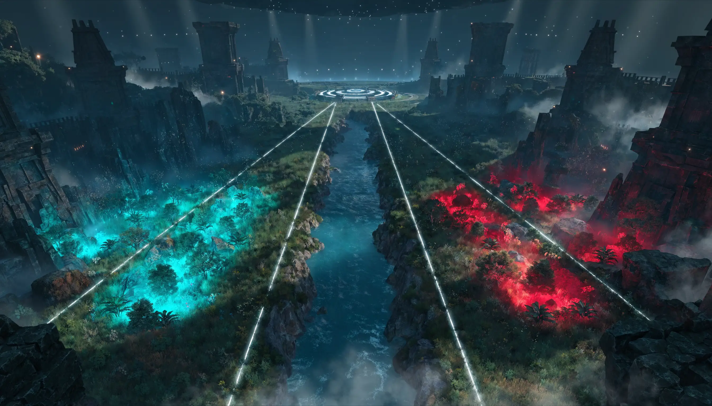

친구가 같이 하자고 해서 깔긴 깔았는데, 처음 켜자마자 영웅이 100개가 넘게 쏟아져서 저도 한참 멍했어요. 라인이 뭔지, 정글이 뭔지, 뭘 먼저 골라야 하는지 하나도 모르겠더라고요. **모바일 레전드 뱅뱅**을 검색해도 영어 가이드 아니면 티어표뿐이라 입문자가 한 번에 보기엔 영 불친절했습니다. 그래서 제가 공식 정보랑 가이드들을 직접 다 뒤져서, 진짜 처음 하는 분이 5분이면 흐름을 잡을 수 있게 한 페이지로 묶어봤어요. 결론부터 말하면요, 이 게임은 "5명이 세 길을 나눠 상대 본진을 부수는 게임"이고, 그 큰 그림만 잡으면 나머지는 따라옵니다.

📌 3줄 요약
<b>모바일 레전드 뱅뱅(MLBB)</b>은 문톤이 2016년 출시한 5대5 모바일 MOBA로, 한국에서도 한국어로 즐길 수 있습니다.

맵은 <b>3개 라인 + 정글</b>로 나뉘고, 영웅은 <b>6개 역할군</b>(탱커·파이터·어쌔신·마크스맨·메이지·서포터)으로 나뉩니다.

초보는 <b>클래식 모드 + 배우기 쉬운 영웅 + 추천 빌드</b>로 시작하면 가장 빠르게 적응합니다.

## 모바일 레전드 뱅뱅이 대체 무슨 게임인가요

모바일 레전드 뱅뱅(줄여서 MLBB)은 **문톤(Moonton)이 2016년에 내놓은 5대5 모바일 MOBA**입니다. MOBA가 낯설다면 "리그 오브 레전드 같은 AOS 장르의 모바일 버전"이라고 생각하면 가장 빠릅니다. 두 팀이 각각 다섯 명씩 붙어서, 상대 진영 안쪽의 핵심 건물(베이스)을 먼저 부수는 쪽이 이기는 게임이에요.

한국에서도 즐길 수 있습니다. 직접 찾아보니 2016년 출시 이후 한국에서도 앱스토어와 구글플레이에서 **한국어로 다운로드**해 플레이할 수 있더라고요. 한 판은 보통 12~18분 정도라, 출퇴근길에 한두 판 돌리기 딱 좋은 호흡입니다.

이 게임의 매력은 "짧고 빠른데 전략은 깊다"는 데 있습니다. 영웅이 **120종이 넘게** 계속 늘어나고 있어서 고를 맛이 있고, e스포츠도 활발해 매년 M-Series라는 세계대회가 열립니다. 그러니 지금 시작해도 한참 즐길 수 있는 게임이라는 뜻이죠.

## 맵부터 이해하면 절반은 끝납니다 — 3라인과 정글

MOBA가 어려워 보이는 건 사실 맵을 몰라서예요. 여기만 잡으면 확 쉬워집니다. 표준 MLBB 맵은 대각선으로 마주 본 두 진영 사이를 **세 개의 길(라인)** 이 잇고, 그 사이사이 숲(정글)이 채우는 구조입니다.

- **상단 라인(EXP 레인)** — 보통 단단한 파이터가 1대1로 버티며 경험치를 먹는 자리
- **중앙 라인(미드 레인)** — 마법 딜러(메이지)가 빠르게 성장하며 양쪽을 지원하는 핵심 길
- **하단 라인(골드 레인)** — 원거리 딜러(마크스맨)가 골드를 모아 후반 캐리를 준비하는 자리
- **정글** — 라인에 안 서고 숲의 몬스터를 잡아 크는 어쌔신/탱커의 영역

여기에 **오브젝트** 두 개가 승부를 가릅니다. 강가에 나오는 **터틀**(거북)은 초중반에 잡으면 팀 전체 골드·경험치 보너스를 주고, 후반에 등장하는 **로드**는 잡은 팀에 강력한 공성 지원군을 붙여 줍니다. 솔직히 저도 처음엔 이걸 무시하고 킬만 노렸는데, 알고 보니 오브젝트 한 번이 킬 서너 개보다 클 때가 많더라고요.

## 영웅 6역할군 — 내 자리부터 정하기

영웅이 120종이 넘는다고 겁먹을 필요 없어요. 전부 **6개 역할군** 안에 들어갑니다. 이 분류만 알면 "나는 어떤 스타일인지"부터 정할 수 있습니다. 여기서 많이들 헷갈리는데, 역할과 라인은 거의 짝이 정해져 있어서 표로 묶어보면 한눈에 들어옵니다.

| 역할군 | 하는 일 | 주로 서는 라인 | 초보 난이도 |
|---|---|---|---|
| 탱커(Tank) | 앞에서 맞아주고 이니시 | 로밍(서포트) | 쉬움 |
| 파이터(Fighter) | 단단하면서 딜도 됨 | 상단(EXP) | 쉬움~보통 |
| 마크스맨(Marksman) | 원거리 지속 딜, 후반 캐리 | 하단(골드) | 보통 |
| 메이지(Mage) | 마법 폭딜·광역기 | 중앙(미드) | 보통 |
| 어쌔신(Assassin) | 빠르게 침투해 적 딜러 암살 | 정글 | 어려움 |
| 서포터(Support) | 아군 보호·회복·CC | 로밍 | 쉬움 |

처음이라면 **탱커나 서포터, 또는 단단한 파이터**부터 잡는 걸 추천합니다. 실수해도 잘 안 죽고, 팀에 기여하기 쉬워서 게임 흐름을 배우기 좋거든요. 반대로 어쌔신(정글)은 동선·타이밍을 다 알아야 해서 입문 영웅으로는 좀 매운 편입니다.

## 초보가 딱 5가지만 지키면 됩니다

공략을 아무리 봐도 막상 게임에 들어가면 손이 안 따라가죠. 그래서 정말 기본 중의 기본만 추렸습니다. 이거 다섯 개만 지켜도 초반 멘탈이 훨씬 편해져요.

1. **클래식 모드로 시작하세요.** 랭크는 패배 시 점수가 깎여 스트레스가 큽니다. 클래식에서 조작과 영웅을 충분히 익힌 뒤 랭크로 넘어가는 게 정석이에요.
2. **게임이 추천하는 빌드를 그대로 따라가세요.** 영웅 선택 후 화면에 뜨는 추천 아이템 세팅을 켜 두면, 아이템 고민 없이 라인전에 집중할 수 있습니다.
3. **미니맵을 계속 보세요.** 적이 화면에서 사라지면 위험 신호입니다. 미니맵으로 적 위치를 확인하는 습관이 죽는 횟수를 확 줄여 줍니다.
4. **배우기 쉬운 영웅 한둘을 깊게 파세요.** 매판 새 영웅을 고르면 늘 어설픕니다. 처음엔 쉬운 영웅 1~2개를 정해 손에 익히는 게 훨씬 빨리 늡니다.
5. **라인을 지키고 오브젝트를 같이 치세요.** 다섯 명이 우르르 몰려다니면 라인이 비고, 터틀·로드를 뺏깁니다. 내 라인을 지키다 오브젝트 타이밍에만 모이는 게 이깁니다.

💡 픽셀의 한 줄 팁
저도 처음엔 킬에만 눈이 멀어 라인을 버리고 싸움만 쫓아다녔는데, <b>오브젝트와 라인을 챙기기 시작하니 승률이 눈에 띄게 올랐어요.</b> MOBA는 킬보다 "맵을 누가 더 차지하느냐" 싸움입니다.

## 한국에서 하는 법 — 휴대폰 앱과 PC

"한국에서 되나요?", "PC로도 할 수 있나요?"가 가장 많이 묻는 질문이라 따로 정리합니다. 결론부터 말하면 둘 다 됩니다.

**휴대폰**은 가장 기본입니다. 앱스토어나 구글플레이에서 "Mobile Legends Bang Bang"을 검색해 설치하면 되고, 한국어를 지원하니 메뉴 걱정은 안 해도 됩니다. 설치 용량과 첫 패치 다운로드가 있으니 와이파이 환경에서 받는 걸 권합니다.

**PC**로 즐기고 싶다면 LD플레이어나 블루스택 같은 안드로이드 에뮬레이터를 쓰면 됩니다. 큰 화면과 마우스·키보드로 조작감이 좋아져 초보 연습용으로 괜찮아요. 다만 에뮬레이터 사양과 매칭 정책은 버전마다 달라질 수 있으니, 설치 전 공식 안내를 한 번 확인하는 걸 추천합니다. 공식 정보와 최신 버전은 [구글플레이 모바일 레전드 공식 페이지](https://play.google.com/store/apps/details?id=com.mobile.legends)에서 확인할 수 있어요. MOBA가 어떤 장르인지 더 알고 싶다면 [게임 장르 완벽 가이드](/game-genre-guide/)도 같이 보면 이해가 빠릅니다.

## 한눈에 보는 모바일 레전드 뱅뱅 정리

지금까지 내용을 한 장으로 압축했습니다. 시작 전에 이 표만 머리에 넣어 두세요.

| 항목 | 내용 |
|---|---|
| 장르 | 5대5 모바일 MOBA(AOS) |
| 개발사 / 출시 | 문톤(Moonton) / 2016년 |
| 한국 플레이 | 앱스토어·구글플레이 한국어 지원 |
| 한 판 시간 | 보통 12~18분 |
| 맵 구조 | 3라인(상·중·하) + 정글 + 오브젝트(터틀·로드) |
| 역할군 | 탱커·파이터·어쌔신·마크스맨·메이지·서포터 6종 |
| 추천 입문 역할 | 탱커·서포터·파이터 |
| 플레이 환경 | 모바일(앱) + PC(에뮬레이터) |

## 자주 묻는 질문 (FAQ)

**Q. 모바일 레전드 뱅뱅 초보는 어떤 영웅부터 하는 게 좋나요?** 잘 안 죽고 팀에 기여하기 쉬운 탱커·서포터, 또는 단단한 파이터부터 추천합니다. 어쌔신(정글)은 동선과 타이밍 이해가 필요해 입문 영웅으로는 어려운 편입니다. 쉬운 영웅 1~2개를 정해 깊게 파는 게 빨리 느는 길입니다.

**Q. 모바일 레전드 뱅뱅 PC로도 할 수 있나요?** 네. LD플레이어·블루스택 같은 안드로이드 에뮬레이터를 설치하면 PC에서 큰 화면과 마우스·키보드로 즐길 수 있습니다. 다만 에뮬레이터 사양·매칭 정책은 버전마다 달라질 수 있어 설치 전 확인을 권합니다.

**Q. 한국에서 모바일 레전드 뱅뱅을 할 수 있나요?** 네, 할 수 있습니다. 2016년 글로벌 출시 이후 현재 앱스토어·구글플레이에서 한국어로 다운로드해 플레이할 수 있습니다.

**Q. 영웅이 너무 많은데 다 사야 하나요?** 아니요. 영웅은 120종이 넘지만 무료로 로테이션되는 영웅과 게임 내 재화로 얻는 영웅이 있어, 처음부터 다 살 필요가 없습니다. 우선 무료로 풀린 쉬운 영웅으로 시작해 손에 맞는 걸 골라 키우면 됩니다.

## 마무리

모바일 레전드 뱅뱅, 영웅 숫자에 겁먹지 마세요. 이거 하나만 기억하면 돼요. **다섯 명이 세 길과 정글을 나눠 맡고, 오브젝트를 챙기며 상대 본진을 부수는 게임.** 그 큰 그림을 잡고 클래식 모드에서 쉬운 영웅으로 시작하면, 며칠이면 흐름이 손에 붙습니다. 저도 맵과 역할을 이해하고 나서야 비로소 이 게임이 왜 재밌는지 알겠더라고요. 장르 자체가 더 궁금해졌다면 [게임 장르 완벽 가이드](/game-genre-guide/)로 이어서 읽어보세요. 그럼 좋은 첫 판 보내시길 바랄게요. 🎮

---

**관련 키워드** — #모바일레전드뱅뱅 #모바일레전드초보 #MLBB #모바일레전드하는법 #모바일레전드영웅추천 #모바일레전드포지션 #모바일레전드역할군 #모바일레전드PC #모바일레전드한국서버 #모바일레전드맵 #모바일레전드티어 #모바일레전드입문
