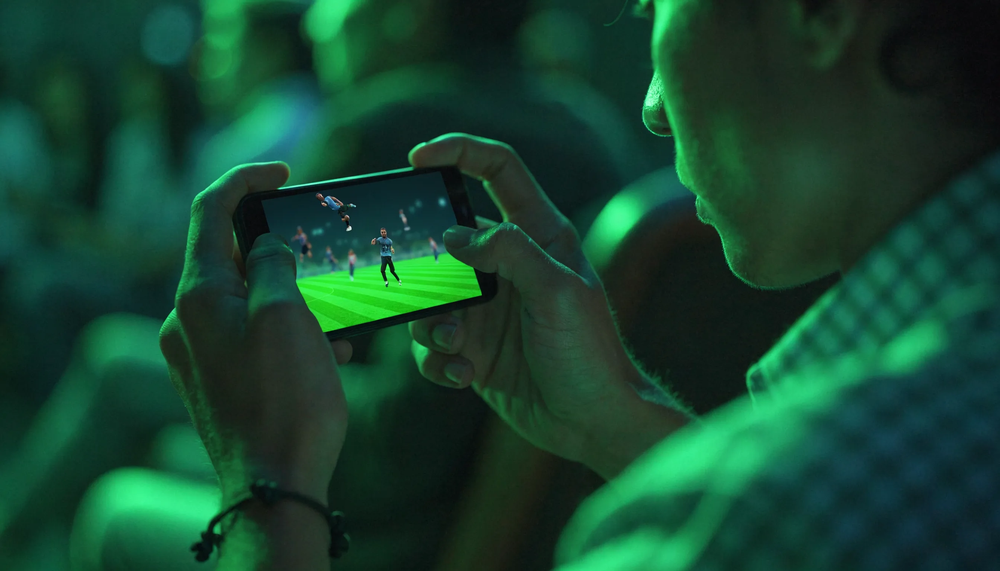

"모바일 축구게임 추천 좀"이라는 말을 들으면 저도 항상 되묻게 됩니다. 같은 축구게임이라도 실시간으로 상대와 맞붙는 대전형과, 혼자 팀을 키우는 커리어형, 지하철에서 3분만 하는 아케이드형은 전혀 다른 경험을 주거든요. 결론부터 말하면요, **모바일 축구게임 추천**은 "제일 재밌는 게임"이 아니라 "내가 어떻게 즐길 건지"부터 정해야 실패가 없습니다. 그래서 이 글은 인기작 15종을 실시간 대전·커리어 육성·아케이드 캐주얼·매니저 전술로 나누고, 추천글이 흔히 빼먹는 무료 여부·과금 부담·저사양/오프라인 가능 여부까지 제가 직접 찾아 게임마다 분명히 적었습니다.

📌 3줄 요약
모바일 축구게임은 크게 <b>실시간 대전(EA FC 모바일·eFootball), 커리어 육성(드림 리그 사커), 아케이드 캐주얼(스코어 히어로·헤드볼2), 매니저 전술(탑 일레븐·풋볼 매니저)</b> 4갈래로 나뉩니다.

본격 실사 축구를 원하면 EA FC 모바일, 손맛 없이 전술만 짜고 싶으면 매니저형, 저사양 폰·오프라인이면 드림 리그 사커나 스코어 히어로가 무난합니다.

대부분 무료지만 대전형은 과금이 순위에 영향을 주는 편이라, 부담이 싫으면 오프라인·아케이드 쪽이 편합니다.

## 모바일 축구게임 고르는 기준 — 조작·과금·저사양

처음엔 저도 뭐부터 봐야 할지 헷갈렸는데, 다운로드 전에 네 가지만 먼저 따져보면 후회가 줄어듭니다.

**첫째, 어떻게 즐길지 정합니다.** 직접 선수를 조작해 골을 넣고 싶으면 실시간 대전형, 조작은 부담스럽고 팀 짜는 재미를 원하면 매니저형, 가볍게 짧게 하고 싶으면 아케이드형이 맞습니다. 장르 감이 안 잡히면 [게임 장르 완벽 가이드](/game-genre-guide/)를 먼저 보고 오면 도움이 됩니다.

**둘째, 내 폰 사양을 봅니다.** EA FC 모바일이나 eFootball은 3D 그래픽이라 어느 정도 사양이 필요하고, 드림 리그 사커나 아케이드 게임은 2~3GB 램 저사양에서도 잘 돌아갑니다.

**셋째, 과금 구조를 확인합니다.** 대전형은 무료지만 좋은 선수 카드를 뽑는 과금이 순위에 영향을 줍니다. 반대로 커리어·아케이드는 과금 없이도 충분히 즐길 수 있어요.

**넷째, 오프라인 여부를 챙깁니다.** 데이터가 아쉽거나 지하철에서 하려면 오프라인 지원이 중요한데, 드림 리그 사커의 커리어 모드나 스코어 히어로가 대표적으로 오프라인이 됩니다.

## 실시간 대전형 — 본격 실사 축구의 손맛

직접 선수를 조작해 패스하고 슛하는, 콘솔 축구게임을 폰으로 옮겨온 느낌의 본격파입니다.

**EA SPORTS FC 모바일**(EA SPORTS FC Mobile)은 옛 피파 모바일의 후속으로, 모바일 축구게임 중 라이선스와 콘텐츠가 가장 방대합니다. 앱스토어 기준 19,000명 이상의 실제 선수와 690개 팀, 35개 리그를 공식 라이선스로 담았고, 카드로 팀을 꾸리는 얼티밋 팀과 실시간 대전(H2H·디비전 라이벌스)이 핵심이에요. 무료지만 인앱 결제가 있고, 2025년 9월 'FC 모바일 26' 시즌 업데이트가 적용됐습니다. 실사 라이선스와 본격 대전을 원한다면 가장 무난한 첫 선택입니다.

**eFootball**(이풋볼)은 코나미의 게임으로, 예전 위닝일레븐·PES의 후신입니다. EA FC 모바일보다 그래픽 화려함보다는 **볼 물리와 전술 리얼리즘**에 무게를 둔 게 특징이라, 드리블·태클의 무게감을 중시하는 사람에게 맞습니다. 역시 무료로 시작할 수 있어요. 두 게임을 저울질한다면 화려한 콘텐츠는 EA FC, 진지한 게임성은 eFootball로 갈립니다.

**바이브 르 풋볼**(Vive le Football)이나 **토탈 풋볼**(Total Football) 같은 후발 3D 대전 게임도 있습니다. 라이선스는 위 두 게임만 못하지만, 실사 대전을 좋아하고 새로운 걸 해보고 싶다면 대안이 됩니다.

## 커리어·클럽 육성형 — 내 팀을 밑바닥부터

작은 클럽을 맡아 선수를 영입하고 경기장을 키우며 리그를 올라가는, 혼자 오래 파는 재미의 육성형입니다.

**드림 리그 사커 2026**(Dream League Soccer 2026)은 이 분야의 대표작입니다. 퍼스트 터치 게임즈가 만들었고, 무명 클럽에서 시작해 FIFPro 라이선스 선수를 영입하고 유니폼·스타디움을 커스텀하는 커리어 모드가 알찹니다. 무엇보다 **오프라인 커리어가 되고 2~3GB 램 저사양에서도 잘 돌아가서**, 폰 사양이 아쉽거나 데이터가 부담이면 이게 정답에 가깝습니다.

**풋볼 리그 2026**(Football League 2026)도 비슷한 결의 오프라인 육성 게임인데, 맨체스터 시티·AS 모나코 같은 일부 팀이 라이선스돼 있고 빠른 로딩과 낮은 배터리 소모가 강점으로 꼽힙니다. 무거운 3D 대전이 부담스러운 사람에게 가벼운 대안이에요.

## 아케이드 캐주얼형 — 짧고 굵게 3분 컷

복잡한 조작 없이 스와이프 한두 번으로 골을 넣는, 출퇴근길에 짧게 즐기기 좋은 캐주얼파입니다.

**스코어 히어로**(Score! Hero)는 손가락으로 패스·슛 경로를 그리는 레벨식 게임입니다. 한 선수의 커리어를 따라가는 스토리 구성에 오프라인도 돼서, 부담 없이 한 판씩 끊어 하기 좋아요. 같은 개발사의 스코어! 월드 골즈처럼 명장면을 재현하는 퍼즐형도 있습니다.

**헤드볼 2**(Head Ball 2)는 1대1 빠른 대전이 핵심인 아케이드 게임입니다. 캐릭터를 키우며 실시간으로 짧게 맞붙는 재미가 있어요. 이 밖에 미니클립의 **풋볼 스트라이크**(Football Strike, 프리킥·페널티 대결)와 **사커 스타즈**(Soccer Stars, 물리 기반 보드축구), 자동차로 축구하는 **로켓 리그 사이드스와이프**(Rocket League Sideswipe)까지, 정통 축구가 아니어도 공을 차는 손맛만 원하면 선택지가 넓습니다.

## 매니저·전술형 — 조작은 그만, 머리로 이긴다

직접 뛰는 대신 전술·훈련·이적만 챙기고 경기는 시뮬레이션으로 지켜보는, 감독 시점의 두뇌파입니다.

**탑 일레븐**(Top Eleven)은 노르데우스가 만든 오래된 축구 매니저 게임으로, 전술을 짜고 선수를 영입해 다른 감독들과 실시간으로 경쟁합니다. 접근성이 좋아 매니저 입문용으로 무난해요. **풋볼 매니저 모바일**(Football Manager Mobile)은 훨씬 깊은 관리 시뮬레이션으로, 조작 없이 전술·이적·훈련에 집중하고 대체로 오프라인으로 즐길 수 있습니다.

**온라인 사커 매니저**(OSM)나 **사커 매니저 2026**(Soccer Manager 2026)도 실제 리그·클럽으로 전술과 이적을 짜는 매니저 계열입니다. 사커 매니저 2026은 FIFPro 라이선스로 90개 이상 리그를 담았고요. 손맛보다 "내 전술이 통했다"는 성취를 좋아한다면 이쪽이 오래 갑니다.

## 저사양·오프라인으로 즐기려면

폰 사양이 낮거나 데이터가 부담이면 선택지가 확 좁아지는데, 제가 게임별 정보를 찾아 정리해보니 기준이 분명해집니다. 무거운 3D 대전형(EA FC 모바일·eFootball)은 사양을 타고 대체로 온라인 위주라, 이럴 땐 **오프라인 커리어가 되는 드림 리그 사커**나 **레벨식 스코어 히어로**, 또는 텍스트 기반 매니저 게임이 안전합니다. 매니저형은 그래픽 부담이 거의 없어 구형 폰에서도 잘 돌아가는 편이에요.

⚠️ 과금(페이 투 윈) 주의
EA FC 모바일·eFootball 같은 대전형은 무료지만, 좋은 선수 카드를 뽑는 인앱 결제가 랭킹 경쟁에 영향을 줍니다. 과금 없이 오래 즐기고 싶다면 커리어형(드림 리그 사커)이나 아케이드·매니저형이 부담이 훨씬 적습니다. 결제 전 환불 정책과 청소년 결제 한도를 꼭 확인하세요.

## 한눈 비교표

흩어진 정보를 직접 찾아 표로 묶어봤습니다. 무료 여부·조작 방식·온오프라인·과금 부담을 핵심만 추렸어요. 세부 사양·시즌은 업데이트로 바뀔 수 있으니 스토어에서 최종 확인을 권합니다.

| 게임 | 유형 | 무료 | 조작 | 온·오프라인 | 과금 부담 |
| --- | --- | --- | --- | --- | --- |
| EA SPORTS FC 모바일 | 실시간 대전 | O(인앱결제) | 직접 조작 | 온라인 위주 | 높음 |
| eFootball | 실시간 대전 | O(인앱결제) | 직접 조작 | 온라인 위주 | 높음 |
| 드림 리그 사커 2026 | 커리어 육성 | O(인앱결제) | 직접 조작 | 오프라인 가능 | 보통 |
| 풋볼 리그 2026 | 커리어 육성 | O | 직접 조작 | 오프라인 가능 | 낮음 |
| 스코어 히어로 | 아케이드 | O | 스와이프 | 오프라인 가능 | 낮음 |
| 헤드볼 2 | 아케이드 대전 | O | 간단 조작 | 온라인 | 보통 |
| 로켓 리그 사이드스와이프 | 아케이드 | O | 간단 조작 | 온라인 | 낮음 |
| 탑 일레븐 | 매니저 | O | 전술 지시 | 온라인 | 보통 |
| 풋볼 매니저 모바일 | 매니저 | 유료 계열 | 전술 지시 | 오프라인 가능 | 낮음 |
| 사커 매니저 2026 | 매니저 | O | 전술 지시 | 온라인 | 낮음 |

## 상황별 추천 정리

💡 이럴 땐 이거
<b>본격 실사 축구·라이선스 중시</b> → EA SPORTS FC 모바일. <b>진지한 게임성·볼 물리</b> → eFootball. <b>저사양 폰·오프라인·과금 부담 최소</b> → 드림 리그 사커 2026. <b>출퇴근 3분 컷</b> → 스코어 히어로·헤드볼 2. <b>조작 없이 전술만</b> → 탑 일레븐·풋볼 매니저 모바일. 정통 축구가 아니어도 좋다면 로켓 리그 사이드스와이프도 별미입니다.

## 자주 묻는 질문(FAQ)

**Q. 모바일 축구게임 무료로 할 만한 건 뭔가요?** EA FC 모바일·eFootball·드림 리그 사커·스코어 히어로 모두 무료로 시작할 수 있습니다. 다만 대전형은 인앱 결제가 순위에 영향을 주니, 과금 부담이 싫으면 커리어형이나 아케이드형이 편합니다.

**Q. 저사양 폰에서 잘 돌아가는 축구게임은요?** 드림 리그 사커(2~3GB 램에서도 구동)나 스코어 히어로 같은 아케이드, 그래픽 부담이 적은 매니저 게임이 무난합니다. EA FC 모바일·eFootball은 3D라 사양을 타는 편입니다.

**Q. 오프라인으로 즐길 수 있는 모바일 축구게임이 있나요?** 드림 리그 사커의 커리어 모드, 스코어 히어로, 풋볼 리그 2026, 풋볼 매니저 모바일 등이 오프라인 플레이를 지원합니다. 실시간 대전형은 대부분 온라인 연결이 필요합니다.

**Q. EA FC 모바일과 eFootball 중 뭐가 더 나은가요?** 방대한 라이선스와 콘텐츠·이벤트를 원하면 EA FC 모바일, 화려함보다 사실적인 볼 물리와 전술 게임성을 원하면 eFootball이 낫습니다. 둘 다 무료라 직접 해보고 고르는 걸 권합니다.

**Q. 조작이 어려운데 쉬운 축구게임 없나요?** 스와이프로 슛 경로만 그리는 스코어 히어로, 간단 조작의 헤드볼 2가 쉽습니다. 아예 직접 조작이 싫으면 전술만 지시하는 탑 일레븐 같은 매니저 게임이 답입니다.

자, 이거 하나만 기억하면 돼요. 모바일 축구게임 추천은 유명한 순서가 아니라 **내가 어떻게 즐길지(대전·육성·아케이드·매니저)와 폰 사양·과금 취향**부터 정하면 15종 중에 맞는 게 분명히 보입니다. 더 큰 화면에서 즐길 게임도 찾는다면 [콘솔 게임 추천](/console-game-recommendations/) 글도 함께 보세요. 각 게임의 최신 시즌·사양은 [EA SPORTS FC 모바일 공식 페이지](https://www.ea.com/games/ea-sports-fc/fc-mobile) 같은 공식 스토어에서 확인하는 게 정확합니다.

---

**관련 키워드** — #모바일축구게임추천 #모바일축구게임 #EAFC모바일 #eFootball #드림리그사커 #축구게임추천 #무료축구게임 #오프라인축구게임 #저사양축구게임 #스코어히어로 #축구매니저게임 #안드로이드축구게임
