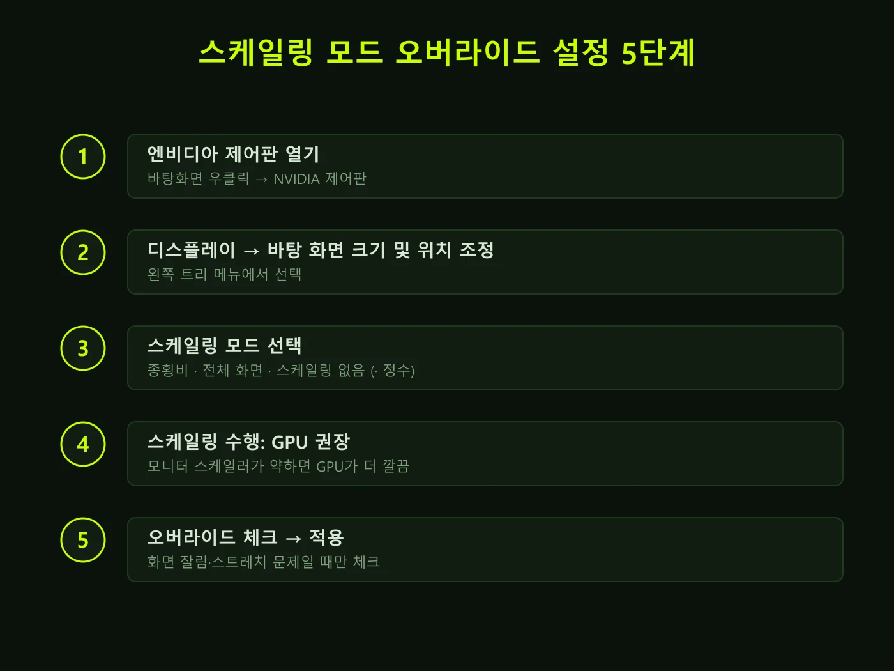

엔비디아 제어판을 뒤지다가 **게임 및 프로그램에 의해 설정된 스케일링 모드 오버라이드**라는 긴 문구 앞에서 멈칫해 본 적 있으시죠. 저도 처음엔 "이거 체크해야 되나, 풀어야 되나"부터 막혔거든요. 커뮤니티를 찾아봐도 "체크해라", "풀어라" 답이 제각각이라 더 헷갈리고요. 결론부터 말하면요, **모니터 기본 해상도 그대로 게임한다면 이 옵션은 켜든 끄든 아무 일도 안 일어납니다.** 문제는 해상도를 낮췄을 때 화면이 잘리거나, 비율이 이상하거나, 게임이 멋대로 설정을 바꿀 때 — 그때만 이 체크박스가 일을 합니다. 직접 공식 문서와 실사례를 뒤져서 언제 체크하는지 기준을 정리해 봤습니다.

📌 3줄 요약
이 옵션은 <b>게임이 스케일링 방식을 마음대로 바꾸지 못하게 막고, 엔비디아 제어판의 설정을 강제</b>하는 체크박스입니다.

스케일링 자체가 <b>모니터 기본 해상도와 다른 해상도로 게임할 때만 작동</b>하므로, 네이티브 해상도 유저에겐 사실상 무의미합니다.

화면 양옆 잘림·레터박스·4대3 스트레치 문제가 있을 때 <b>원하는 모드 선택 + GPU 수행 + 오버라이드 체크</b> 조합이 정석입니다.

## 이 체크박스, 정확히 무슨 뜻일까

엔비디아 공식 도움말의 설명은 의외로 짧습니다. 이 체크박스를 켜면 **"응용 프로그램은 이 페이지에서 설정된 스케일링 모드를 변경할 수 없습니다."** 그게 전부예요. 풀어서 말하면 이렇습니다. 일부 게임은 실행되면서 자기가 원하는 스케일링 방식(예를 들어 무조건 전체 화면으로 늘리기)을 드라이버에 요청하는데, 이 체크박스를 켜 두면 그 요청을 무시하고 **제어판에서 내가 고른 스케일링 모드가 항상 이깁니다.**

그래서 이름이 "오버라이드(override, 덮어쓰기)"입니다. 게임의 설정을 내 설정으로 덮어쓴다는 뜻이에요. 반대로 체크를 풀어 두면 게임이 자체 스케일링 방식을 쓰는 걸 허용합니다. 기본값은 해제 상태고, 아무 문제 없이 게임하고 있다면 굳이 건드릴 이유가 없는 옵션입니다.

## 전제 조건 — 스케일링은 "해상도가 다를 때"만 작동한다

여기서 많이들 헷갈리는데, 스케일링 설정 전체가 **모니터의 기본(네이티브) 해상도와 다른 해상도를 쓸 때만** 의미가 있습니다. 예를 들어 QHD(2560×1440) 모니터에서 게임도 2560×1440으로 돌리면 늘리고 줄일 게 없으니 스케일링이 아예 개입하지 않아요. 관련 설정 해설 영상들에서도 "자기 모니터 해상도와 같은 해상도로 게임할 거면 신경 안 써도 되는 옵션"이라고 딱 잘라 말합니다.

스케일링이 개입하는 대표 상황은 이런 경우입니다. 프레임 확보를 위해 해상도를 한 단계 낮췄을 때, 옛날 게임이 1024×768 같은 4대3 해상도만 지원할 때, FPS에서 일부러 1728×1080 같은 스트레치 해상도를 쓸 때. 이럴 때 "낮은 해상도 화면을 어떻게 모니터에 채울 것인가"를 정하는 게 스케일링 모드입니다.

## 스케일링 모드 4종 — 뭐가 다른가

공식 문서 기준으로 모드는 네 가지입니다. 표로 묶어보면 이렇습니다.

| 모드 | 화면 표시 | 이런 사람에게 |
|---|---|---|
| 종횡비 | 비율 유지 + 최대 확대, 양옆 검은 띠 | 화면 왜곡이 싫은 사람 (기본 추천) |
| 전체 화면 | 비율 무시하고 꽉 채움 | 4대3 스트레치·잘림 해결 |
| 스케일링 없음 | 원본 크기 그대로 중앙 배치 | 또렷함·지연 최소가 우선인 사람 |
| 정수 스케일링 | 픽셀을 정수배로 복제 | 도트·레트로 게임 (RTX 20번대 이상) |

정수 스케일링만 조건이 붙습니다. 공식 문서 기준 Turing 세대(RTX 20번대·GTX 16번대) 이상 GPU에서만 나타나요. 픽셀아트 게임을 뿌옇게 뭉개지 않고 칼같이 확대해 주는 모드라, 레트로 게이머라면 기억해 둘 가치가 있습니다.

## "스케일링 수행" — GPU와 디스플레이 중 뭘 고를까

같은 화면에 있는 "다음에서 스케일링 수행" 드롭다운도 같이 정리할게요. **GPU**를 고르면 그래픽카드가 확대 작업을 한 뒤 완성된 화면을 모니터로 보내고, **디스플레이**를 고르면 낮은 해상도 신호를 모니터가 받아서 자체 스케일러로 늘립니다.

어느 쪽이 낫냐는 통설이 갈립니다. 모니터 내장 스케일러 품질이 낮은 경우가 많아 **GPU 쪽이 대체로 깔끔하다**는 의견이 다수지만, 인풋랙(입력 지연)에 민감한 경쟁 게임 유저 사이에선 "스케일링 없음이 지연이 가장 적다"거나 디스플레이 수행을 선호하는 의견도 있어요. 실측 차이는 모니터·게임마다 달라서 단정하기 어렵습니다. 저라면 화질 문제 해결이 목적일 땐 GPU, 지연이 목숨인 FPS에선 네이티브 해상도(스케일링 자체를 안 씀)를 기본값으로 잡겠습니다. FPS 최적화 전반은 [FPS 게임 설정 기초 가이드](/fps-settings-basics/)에서 이어집니다.

## 설정 방법 5단계

경로는 하나뿐입니다. 바탕화면 우클릭 → NVIDIA 제어판 → 왼쪽 트리에서 **디스플레이 → 바탕 화면 크기 및 위치 조정** → 스케일링 모드 선택 → 스케일링 수행 선택 → **오버라이드 체크 → 적용**. 자세한 옵션 설명은 [엔비디아 공식 도움말](https://www.nvidia.com/content/control-panel-help/vlatest/ko-kr/mergedprojects/nvdspkor/Adjust_Desktop_Size_and_Position_-_Windows_Vista_and_Later.htm)에도 나와 있습니다.

## 상황별 정답 — 이럴 때 이렇게

제가 커뮤니티 실사례들을 뒤져서 증상별로 묶어봤습니다.

| 증상 | 설정 조합 |
|---|---|
| 게임 화면 양옆이 잘려서 나옴 | 전체 화면 + GPU 수행 + 오버라이드 체크 |
| 해상도 낮추면 위아래 레터박스 | 종횡비(또는 전체 화면) + 오버라이드 체크 |
| 4대3 스트레치로 적 크게 보고 싶음 | 전체 화면 + 오버라이드 체크 |
| 도트 게임이 뿌옇게 확대됨 | 정수 스케일링 (RTX 20번대 이상) |
| 아무 문제 없음 | 그대로 두기 (체크 불필요) |

실제로 윈도우에서 게임 화면 양옆이 잘리는 증상을 "전체 화면 체크 → GPU 수행 → 오버라이드 체크" 순서로 해결한 사례가 여러 커뮤니티에서 확인됩니다. 서든어택·배틀그라운드처럼 스트레치 해상도를 쓰는 게임 유저들이 이 체크박스를 찾는 것도 같은 원리예요. 게임이 멋대로 종횡비를 되돌리는 걸 막아야 스트레치가 유지되니까요.

⚠️ 체크했는데 안 먹힐 때
① 게임을 <b>전용 전체 화면(fullscreen) 모드</b>로 돌려야 스케일링이 적용됩니다 — 창 모드·테두리 없는 창은 바탕화면 해상도를 그대로 쓰기 때문에 스케일링이 개입하지 않아요. ② 설정 후 게임을 완전히 껐다 켜야 반영되는 경우가 많습니다. ③ 노트북은 화면이 내장 그래픽에 물려 있으면 이 메뉴 자체가 안 보일 수 있습니다(외장 GPU 직결 모드에서 확인). ④ 게임 해상도 목록에 원하는 해상도(1728×1080 등)가 아예 없다면, 같은 화면의 "사용자 정의 해상도" 기능으로 먼저 추가해야 합니다.

## 인풋랙 걱정, 얼마나 해야 하나

이 옵션 검색하는 분들이 꼭 같이 묻는 게 "GPU 스케일링 켜면 인풋랙 생기지 않나"입니다. 솔직하게 정리하면, GPU가 확대 작업을 한 단계 더 하는 만큼 이론상 지연이 아주 약간 늘 수 있다는 게 통설이지만, **체감 여부는 사람·장비마다 다르고 정밀 실측 자료도 드뭅니다.** 프로 지향 FPS 유저 커뮤니티에서도 "스케일링 없음이 가장 지연이 적다"는 경험담과 "차이 못 느낀다"는 반응이 공존해요. 지연이 정말 중요하다면 답은 간단합니다. 네이티브 해상도로 돌려서 스케일링 자체를 안 쓰면 됩니다.

## 한눈에 정리

| 항목 | 내용 |
|---|---|
| 옵션 위치 | NVIDIA 제어판 → 디스플레이 → 바탕 화면 크기 및 위치 조정 |
| 하는 일 | 게임의 스케일링 변경 요청을 무시하고 제어판 설정 강제 |
| 작동 조건 | 모니터 기본 해상도와 다른 해상도로 게임할 때만 |
| 기본값 | 체크 해제 (문제 없으면 그대로) |
| 체크할 때 | 화면 잘림·레터박스·스트레치 유지가 필요할 때 |
| 모드 | 종횡비 · 전체 화면 · 스케일링 없음 · 정수(RTX 20+) |

## 자주 묻는 질문 (FAQ)

**Q. 게임 및 프로그램에 의해 설정된 스케일링 모드 오버라이드, 꼭 체크해야 하나요?** 아니요. 기본은 해제 상태이고, 네이티브 해상도로 게임하면 켜든 끄든 차이가 없습니다. 낮춘 해상도에서 화면 표시가 이상할 때만 체크하세요.

**Q. 체크했는데 화면이 그대로예요.** 게임이 전용 전체 화면 모드인지 확인하고, 게임을 완전히 재시작해 보세요. 창 모드·테두리 없는 창에서는 스케일링이 적용되지 않습니다.

**Q. AMD 그래픽카드에도 같은 기능이 있나요?** 있습니다. AMD 소프트웨어의 "GPU 스케일링·스케일링 모드" 항목이 같은 역할을 하는 것으로 안내됩니다. 명칭과 위치만 다를 뿐 원리는 동일합니다.

**Q. 정수 스케일링이 안 보여요.** 공식 문서 기준 Turing 세대(RTX 20번대·GTX 16번대) 이상에서만 표시됩니다. 그 이전 세대 GPU에서는 목록에 나타나지 않습니다.

---

마지막으로 이거 하나만 기억하면 돼요. **이 체크박스는 "게임아, 스케일링은 내가 정한다"는 선언이고, 네이티브 해상도 유저에겐 있으나 마나 한 옵션이다.** 화면이 잘리거나 비율이 틀어졌을 때만 표의 조합대로 만지면 됩니다. 게임 환경 최적화를 더 파고 싶다면 [FPS 게임 설정 기초 가이드](/fps-settings-basics/)도 이어서 읽어 보세요.

**관련 키워드** — #스케일링모드오버라이드 #엔비디아스케일링 #엔비디아제어판 #GPU스케일링 #디스플레이스케일링 #종횡비 #전체화면설정 #게임화면잘림 #4대3스트레치 #정수스케일링 #인풋랙
