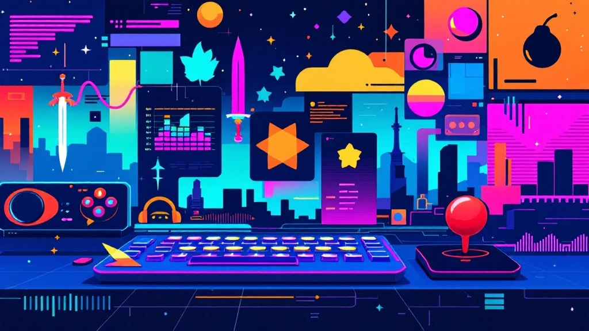

📌 3줄 요약
추억의 PC방 고전게임은 2000년대 PC방 황금기를 이끈 스타크래프트·카트라이더·서든어택 같은 온라인게임을 말합니다. RTS·FPS·캐주얼·MMORPG로 장르가 나뉩니다.

이 글은 대표작 15종을 장르별로 묶고, 출시연도와 지금도 할 수 있는지를 표로 정리했습니다.

스타·메이플·던파처럼 아직 현역인 게임도 많고, 크레이지아케이드처럼 서비스 종료가 예고된 게임도 있습니다.

"추억의 PC방 고전게임" 하면 저도 곧바로 담배 냄새 밴 PC방 소음과 라면 냄새부터 떠오릅니다. 결론부터 말하면요, 2000년대 PC방은 단순히 게임하던 공간이 아니라 하나의 문화였고, 그 중심에 몇 개의 국민게임이 있었습니다. 그래서 이 글은 "그땐 그랬지"로 끝내지 않고, 대표작을 장르별로 정리하고 출시연도와 지금도 할 수 있는지까지 제가 직접 찾아 표로 묶었습니다. 추억도 되살리고, 다시 하고 싶을 때 바로 찾을 수 있게요.

## 추억의 PC방 고전게임, 왜 이렇게 오래 기억될까

핵심부터 말하면, 2000년대는 한국 온라인게임의 황금기였기 때문입니다. 초고속 인터넷이 깔리고 PC방이 골목마다 생기면서, 집이 아니라 친구들과 모이는 공간에서 함께 게임을 즐기는 문화가 자리 잡았습니다.

이 시기 게임들의 공통점은 혼자가 아니라 여럿이 했다는 점입니다. 옆자리 친구와 팀을 맺거나 맞붙으면서 생긴 기억이라, 게임 자체보다 그때의 관계와 분위기가 함께 각인됐습니다. 고전게임이 유독 오래 기억되는 이유가 여기에 있습니다.

저도 장르별로 다시 정리해보니, 당시 PC방을 점령한 게임들이 RTS·FPS·캐주얼·MMORPG로 꽤 뚜렷하게 나뉘더군요. 장르 개념이 헷갈린다면 [게임 장르 완벽 가이드](/game-genre-guide/)를 먼저 보고 오면 이 글이 더 잘 읽힙니다. 이제 장르별로 하나씩 보겠습니다.

## RTS·전략 — PC방을 점령한 시작

PC방 문화의 진짜 출발점은 스타크래프트였습니다. 1998년 출시된 이 실시간 전략게임은 "민속놀이"라는 별명이 붙을 만큼 국민적 사랑을 받았고, 임요환·홍진호 같은 스타 프로게이머와 방송 리그를 낳으며 e스포츠 산업의 기폭제가 됐습니다. PC방이 폭발적으로 늘어난 것도 스타크래프트의 힘이 컸습니다.

2002년 나온 워크래프트 3도 빼놓을 수 없습니다. 영웅 유닛 개념을 전면에 내세운 전략게임인데, 여기서 파생된 유즈맵 '도타(DotA)'가 훗날 AOS(MOBA) 장르의 뿌리가 됐습니다. 지금의 리그 오브 레전드 계보를 거슬러 올라가면 이 게임이 나옵니다.

저도 처음엔 스타와 워크래프트가 그냥 비슷한 전략게임인 줄 알았는데, 워크3의 영웅 육성 요소가 이후 장르 지형을 통째로 바꿔놨다는 걸 정리하면서 새삼 알게 됐습니다.

## FPS — 총성이 울리던 PC방

한국 PC방 FPS의 상징은 단연 서든어택입니다. 2005년 서비스를 시작한 이 게임은 빠르고 직관적인 교전으로 한국형 FPS 시장을 평정했습니다. 특히 2006년부터 약 106주 연속 PC방 점유율 1위라는 국산 게임 최장기 기록을 세웠고, 누적 가입자 약 3천만 명을 모았습니다. '웨어하우스' 같은 맵 이름은 지금도 회자됩니다.

그 이전에는 카운터스트라이크가 있었습니다. 2000년 무렵 de_dust 맵에서 벌어지던 테러리스트 대 대테러부대의 팀전은, 전략적 총격전의 재미를 PC방에 각인시켰습니다. 국산으로는 스페셜포스도 서든어택과 함께 FPS 전성기를 이끌었습니다.

## 캐주얼·아케이드 — 남녀노소의 놀이터

PC방을 남성 전유물에서 모두의 공간으로 바꾼 건 캐주얼 게임이었습니다. 대표주자는 2004년 나온 카트라이더입니다. 넥슨이 서비스한 이 레이싱 게임은 드리프트 하나로 남녀노소를 사로잡아, 출시 1년도 안 돼 등록회원 1천만 명을 넘기고 한때 스타크래프트를 제치고 PC방 점유율 1위를 찍었습니다. 여성 게이머를 대거 끌어들인 일등공신이기도 합니다.

물풍선의 추억, 크레이지아케이드도 빼놓을 수 없습니다. 2001년 넥슨이 선보인 이 게임은 배찌 캐릭터와 물풍선 대결로 한 시대를 풍미했습니다. 각도와 바람을 계산해 포탄을 쏘던 포트리스 2 블루는 2001년 CCR이 내놓은 턴제 포격게임으로, '각치기' 같은 용어를 국민 게임 용어로 만들었습니다.

## MMORPG — 또 다른 세계로

PC방에서 몇 시간씩 눌러앉게 만든 장르가 바로 MMORPG입니다. 뿌리는 1996년 넥슨이 선보인 바람의 나라로, 세계에서 손꼽히는 최장수 상용 그래픽 MMORPG로 기록됩니다. 이어 1998년 리니지가 혈맹과 자유로운 PK로 시작해 공성전으로 확장되며 하드코어 팬층을 만들었습니다.

접근성을 확 낮춘 건 2003년 넥슨의 메이플스토리입니다. 2D 횡스크롤 방식과 귀여운 그래픽으로 초등학생부터 어른까지 끌어들였습니다. 여기에 2004년 마비노기가 생활 스킬과 환생이라는 색다른 재미를, 2005년 던전앤파이터가 횡스크롤 액션 RPG로 손맛을 더했습니다. 던전앤파이터는 훗날 중국에서 대성공을 거두며 전 세계 수억 명이 즐긴 게임으로 성장했습니다.

MMORPG 계보가 궁금해 요즘 작품까지 이어보고 싶다면 [RPG 게임 추천](/rpg-game-recommendations/) 글에 현대 명작을 정리해 뒀습니다.

## 리듬·스포츠 — 함께 즐기던 게임

여럿이 소통하는 재미로는 리듬·스포츠 게임도 한 축이었습니다. 2000년대 중반의 오디션은 음악에 맞춰 키를 누르는 댄스 리듬게임으로, 아바타 꾸미기와 커플 시스템까지 더해 커뮤니티 게임으로 인기를 끌었습니다.

3대 3 길거리 농구를 표방한 프리스타일도 빼놓기 아쉽습니다. 포지션을 나눠 팀플레이를 해야 이기는 구조라, 친구들과 손발을 맞추는 재미가 확실했습니다. 이런 게임들은 실력보다 함께하는 분위기가 핵심이라, PC방이라는 공간과 특히 잘 맞았습니다.

## 한눈에 보는 고전게임 연표

지금까지 소개한 게임을 출시연도 순으로 묶으면 이렇습니다. 일부 게임의 정확한 시점은 자료마다 조금씩 다를 수 있어, 대략적인 서비스 시작 기준으로 정리했습니다.

| 게임 | 장르 | 출시(대략) | 서비스사 |
| --- | --- | --- | --- |
| 바람의 나라 | MMORPG | 1996 | 넥슨 |
| 스타크래프트 | RTS | 1998 | 블리자드 |
| 리니지 | MMORPG | 1998 | 엔씨소프트 |
| 크레이지아케이드 | 캐주얼 | 2001 | 넥슨 |
| 포트리스 2 블루 | 턴제 포격 | 2001 | CCR |
| 워크래프트 3 | RTS | 2002 | 블리자드 |
| 메이플스토리 | MMORPG | 2003 | 넥슨 |
| 카트라이더 | 레이싱 | 2004 | 넥슨 |
| 마비노기 | MMORPG | 2004 | 넥슨 |
| 서든어택 | FPS | 2005 | 넥슨 |
| 던전앤파이터 | 액션 RPG | 2005 | 네오플·넥슨 |

## 지금도 할 수 있을까?

의외로 많은 고전게임이 아직 현역입니다. 스타크래프트는 리마스터로, 메이플스토리·던전앤파이터·마비노기·서든어택은 지금도 정식 서비스가 이어지고 있어 재설치만 하면 바로 즐길 수 있습니다. 세월이 흘러도 팬층이 유지되는 게 대단하죠.

반면 아쉬운 소식도 있습니다. 물풍선의 추억 크레이지아케이드는 오랜 서비스 끝에 종료가 예고된 것으로 전해집니다. 잘 바뀌는 정보라 정확한 일정은 공식 공지로 확인하는 게 안전하지만, 추억의 게임이 하나둘 문을 닫는 흐름은 씁쓸합니다. 넥슨이 서비스한 게임들의 최신 현황은 [넥슨 공식 사이트](https://www.nexon.com/)에서 확인할 수 있습니다.

혹시 지금은 종료된 게임이 그립다면, 공식 서비스가 끝난 게임은 복원 프로젝트나 추억 영상으로 남아 있는 경우가 많습니다. 다만 비공식 서버는 안전·저작권 문제가 있으니, 되도록 현역 게임을 정식 경로로 즐기시길 권합니다.

## 자주 묻는 질문 (FAQ)

**Q. 추억의 PC방 고전게임 중 지금도 할 수 있는 게 있나요?** 네, 꽤 많습니다. 스타크래프트(리마스터), 메이플스토리, 던전앤파이터, 마비노기, 서든어택 등은 지금도 정식 서비스가 이어져 재설치만 하면 즐길 수 있습니다. 반대로 서비스가 종료됐거나 종료 예고된 게임도 있으니 개별 확인이 필요합니다.

**Q. 2000년대 PC방에서 가장 인기 있었던 게임은 뭔가요?** 스타크래프트·카트라이더·서든어택이 대표적입니다. 특히 서든어택은 2006년부터 약 106주 연속 PC방 점유율 1위라는 국산 게임 최장 기록을 세웠고, 카트라이더는 출시 1년도 안 돼 회원 1천만 명을 넘겼습니다.

**Q. 크레이지아케이드는 아직 서비스하나요?** 오랫동안 서비스돼 왔지만, 서비스 종료가 예고된 것으로 전해집니다. 시점 같은 세부는 바뀔 수 있으니 넥슨 공식 공지로 확인하는 게 정확합니다.

**Q. 고전 온라인게임을 다시 하고 싶으면 어떻게 하나요?** 현역 게임은 각 게임 공식 사이트에서 클라이언트를 다시 받아 즐기면 됩니다. 이미 종료된 게임은 정식 경로가 없으니, 무리한 비공식 서버보다는 같은 장르의 현대 게임으로 향수를 달래는 편을 권합니다.

## 마무리

자, 이거 하나만 기억하면 돼요. 추억의 PC방 고전게임은 스타·카트·서든 같은 대표작을 축으로 RTS·FPS·캐주얼·MMORPG로 정리하면 한눈에 들어옵니다. 그리고 생각보다 많은 게임이 아직 살아 있어, 마음만 먹으면 그때 그 손맛을 다시 느낄 수 있습니다. 저처럼 추억이 새록새록 돋았다면, 오늘 저녁엔 현역으로 남은 명작 하나를 재설치해보는 것도 좋겠습니다. 요즘 즐길 게임을 찾는다면 [콘솔 게임 추천](/console-game-recommendations/) 글도 함께 보세요.

---

**관련 키워드** — #추억의PC방고전게임 #고전온라인게임 #2000년대게임 #추억의게임 #PC방게임순위 #스타크래프트 #카트라이더 #서든어택 #메이플스토리 #크레이지아케이드 #포트리스 #고전게임추천
