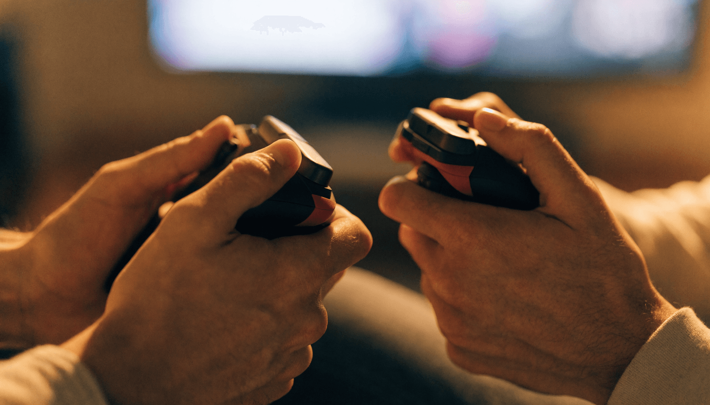

📌 3줄 요약
스위치 2인 게임은 크게 ①조이콘 하나씩 나눠 바로 하는 게임, ②힘을 합치는 협동(코옵), ③둘이 겨루는 대전·파티로 나뉩니다.

같은 방에서 즐기는 로컬 2인은 닌텐도 온라인 구독이 필요 없고, 떨어져 즐기는 온라인 2인만 구독이 필요합니다.

오버쿡드·마리오 카트·스니퍼클립스는 컨트롤러 추가 구매 없이 기본 조이콘만으로 바로 둘이 할 수 있습니다.

"스위치 한 대로 둘이 같이 놀 수 있나요?"라는 질문을 정말 자주 받습니다. 결론부터 말하면요, 스위치 2인 게임은 대부분 **추가 컨트롤러 없이** 기본에 딸려 오는 조이콘 두 개를 한 개씩 나눠 쥐는 것만으로 바로 시작할 수 있습니다. 처음엔 저도 컨트롤러를 더 사야 하는 줄 알았거든요. 이 글에서는 직접 찾아본 정보를 바탕으로 닌텐도 스위치 2인용 게임을 목적별로 12종 추천하고, 조이콘 하나로 되는지·온라인 구독이 필요한지·연인이나 가족 중 누구와 하기 좋은지까지 한 번에 정리했습니다.

## 스위치 2인 게임, 고르기 전 알아야 할 3가지

여기서 많이들 헷갈리는데, 게임을 고르기 전에 세 가지만 짚고 넘어가면 헛돈 쓰는 일을 막을 수 있습니다.

**첫째, 조이콘 하나씩으로 되는 게임인지 확인합니다.** 스위치 본체에는 조이콘이 좌우 두 개 들어 있습니다. 마리오 카트나 오버쿡드처럼 단순한 조작의 게임은 이 조이콘을 가로로 눕혀 한 개씩 나눠 쥐면 곧바로 2인 플레이가 됩니다. 다만 버튼 수가 적어지므로, 조작이 복잡한 3D 게임은 프로 컨트롤러나 조이콘 한 쌍을 추가로 사야 할 수 있습니다.

**둘째, 로컬과 온라인을 구분합니다.** 같은 방에서 한 화면(또는 분할 화면)으로 즐기는 로컬 2인은 닌텐도 스위치 온라인 구독이 필요 없습니다. 반면 서로 다른 장소에서 인터넷으로 연결해 함께하는 온라인 2인은 유료 구독이 필요합니다. 둘이 한 집에서 즐길 생각이라면 구독 없이 충분합니다.

**셋째, 2인 전용인지 2인 지원인지 봅니다.** 잇 테이크 투처럼 처음부터 두 명을 전제로 설계된 게임이 있고, 마리오 파티처럼 1인도 되지만 둘 이상일 때 진가가 나오는 게임이 있습니다. 입문자라면 후자가 부담이 적습니다.

## 조이콘 하나씩 나눠 바로 즐기는 게임

정리해보니 컨트롤러를 더 사지 않고 지금 당장 둘이 할 수 있는 게임부터 보는 게 순서더라고요.

**오버쿡드! 올 유 캔 잇**(Overcooked! All You Can Eat)은 난장판이 된 주방에서 둘이 요리를 쳐내는 협동 게임입니다. 조이콘을 하나씩 나눠 쥐고 바로 시작할 수 있고, "사이 나빠지는 게임"이라는 별명처럼 손발이 안 맞으면 웃음이 터집니다. 최대 4인까지 늘어납니다.

**마리오 카트 8 디럭스**(Mario Kart 8 Deluxe)는 분할 화면으로 둘이 레이싱을 즐깁니다. 역시 조이콘 하나씩으로 충분하고, 코스와 캐릭터가 방대해 질리지 않습니다. 가족이나 게임을 잘 안 하는 상대와 해도 금방 빠져듭니다.

**스니퍼클립스**(Snipperclips)는 두 캐릭터가 서로의 몸을 잘라 모양을 맞추며 퍼즐을 푸는 게임입니다. 조이콘 한 개씩이면 되고, 순수하게 머리를 맞대는 재미가 커서 퍼즐을 좋아하는 둘에게 잘 맞습니다.

## 협동(코옵)으로 빛나는 2인 게임

힘을 합쳐 깨는 재미를 원한다면 코옵 전용에 가까운 게임이 좋습니다.

**잇 테이크 투**(It Takes Two)는 2인 전용으로 설계된 협동 액션입니다. 혼자서는 클리어 자체가 불가능하고 둘의 호흡이 핵심입니다. 프렌즈 패스 덕분에 한 명만 게임을 구매하면 친구는 무료로 초대받아 함께할 수 있다는 점이 큰 장점입니다.

**무빙 아웃 2**(Moving Out 2)는 가구를 옮기는 이삿짐 센터 협동 게임으로, 오버쿡드와 결이 비슷합니다. 둘이 소파나 냉장고를 같이 들고 좁은 문을 통과하는 과정에서 자연스럽게 협동이 강제됩니다.

**루이지 맨션 3**(Luigi's Mansion 3)는 유령이 가득한 호텔을 탐험하는 어드벤처입니다. 한 명은 루이지, 다른 한 명은 분신 구이지를 맡아 퍼즐을 풀고 유령을 잡습니다. 스토리를 따라가며 둘이 천천히 즐기기 좋습니다.

## 둘이 겨루는 대전·파티 게임

협동보다 경쟁이 취향이라면 대전·파티 쪽이 답입니다.

**슈퍼 스매시브라더스 얼티밋**(Super Smash Bros. Ultimate)은 닌텐도 캐릭터들이 총출동하는 대전 격투 게임입니다. 둘이 맞붙어 승부를 가리기에 최고이며, 캐릭터 수가 압도적으로 많아 오래 즐길 수 있습니다.

**마리오 파티 시리즈**(최신작 마리오 파티 잼버리)는 보드게임 위에서 미니게임으로 승부하는 대표적인 파티 게임입니다. 둘이서도 되지만 인원이 많을수록 분위기가 살아나, 친구들이 모였을 때 꺼내기 좋습니다.

**스위치 스포츠**(Nintendo Switch Sports)는 조이콘을 휘둘러 테니스·볼링·배드민턴 등을 즐기는 모션 게임입니다. 몸을 움직이는 재미가 있어 게임에 익숙하지 않은 가족과도 부담 없이 할 수 있습니다.

## 깊이 있게 즐기는 2인 RPG·액션

게임을 좀 해본 둘이라면 깊이 있는 작품이 만족도가 높습니다.

**디아블로 III: 이터널 컬렉션**(Diablo III)은 스위치에서 둘이 즐길 수 있는 액션 RPG 중 완성도가 손꼽힙니다. 같은 화면에서 몬스터를 쓸어 담고 장비를 파밍하는 손맛이 깊어, 한 작품을 길게 파고들고 싶은 둘에게 잘 맞습니다.

**마인크래프트 던전스**(Minecraft Dungeons)는 마인크래프트 세계관의 던전 탐험 코옵입니다. 조작이 직관적이라 액션 RPG 입문자도 둘이 부담 없이 즐길 수 있습니다.

이런 협동 중심 게임을 더 찾고 있다면 [입문자에게 추천하는 협동 게임 완벽 가이드](/co-op-games-for-beginners/)에서 고르는 기준과 추가 추천작을 함께 확인해 보세요.

## 목적별 추천 — 연인·가족·친구

같은 2인 게임이라도 누구와 하느냐에 따라 정답이 달라집니다.

- **연인과** — 잇 테이크 투, 스니퍼클립스. 대화하며 협동하는 게임이 사이를 돈독하게 합니다.
- **아이가 있는 가족과** — 마리오 카트 8 디럭스, 스위치 스포츠, 슈퍼 마리오 브라더스 원더. 조작이 쉽고 폭력성이 낮습니다.
- **친구들과 왁자지껄** — 마리오 파티, 슈퍼 스매시브라더스 얼티밋, 저스트댄스. 승부와 웃음이 함께 터집니다.
- **게임 좀 하는 둘** — 디아블로 III, 무빙 아웃 2. 난이도와 깊이가 있어 몰입됩니다.

## 한눈에 보는 스위치 2인 게임 비교표

매번 찾기 번거로워서 제가 핵심만 표로 묶어봤습니다. 조이콘 하나로 되는지, 최대 몇 명까지 늘어나는지 한눈에 보세요.

| 게임 | 유형 | 조이콘 1개씩 | 최대 인원 | 추천 대상 |
| --- | --- | --- | --- | --- |
| 오버쿡드! 올 유 캔 잇 | 협동 요리 | 가능 | 4인 | 친구·연인 |
| 마리오 카트 8 디럭스 | 레이싱 | 가능 | 4인 | 가족·누구나 |
| 스니퍼클립스 | 퍼즐 | 가능 | 4인 | 연인·퍼즐러 |
| 잇 테이크 투 | 2인 전용 협동 | 컨트롤러 권장 | 2인 | 연인 |
| 무빙 아웃 2 | 협동 액션 | 가능 | 4인 | 친구 |
| 루이지 맨션 3 | 협동 어드벤처 | 컨트롤러 권장 | 2인 | 연인·가족 |
| 슈퍼 스매시브라더스 얼티밋 | 대전 격투 | 게임패드 권장 | 8인 | 친구 |
| 디아블로 III | 액션 RPG | 컨트롤러 권장 | 4인 | 코어 게이머 |

(표의 "조이콘 1개씩"은 가로로 눕혀 쥐는 기본 구성 기준이며, 게임에 따라 조작이 제한될 수 있습니다.)

## 구매·세팅 전 체크 포인트

💡 컨트롤러 팁
조이콘 하나씩으로 시작해 보고, 버튼이 부족하다고 느껴지면 그때 프로 컨트롤러를 추가하면 됩니다. 처음부터 무리해서 살 필요는 없습니다.

로컬 2인(같은 방, 한 본체)은 추가 비용이 거의 들지 않습니다. 본체에 딸려 온 조이콘 두 개만 있으면 위에서 소개한 상당수 게임을 바로 즐길 수 있습니다. 디아블로나 스매시브라더스처럼 버튼을 많이 쓰는 게임만 프로 컨트롤러를 한 개 더 갖추면 쾌적합니다.

온라인으로 떨어져 있는 친구와 함께할 계획이라면 닌텐도 스위치 온라인 구독이 필요합니다. 어떤 게임이 함께 즐기기 좋은지 더 살펴보고 싶다면 [닌텐도 공식 — 함께 즐기는 소프트웨어](https://www.nintendo.com/kr/guide/software/together.html) 페이지에서 협동·대전 지원 게임을 직접 확인할 수 있습니다.

⚠️ 구매 전 확인
같은 게임이라도 로컬 2인만 지원하고 온라인 2인은 안 되는 경우, 혹은 그 반대인 경우가 있습니다. 구매 전 상점 페이지의 플레이 방식 표기를 꼭 확인하세요.

## 자주 묻는 질문 (FAQ)

**Q. 조이콘 하나로 둘이 게임할 수 있나요?** 네, 좌우 조이콘을 한 개씩 나눠 가로로 쥐면 추가 구매 없이 2인 플레이가 됩니다. 다만 버튼이 적어 복잡한 게임은 조작이 제한될 수 있습니다.

**Q. 스위치 2인 게임에 닌텐도 온라인 구독이 꼭 필요한가요?** 같은 방에서 즐기는 로컬 2인은 구독이 필요 없습니다. 서로 다른 장소에서 인터넷으로 연결하는 온라인 2인만 유료 구독이 필요합니다.

**Q. 연인끼리 하기 좋은 스위치 2인 게임은 뭔가요?** 둘의 호흡이 핵심인 잇 테이크 투와 스니퍼클립스를 추천합니다. 대화하며 협동하는 구조라 함께 몰입하기 좋습니다.

**Q. 게임을 잘 못하는 사람과 해도 괜찮은 게임이 있나요?** 마리오 카트 8 디럭스와 스위치 스포츠가 가장 무난합니다. 조작이 직관적이고 진입 장벽이 낮아 처음 잡는 사람도 금방 따라옵니다.

**Q. 추가 컨트롤러를 꼭 사야 하나요?** 오버쿡드·마리오 카트·스니퍼클립스 등은 기본 조이콘만으로 충분합니다. 디아블로·스매시브라더스처럼 버튼을 많이 쓰는 게임을 즐길 때만 프로 컨트롤러를 추가하면 됩니다.

---

**관련 키워드** — #스위치2인게임추천 #닌텐도스위치2인용 #스위치협동게임 #스위치커플게임 #오버쿡드 #잇테이크투 #마리오카트8디럭스 #스위치파티게임 #조이콘2인플레이 #스위치코옵게임 #스위치가족게임 #스니퍼클립스
