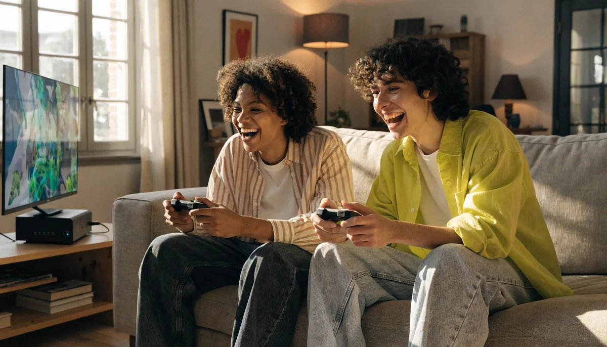

스위치 게임을 고를 때 2026년은 조금 특별합니다. 닌텐도 스위치 2가 나오면서 "지금 스위치 게임 추천"의 그림이 한 번 바뀌었거든요. 신형으로 갈아탈지, 기존 스위치를 더 쓸지, 그리고 그 위에서 무슨 게임을 할지가 다 얽혀 있습니다. 저도 처음엔 어디서부터 봐야 할지 한참 헤맸어요. 그래서 이 글에서는 2026년 기준 스위치 게임 추천을 입문 명작부터 신작·기대작, 장르별 추천, 그리고 스위치 2의 하위호환과 구매 팁까지 직접 찾아본 걸 한 번에 정리했습니다.

📌 3줄 요약
2026년은 <b>스위치 2 출시 이후</b>라, 기존 스위치 명작 대부분이 <b>하위호환</b>으로 신형에서도 돌아갑니다.

입문이라면 <b>젤다·마리오 카트·포켓몬</b>이 정석, 여럿이면 <b>파티·협동</b>, 깊게 파려면 <b>RPG</b>가 갈래입니다.

당장 신형이 급하지 않다면 기존 스위치 + 명작 세일 조합도 여전히 가성비가 좋습니다.

## 2026년, 스위치 게임을 고르기 전 알아야 할 것

가장 먼저 짚을 변화는 **닌텐도 스위치 2의 등장**입니다. 2025년에 출시되면서, 2026년의 "스위치 게임"은 기존 스위치(1세대)용과 스위치 2용이 함께 존재하는 상황이 됐어요. 다행히 둘은 완전히 단절돼 있지 않습니다.

핵심은 **하위호환**입니다. 사실 저도 하위호환이 전부 다 되는 줄 알았거든요. 그런데 직접 찾아보니 닌텐도는 기존 스위치의 패키지(카트리지)와 다운로드 타이틀 대부분이 스위치 2에서도 구동된다고 공식 안내하고 있어요. 그래서 지금 기존 스위치 명작을 사두어도 나중에 신형으로 갈아탈 때 대부분 그대로 즐길 수 있습니다. 다만 모션 IR 카메라나 링피트·라보처럼 특수 주변기기를 쓰는 일부 게임은 제약이 있으니, 그런 게임은 구매 전 호환 여부를 확인하는 게 안전합니다.

그래서 이 글의 추천은 "기존 스위치 명작(신형에서도 대체로 호환)"과 "스위치 2 신작"을 함께 다룹니다. 본인이 어느 기기를 쓰는지, 누구와 어떻게 즐길지에 따라 아래 갈래에서 골라보세요.

## 장르별 추천 한눈에 보기

바쁜 분들을 위해 결론부터 표로 정리했습니다. 아래에서 각 갈래를 자세히 풀어드릴게요.

| 목적·장르 | 기존 스위치 대표작 | 스위치 2 시대 픽 |
|---|---|---|
| 입문·오픈월드 | 젤다의 전설 브레스 오브 더 와일드 | 티어스 오브 더 킹덤 (신형 개선판) |
| RPG | 드래곤 퀘스트 XI S, 페르소나 5 로열 | 드래곤 퀘스트 VII 리이매진드, FF7 리메이크 |
| 레이싱·파티 | 마리오 카트, 마리오 파티 | 마리오 카트 월드, 마리오 테니스 피버 |
| 협동(코옵) | 오버쿡드, 잇 테이크 투 | 동키콩 바난자 (2인 협력 지원) |
| 포켓몬 | 스칼렛·바이올렛, 레전드 아르세우스 | 레전드 Z-A |
| 액션 | 슈퍼 마리오 오디세이 | 동키콩 바난자 |

## 입문자라면 — 실패 없는 머스트해브 명작

처음 스위치를 잡았다면, 평가와 판매량이 모두 검증된 명작부터 시작하는 게 가장 안전합니다. 이 게임들은 출시된 지 시간이 지나 세일 빈도도 높아 가성비도 좋아요.

**젤다의 전설 브레스 오브 더 와일드**는 메타크리틱 97점으로, "이 게임 하나만으로 스위치를 살 가치가 있다"는 말이 나올 만큼 오픈월드의 기준을 세운 작품입니다. 후속작 **티어스 오브 더 킹덤**까지 이어서 하면 수백 시간이 훌쩍 갑니다. **마리오 카트**는 핸들 어시스트 덕분에 게임을 잘 안 하던 사람도 금방 빠져들고, 가족·친구와 함께하기에 최고예요.

**포켓몬**은 입문 난이도가 낮은 편이라 첫 RPG로 좋습니다. 최신 세대인 스칼렛·바이올렛, 혹은 오픈월드형으로 접근하기 쉬운 레전드 아르세우스가 자주 추천됩니다. 셋 중 무엇을 먼저 잡아도 후회가 적은 조합입니다.

## RPG를 깊게 파고 싶다면

혼자 긴 호흡으로 몰입하고 싶다면 RPG 라인업이 스위치의 진짜 강점입니다. 정리해보니 한 작품에 수십~수백 시간을 쏟을 수 있어 가성비도 뛰어나더라고요.

JRPG 입문으로는 **드래곤 퀘스트 XI S**가 자주 1순위로 꼽힙니다. 감동적인 스토리와 방대한 분량으로 "일본 국민 RPG"의 진수를 보여줘요. 세련된 연출과 전투를 원하면 **페르소나 5 로열**, 전략적인 턴제와 캐릭터 육성을 좋아하면 **파이어 엠블렘 풍화설월** 같은 SRPG가 잘 맞습니다.

광활한 세계를 탐험하는 맛을 원하면 **제노블레이드 크로니클스** 시리즈나 **옥토패스 트래블러**도 좋습니다. RPG를 본격적으로 비교해 고르고 싶다면 [RPG 게임 추천 가이드](/rpg-game-recommendations/)에서 장르별 갈래를 먼저 잡아보는 걸 추천합니다.

## 여럿이 함께라면 — 파티·협동 게임

스위치의 가장 큰 매력 중 하나는 **컨트롤러(조이콘)를 나눠 쥐고 바로 둘이 할 수 있다**는 점입니다. 친구·가족·연인과 함께라면 파티·협동 게임을 빼놓을 수 없어요.

**마리오 카트**와 **마리오 파티**는 여럿이 모였을 때 분위기를 띄우는 정석입니다. 협동을 원하면 난장판 요리 게임 **오버쿡드**, 둘의 호흡이 전부인 **잇 테이크 투**가 대표적이에요. 잇 테이크 투는 한 명만 구매하면 친구를 무료로 초대할 수 있는 프렌즈 패스가 있어 부담도 적습니다.

같은 방에서 한 화면으로 즐기는 로컬 플레이는 닌텐도 온라인 구독 없이도 됩니다. 2인 플레이를 더 자세히 보고 싶다면 [스위치 2인 게임 추천](/switch-2player-games/)과 [스위치 협동(코옵) 게임](/switch-co-op-games/) 글에서 목적별로 정리해 두었으니 함께 참고하세요.

## 2026년 신작·기대작 — 스위치 2 라인업

스위치 2로 넘어오면서 신작·기대작도 쌓이고 있습니다. 출시 일정은 변동될 수 있으니, 정확한 발매일은 구매 전 닌텐도 공식 정보로 확인하는 게 좋습니다.

신형의 간판 런칭작으로는 오픈 구조로 확장된 **마리오 카트 월드**가 꼽힙니다. 여기에 슈퍼 마리오 오디세이 제작진이 만든 것으로 알려진 액션 **동키콩 바난자**, 포켓몬 신작 **레전드 Z-A** 등이 기대작으로 자주 언급돼요. 닌텐도 공식 라인업에는 드래곤 퀘스트 몬스터즈 신작, 제노블레이드 크로니클스 스위치 2 에디션 등 굵직한 타이틀도 줄지어 있습니다.

흥미로운 점은 **기존 명작이 스위치 2에서 더 좋아진다**는 것입니다. 슈퍼 마리오 오디세이는 신형에서 4K 업스케일과 60프레임 고정, 포켓몬 스칼렛·바이올렛은 프레임·시야 거리 개선 효과를 받는 사례가 보고됐어요. 다만 모든 게임이 패치되는 건 아니고 타이틀마다 개선 폭이 다르니, 이 부분은 기대보다 보수적으로 보는 게 맞습니다.

### 2026년 신작 발매 캘린더 (7월 기준)

올해 나온 게임과 나올 게임을 발매일 기준으로 제가 표로 묶어봤습니다. 2026년 상반기는 특히 서드파티 대작이 스위치 진영에 처음 합류한 게 큰 특징이에요.

| 타이틀 | 발매 시기 | 기종 | 비고 |
|---|---|---|---|
| 파이널 판타지 VII 리메이크 인터그레이드 | 2026년 1월 | 스위치 2 | 스위치 진영 첫 합류 |
| 동물의 숲: 뉴 호라이즌 스위치 2 에디션 | 2026년 1분기 | 스위치 2 | 기존판 업그레이드 |
| 드래곤 퀘스트 VII 리이매진드 | 2026년 2월 5일 | 스위치 2·스위치 | 풀 리메이크 |
| 마리오 테니스 피버 | 2026년 2월 12일 | 스위치 2 | 파티용으로도 좋음 |
| 포코피아 | 2026년 (예정) | 스위치 2 | 닌텐도 신규 IP |
| 요시와 신기한 도감 | 2026년 (예정) | 스위치 2 | 요시 신작 |
| 레이튼 교수와 증기의 신세계 | 2026년 (예정) | 스위치·스위치 2 | 시리즈 부활작 |
| 엘든 링 Tarnished Edition | 2026년 (예정) | 스위치 2 | 화제의 이식작 |

이미 출시된 상반기 타이틀 중에서는 **드래곤 퀘스트 VII 리이매진드**가 JRPG 팬 사이에서 반응이 좋고, **마리오 테니스 피버**는 여럿이 즐기기 좋은 스포츠 파티 게임으로 자리 잡았습니다. "(예정)"으로 표시한 타이틀은 일정이 변동될 수 있으니, 발매일은 구매 전 [닌텐도 공식 라인업](https://www.nintendo.com/kr/games/switch2/lineup)에서 한 번 더 확인하세요.

## 스위치 2 가격, 9월부터 오릅니다 — 구매 타이밍

2026년 구매 계획에서 가장 중요한 변수가 하나 생겼습니다. 한국닌텐도가 **스위치 2 본체 희망소비자가격을 2026년 9월 1일부터 64만 8,000원에서 75만 8,000원으로 인상**한다고 공식 발표했어요(약 17% 인상). 저도 신형 구매를 미루고 있다가 이 발표를 보고 계산이 완전히 달라졌습니다.

| 구분 | 2026년 8월까지 | 2026년 9월 1일부터 |
|---|---|---|
| 스위치 2 본체 정가 | 648,000원 | 758,000원 |
| 차액 | — | +110,000원 |

정리하면 이렇습니다. **스위치 2를 살 마음이 이미 있다면 8월 안에 사는 쪽이 11만 원 이득**입니다. 반대로 신작에 큰 관심이 없다면, 굳이 인상 소식에 쫓겨 살 필요는 없어요. 기존 스위치와 명작 세일 조합은 여전히 유효하니까요. 실제 판매가는 매장·프로모션에 따라 다를 수 있으니 구매 시점에 비교해 보세요.

## 스위치 vs 스위치 2 — 지금 뭘 사야 할까

기기를 새로 장만한다면 둘 중 무엇을 고를지가 고민입니다. 정답은 "지금 신작에 얼마나 끌리는가"에 달려 있어요.

| 구분 | 기존 스위치(1세대) | 스위치 2 |
|---|---|---|
| 가격 | 더 저렴, 중고·세일 풍부 | 정가 64만 8천 원 (9월부터 75만 8천 원) |
| 게임 풀 | 기존 명작 전부 | 신작 + 하위호환 명작 |
| 성능 | 충분하지만 일부 프레임 한계 | 해상도·프레임 향상 |
| 추천 대상 | 가성비·입문, 명작 위주 | 신작·고성능 원하는 유저 |

💡 이렇게 고르면 쉽습니다
마리오 카트 월드 같은 <b>신작이 당장 하고 싶다</b> → 스위치 2.

젤다·포켓몬 같은 <b>검증된 명작 위주로 가성비 있게</b> → 기존 스위치 + 세일. 나중에 신형으로 가도 대부분 하위호환됩니다.

## 게임 싸게 사는 법 — 구매 팁

스위치 게임은 정가가 6만 원 안팎으로 만만치 않지만, 시기를 잘 고르면 부담을 크게 줄일 수 있습니다. 잘 바뀌는 가격은 단정하기 어려우니 "세일 때 더 저렴해진다" 정도로 기억해 두세요.

닌텐도 e숍은 정기적으로 **할인 세일**을 진행합니다. 위시리스트에 담아두고 세일 알림을 받으면 명작을 정가의 절반 가까이에 잡을 수 있어요. 패키지(카트리지)는 다 한 뒤 중고로 되팔 수 있다는 장점이, 다운로드는 칩 교체 없이 편하다는 장점이 있습니다.

타이틀과 가격은 [닌텐도 공식 사이트](https://www.nintendo.com/kr/)에서 확인하는 게 가장 정확합니다. 신작은 출시 직후 잘 할인되지 않으니, 급하지 않다면 첫 세일 시즌까지 기다리는 것도 방법이에요.

## 자주 묻는 질문 (FAQ)

**Q. 2026년 스위치 입문, 어떤 게임부터 사야 하나요?** 젤다의 전설 브레스 오브 더 와일드, 마리오 카트, 포켓몬 최신작 중 하나로 시작하는 걸 추천합니다. 모두 평가가 검증됐고 난이도 접근성도 좋아 첫 게임으로 실패가 적습니다.

**Q. 기존 스위치 게임을 스위치 2에서도 할 수 있나요?** 대부분 가능합니다. 닌텐도가 패키지·다운로드 타이틀의 하위호환을 공식 지원하기 때문이에요. 다만 모션 IR 카메라나 링피트·라보 등 특수 주변기기 게임은 제약이 있으니 해당 게임은 미리 확인하세요.

**Q. 지금 기존 스위치를 사도 괜찮을까요?** 신작에 당장 큰 관심이 없다면 충분히 괜찮습니다. 기존 스위치는 더 저렴하고 명작 풀이 방대하며, 사둔 게임 대부분이 나중에 스위치 2에서도 하위호환으로 돌아갑니다.

**Q. 혼자 할 게임과 여럿이 할 게임 추천이 다른가요?** 네. 혼자라면 젤다·드래곤 퀘스트 같은 RPG가, 여럿이라면 마리오 카트·오버쿡드·잇 테이크 투 같은 파티·협동 게임이 잘 맞습니다. 목적부터 정하면 고르기가 쉬워집니다.

**Q. 스위치 2 가격이 오른다는데 언제까지 사야 하나요?** 한국닌텐도 공식 발표 기준으로 2026년 9월 1일부터 본체 정가가 64만 8,000원에서 75만 8,000원으로 인상됩니다. 신형 구매 계획이 있다면 8월 안에 사는 쪽이 11만 원가량 유리합니다.

**Q. 2026년 신작 중에 뭐부터 해보는 게 좋나요?** JRPG를 좋아하면 드래곤 퀘스트 VII 리이매진드, 여럿이 즐긴다면 마리오 테니스 피버가 무난한 출발입니다. 파이널 판타지 VII 리메이크처럼 스위치 진영에 처음 온 대작도 올해의 특징이에요.

## 마무리

자, 이거 하나만 기억하면 돼요. 2026년 스위치 게임 추천의 핵심은 "스위치 2 시대가 열렸지만, 기존 명작도 하위호환으로 여전히 살아 있다"는 점입니다. 그러니 기기에 너무 얽매이지 말고, 먼저 본인이 어떤 플레이를 원하는지부터 정하세요. 혼자 깊게 빠질 RPG인지, 친구와 웃고 떠들 파티 게임인지, 실패 없는 입문 명작인지. 갈래만 정하면 그에 맞는 게임은 자연스럽게 좁혀집니다. 더 구체적인 추천은 [스위치 2인 게임](/switch-2player-games/)과 [RPG 추천](/rpg-game-recommendations/) 글도 함께 보시고, 즐거운 게임 라이프 되시길 바랍니다. 🎮

---

**관련 키워드** — #스위치게임추천 #스위치게임추천2026 #닌텐도스위치 #스위치2 #스위치2게임추천 #스위치명작 #스위치RPG추천 #스위치파티게임 #포켓몬추천 #젤다의전설 #마리오카트 #스위치하위호환 #스위치입문게임
