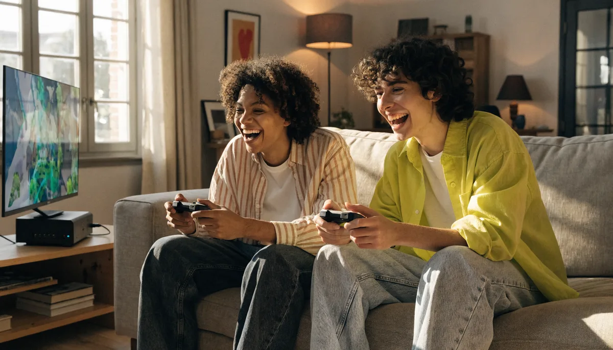

2026년 9월 기준 닌텐도 스위치 게임 추천은 두 가지가 달라졌습니다. 하나는 9월 1일부터 스위치 2 본체 정가가 75만 8,000원으로 오른 것, 다른 하나는 9월 9일 닌텐도 다이렉트로 연말 신작 일정이 한꺼번에 확정된 것이에요. 저도 6월에 이 글을 처음 쓸 때는 "8월 안에 사라"가 결론이었는데, 그 시점이 지나가서 다시 자료를 뒤져 전부 고쳤습니다. 입문 명작부터 10~12월 발매 캘린더, 장르별 추천, 스위치 2 하위호환과 인상 이후 구매 요령까지 한 번에 정리합니다.

📌 3줄 요약 (2026년 9월 15일 기준)
스위치 2 본체는 <b>9월 1일부터 75만 8,000원</b>이 됐고, 기존 스위치 3종도 5월 25일에 이미 올랐습니다(한국닌텐도 공식 발표 기준).

연말 대작은 <b>12월 3일 드래곤 퀘스트 몬스터즈 4·제노블레이드 3 스위치 2 에디션, 12월 4일 몬스터 헌터 와일즈</b>가 핵심입니다.

입문은 <b>젤다·마리오 카트·포켓몬</b>, 여럿이면 <b>파티·협동</b>, 혼자 깊게는 <b>RPG</b>로 갈래를 먼저 정하면 실패가 없습니다.

## 2026년 9월, 스위치 게임을 고르기 전 알아야 할 것

2026년 9월의 스위치 게임 추천은 기존 스위치(1세대)와 스위치 2를 함께 놓고 봐야 합니다. 스위치 2는 2025년에 출시됐고, 닌텐도 공식 안내 기준으로 기존 스위치의 패키지(카트리지)와 다운로드 타이틀 대부분이 스위치 2에서도 돌아갑니다. 그래서 지금 기존 스위치 명작을 사두어도 나중에 신형으로 갈아탈 때 대부분 그대로 즐길 수 있어요.

사실 저도 하위호환이 전부 다 되는 줄 알았거든요. 그런데 직접 찾아보니 모션 IR 카메라나 링피트·라보처럼 특수 주변기기를 쓰는 일부 게임은 제약이 있습니다. 그런 게임은 구매 전에 닌텐도 공식 호환 목록에서 한 번 확인하는 게 안전합니다.

그래서 이 글의 추천은 "기존 스위치 명작(신형에서도 대체로 호환)"과 "스위치 2 신작"을 함께 다룹니다. 본인이 어느 기기를 쓰는지, 누구와 어떻게 즐길지에 따라 아래 갈래에서 골라보세요.

## 장르별 추천 한눈에 보기

바쁜 분들을 위해 결론부터 표로 정리했습니다. 아래에서 각 갈래를 자세히 풀어드릴게요.

| 목적·장르 | 기존 스위치 대표작 | 스위치 2 시대 픽 |
|---|---|---|
| 입문·오픈월드 | 젤다의 전설 브레스 오브 더 와일드 | 티어스 오브 더 킹덤 (신형 개선판) |
| RPG | 드래곤 퀘스트 XI S, 페르소나 5 로열 | 드래곤 퀘스트 VII 리이매진드, 메타포: 리판타지오 (11월 12일) |
| 레이싱·파티 | 마리오 카트, 마리오 파티 | 마리오 카트 월드, 닌텐도 스위치 스포츠 리조트 (10월 22일) |
| 협동(코옵) | 오버쿡드, 잇 테이크 투 | 동키콩 바난자 (2인 협력 지원) |
| 포켓몬·몬스터 육성 | 스칼렛·바이올렛, 레전드 아르세우스 | 레전드 Z-A, 드래곤 퀘스트 몬스터즈 4 (12월 3일) |
| 액션·헌팅 | 슈퍼 마리오 오디세이 | 몬스터 헌터 와일즈 (12월 4일) |

## 입문자라면 어떤 게임부터 사야 하나요?

처음 스위치를 잡았다면 젤다의 전설 브레스 오브 더 와일드, 마리오 카트, 포켓몬 최신작 중 하나로 시작하는 게 가장 안전합니다. 세 작품 모두 평가와 판매량이 검증됐고, 출시된 지 시간이 지나 세일 빈도도 높아 가성비가 좋아요.

**젤다의 전설 브레스 오브 더 와일드**는 메타크리틱 기준 97점으로, "이 게임 하나만으로 스위치를 살 가치가 있다"는 말이 나올 만큼 오픈월드의 기준을 세운 작품입니다. 후속작 **티어스 오브 더 킹덤**까지 이어서 하면 수백 시간이 훌쩍 갑니다. **마리오 카트**는 핸들 어시스트 덕분에 게임을 잘 안 하던 사람도 금방 빠져들고, 가족·친구와 함께하기에 최고예요.

**포켓몬**은 입문 난이도가 낮은 편이라 첫 RPG로 좋습니다. 최신 세대인 스칼렛·바이올렛, 혹은 오픈월드형으로 접근하기 쉬운 레전드 아르세우스가 자주 추천됩니다. 셋 중 무엇을 먼저 잡아도 후회가 적은 조합입니다.

## RPG를 깊게 파고 싶다면

혼자 긴 호흡으로 몰입하고 싶다면 RPG 라인업이 스위치의 진짜 강점입니다. 정리해보니 한 작품에 수십~수백 시간을 쏟을 수 있어 가성비도 뛰어나더라고요.

JRPG 입문으로는 **드래곤 퀘스트 XI S**가 자주 1순위로 꼽힙니다. 감동적인 스토리와 방대한 분량으로 "일본 국민 RPG"의 진수를 보여줘요. 세련된 연출과 전투를 원하면 **페르소나 5 로열**, 전략적인 턴제와 캐릭터 육성을 좋아하면 **파이어 엠블렘 풍화설월** 같은 SRPG가 잘 맞습니다.

2026년 하반기에는 선택지가 더 늘어납니다. 닌텐도 공식 라인업 페이지 기준으로 아틀러스의 **메타포: 리판타지오**가 11월 12일, **제노블레이드 크로니클스 3 스위치 2 에디션**이 12월 3일에 나와요. RPG를 본격적으로 비교해 고르고 싶다면 [RPG 게임 추천 가이드](/rpg-game-recommendations/)에서 장르별 갈래를 먼저 잡아보는 걸 추천합니다.

## 여럿이 함께라면 — 파티·협동 게임

스위치의 가장 큰 매력 중 하나는 **컨트롤러(조이콘)를 나눠 쥐고 바로 둘이 할 수 있다**는 점입니다. 친구·가족·연인과 함께라면 파티·협동 게임을 빼놓을 수 없어요.

**마리오 카트**와 **마리오 파티**는 여럿이 모였을 때 분위기를 띄우는 정석입니다. 협동을 원하면 난장판 요리 게임 **오버쿡드**, 둘의 호흡이 전부인 **잇 테이크 투**가 대표적이에요. 잇 테이크 투는 한 명만 구매하면 친구를 무료로 초대할 수 있는 프렌즈 패스가 있어 부담도 적습니다. 10월 22일에 나오는 **닌텐도 스위치 스포츠 리조트**는 거실 파티용 신작으로 눈여겨볼 만합니다.

같은 방에서 한 화면으로 즐기는 로컬 플레이는 닌텐도 온라인 구독 없이도 됩니다. 2인 플레이를 더 자세히 보고 싶다면 [스위치 2인 게임 추천](/switch-2player-games/)과 [스위치 협동(코옵) 게임](/switch-co-op-games/) 글에서 목적별로 정리해 두었으니 함께 참고하세요.

## 2026년 10~12월 신작 캘린더 (9월 9일 닌텐도 다이렉트 기준)

2026년 연말 스위치 2 신작은 12월 첫째 주에 몰려 있습니다. 9월 9일 닌텐도 다이렉트에서 발표된 일정을 닌텐도 공식 라인업 페이지와 대조해 제가 표로 묶었어요. 발매일은 바뀔 수 있으니 구매 직전에 [닌텐도 공식 라인업](https://www.nintendo.com/kr/games/switch2/lineup)에서 한 번 더 확인하세요.

| 발매일 | 타이틀 | 기종 | 비고 |
|---|---|---|---|
| 10월 16일 | LEGO 해리포터 컬렉션 | 스위치 2 | 가족용 |
| 10월 16일 | 바이오하자드 RE:2 디럭스 에디션 | 스위치 2 | 다운로드판 먼저, 패키지는 2027년 1월 29일 |
| 10월 22일 | 닌텐도 스위치 스포츠 리조트 | 스위치 2 | 파티·거실용 |
| 10월 22일 | 파이널 판타지 레조넌스, 아랑전설 시티 오브 더 울브스, 원피스 그랜드 레스토랑 | 스위치 2 | 서드파티 3종 동시 |
| 10월 29일 | 헬로키티 파티 랜드, 아노말리스 | 스위치 2 | |
| 11월 5일 | 마블 가디언즈 오브 갤럭시 앙코르 에디션 | 스위치 2 | |
| 11월 6일 | 스텔라 블레이드 컴플리트 에디션 | 스위치 2 | 한국 개발작 |
| 11월 12일 | 메타포: 리판타지오, 피크민 4 스위치 2 에디션 | 스위치 2 | RPG·전략 |
| 12월 3일 | 드래곤 퀘스트 몬스터즈 4, 제노블레이드 크로니클스 3 스위치 2 에디션 | 스위치 2 | 연말 대작 |
| 12월 4일 | 몬스터 헌터 와일즈 | 스위치 2 | 캡콤 헌팅 액션 |
| 12월 10일 | 레이튼 교수와 증기의 신세계 | 스위치·스위치 2 | 시리즈 부활작 |

2027년 일정도 벌써 나와 있습니다. 1월 28일 메트로이드 신작(공식 표기 메트로이드 래버너스), 2월 25일 젤다무쌍 대재앙의 시대 DX, 4월 8일 파이널 판타지 VII 리메이크 시리즈 후속작, 5월 20일 페르소나 4 리바이벌 순이에요. 상반기에 이미 나온 **드래곤 퀘스트 VII 리이매진드**(2월 5일)와 **마리오 테니스 피버**(2월 12일)도 여전히 좋은 선택입니다.

흥미로운 점은 **기존 명작이 스위치 2에서 더 좋아진다**는 것입니다. 슈퍼 마리오 오디세이는 신형에서 4K 업스케일과 60프레임 고정, 포켓몬 스칼렛·바이올렛은 프레임·시야 거리 개선 효과를 받는 사례가 보고됐어요. 다만 모든 게임이 패치되는 건 아니고 타이틀마다 개선 폭이 다르니, 이 부분은 기대보다 보수적으로 보는 게 맞습니다.

## 스위치 2 가격은 얼마나 올랐나요? — 인상 이후 구매 요령

한국닌텐도 공식 발표 기준으로 스위치 2 본체 희망소비자가격은 2026년 9월 1일부터 64만 8,000원에서 75만 8,000원이 됐습니다. 11만 원, 비율로는 16.9% 인상이에요. 한국닌텐도는 이유를 "다양한 시장 환경의 변화에 따라 향후의 글로벌 사업성을 검토한 결과"라고 설명했습니다([ZDNet 코리아 보도](https://zdnet.co.kr/view/?no=20260629112251) 기준). 기존 스위치 3종도 그보다 앞선 5월 25일에 먼저 올랐습니다.

| 기종 | 인상 전 | 인상 후 | 적용일 |
|---|---|---|---|
| 스위치 2 | 648,000원 | 758,000원 | 2026년 9월 1일 |
| 스위치 OLED | 415,000원 | 465,000원 | 2026년 5월 25일 |
| 스위치 일반 | 360,000원 | 410,000원 | 2026년 5월 25일 |
| 스위치 라이트 | 249,800원 | 279,800원 | 2026년 5월 25일 |

저도 6월엔 "8월 안에 사면 11만 원 이득"이라고 썼는데, 그 기회는 지나갔습니다. 그러면 이제 어떻게 하느냐. 정리하면 이렇습니다. **연말 신작을 꼭 하고 싶다면 인상된 가격이라도 스위치 2**가 답이고(몬헌 와일즈·드퀘 몬스터즈 4가 그 기준), 명작 위주로 가성비를 원하면 **기존 스위치 중고나 세일 본체 + 명작 세일 조합**이 여전히 유효합니다. 실제 판매가는 매장·프로모션에 따라 다르니 구매 시점에 비교해 보세요.

## 스위치 vs 스위치 2 — 지금 뭘 사야 할까

기기를 새로 장만한다면 둘 중 무엇을 고를지가 고민입니다. 정답은 "지금 신작에 얼마나 끌리는가"에 달려 있어요.

| 구분 | 기존 스위치(1세대) | 스위치 2 |
|---|---|---|
| 정가 | OLED 46만 5,000원·일반 41만 원·라이트 27만 9,800원 | 75만 8,000원 (9월 1일부터) |
| 게임 풀 | 기존 명작 전부 | 신작 + 하위호환 명작 |
| 성능 | 충분하지만 일부 프레임 한계 | 해상도·프레임 향상 |
| 추천 대상 | 가성비·입문, 명작 위주 | 연말 신작·고성능 원하는 유저 |

💡 이렇게 고르면 쉽습니다
몬스터 헌터 와일즈·마리오 카트 월드 같은 <b>신작이 당장 하고 싶다</b> → 스위치 2.

젤다·포켓몬 같은 <b>검증된 명작 위주로 가성비 있게</b> → 기존 스위치 + 세일. 나중에 신형으로 가도 대부분 하위호환됩니다.

## 게임 싸게 사는 법 — 구매 팁

스위치 게임은 정가가 6만 원 안팎으로 만만치 않지만, 시기를 잘 고르면 부담을 크게 줄일 수 있습니다. 잘 바뀌는 가격은 단정하기 어려우니 "세일 때 더 저렴해진다" 정도로 기억해 두세요.

닌텐도 e숍은 정기적으로 **할인 세일**을 진행합니다. 위시리스트에 담아두고 세일 알림을 받으면 명작을 정가의 절반 가까이에 잡을 수 있어요. 패키지(카트리지)는 다 한 뒤 중고로 되팔 수 있다는 장점이, 다운로드는 칩 교체 없이 편하다는 장점이 있습니다.

타이틀과 가격은 [닌텐도 공식 사이트](https://www.nintendo.com/kr/)에서 확인하는 게 가장 정확합니다. 신작은 출시 직후 잘 할인되지 않으니, 급하지 않다면 첫 세일 시즌까지 기다리는 것도 방법이에요.

## 자주 묻는 질문 (FAQ)

**Q. 2026년 스위치 입문, 어떤 게임부터 사야 하나요?** 젤다의 전설 브레스 오브 더 와일드, 마리오 카트, 포켓몬 최신작 중 하나로 시작하는 걸 추천합니다. 모두 평가가 검증됐고 난이도 접근성도 좋아 첫 게임으로 실패가 적습니다.

**Q. 기존 스위치 게임을 스위치 2에서도 할 수 있나요?** 대부분 가능합니다. 닌텐도가 패키지·다운로드 타이틀의 하위호환을 공식 지원하기 때문이에요. 다만 모션 IR 카메라나 링피트·라보 등 특수 주변기기 게임은 제약이 있으니 해당 게임은 미리 확인하세요.

**Q. 스위치 2 가격이 올랐는데 지금 사도 괜찮을까요?** 한국닌텐도 공식 발표 기준으로 2026년 9월 1일부터 본체 정가가 75만 8,000원입니다. 연말 신작을 꼭 하고 싶다면 사도 되고, 명작 위주라면 기존 스위치 세일이나 중고 본체가 더 합리적입니다.

**Q. 2026년 연말 스위치 2 신작 중 뭐부터 해보는 게 좋나요?** 헌팅 액션이면 12월 4일 몬스터 헌터 와일즈, 몬스터 육성 RPG면 12월 3일 드래곤 퀘스트 몬스터즈 4, 여럿이 즐긴다면 10월 22일 닌텐도 스위치 스포츠 리조트가 무난한 출발입니다.

**Q. 혼자 할 게임과 여럿이 할 게임 추천이 다른가요?** 네. 혼자라면 젤다·드래곤 퀘스트 같은 RPG가, 여럿이라면 마리오 카트·오버쿡드·잇 테이크 투 같은 파티·협동 게임이 잘 맞습니다. 목적부터 정하면 고르기가 쉬워집니다.

**Q. 이 글의 발매일·가격은 언제 기준인가요?** 2026년 9월 15일 기준이며, 발매일은 9월 9일 닌텐도 다이렉트와 닌텐도 공식 라인업 페이지, 가격은 한국닌텐도 공식 발표를 대조했습니다. 일정은 바뀔 수 있으니 구매 직전 공식 페이지를 다시 확인하세요.

## 마무리

자, 이거 하나만 기억하면 돼요. 2026년 9월 스위치 게임 추천의 핵심은 "가격은 올랐지만 연말 라인업이 그만큼 두꺼워졌다"는 점입니다. 기기에 너무 얽매이지 말고, 먼저 본인이 어떤 플레이를 원하는지부터 정하세요. 혼자 깊게 빠질 RPG인지, 친구와 웃고 떠들 파티 게임인지, 실패 없는 입문 명작인지. 갈래만 정하면 그에 맞는 게임은 자연스럽게 좁혀집니다. 더 구체적인 추천은 [스위치 2인 게임](/switch-2player-games/)과 [RPG 추천](/rpg-game-recommendations/) 글도 함께 보시고, 즐거운 게임 라이프 되시길 바랍니다. 🎮

<!-- hub:switch start -->

🎮 닌텐도 스위치 가이드 모음<ul><li><a href="/switch2-game-recommendations/">스위치 2 게임 추천 — 독점작·에디션</a></li><li><a href="/switch-rpg-game-recommendations/">스위치 RPG 게임 추천 12선</a></li><li><a href="/switch-2player-games/">스위치 2인 게임 추천 12선</a></li><li><a href="/switch-co-op-games/">스위치 협동(코옵) 게임 추천 12선</a></li><li><a href="/console-game-recommendations/">콘솔 게임 추천 2026 — PS5·스위치 2·엑스박스</a></li></ul>

<!-- hub:switch end -->

---

**관련 키워드** — #스위치게임추천 #스위치게임추천2026 #닌텐도스위치 #스위치2 #스위치2게임추천 #스위치2가격인상 #스위치명작 #스위치RPG추천 #스위치파티게임 #몬스터헌터와일즈 #드래곤퀘스트몬스터즈4 #스위치하위호환 #스위치입문게임
