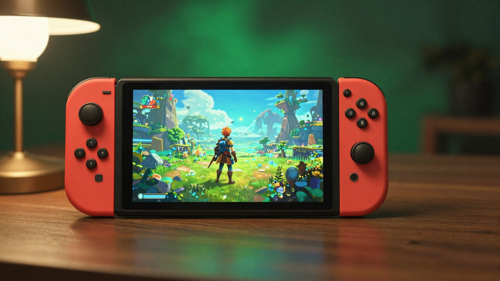

결론부터 말하면요, 닌텐도 스위치 RPG 게임 추천은 "명작 나열"보다 **한글 지원·난이도·플레이타임** 세 가지를 같이 봐야 실패가 없습니다. 저도 스위치로 RPG를 고를 때 추천 목록은 많은데 정작 한글이 되는지, 얼마나 오래 붙잡아야 하는지가 안 적혀 있어서 한참 헤맸어요. 그래서 이 글은 게임 12종을 취향별로 추리고, 추천글이 자주 빼먹는 정보를 게임마다 표로 분명히 적었습니다.

📌 3줄 요약
입문이라면 한글을 지원하고 난이도가 낮은 젤다·포켓몬·룬 팩토리부터, 서사에 빠지고 싶으면 제노블레이드·페르소나5·드퀘11S가 무난합니다.

스위치 RPG는 한글화 여부가 작품마다 갈리니, 구매 전 공식 스토어의 지원 언어를 꼭 확인하세요.

스위치 2를 쓴다면 아래 게임 대부분이 하위호환으로 그대로 돌아가고, 일부는 향상판(스위치 2 에디션)도 있습니다.

## 스위치 RPG 고를 때 뭘 먼저 봐야 하나요?

**장르 취향 → 한글 지원 → 플레이타임 → 난이도** 순으로 좁히면 됩니다. 이 네 가지만 정하면 12종 중 내게 맞는 두세 개가 자연스럽게 남습니다.

첫째, 어떤 재미를 원하는지 정합니다. 넓은 세계를 탐험하고 싶으면 오픈월드, 캐릭터와 긴 이야기에 정 붙이고 싶으면 JRPG, 짧게 여러 번 즐기고 싶으면 생활형·로그라이크 쪽이 맞습니다. 장르 자체가 헷갈린다면 [게임 장르 완벽 가이드](/game-genre-guide/)를 먼저 보고 오면 정리가 됩니다.

둘째, 한글 지원 여부를 챙깁니다. RPG는 대사와 스토리가 재미의 절반이라, 자막 한글화가 되느냐가 몰입을 크게 좌우해요. 여기서 많이들 헷갈리는데, 같은 시리즈라도 편에 따라 한글이 되고 안 되고가 갈립니다. 옥토패스 트래블러는 1편이 나중에 한글 패치로 풀렸고 2편은 처음부터 한글이었던 게 대표적인 예입니다.

셋째와 넷째로 플레이타임과 난이도를 봅니다. 제노블레이드나 드퀘11S는 메인만 50시간을 훌쩍 넘겨서, 시간이 빠듯하면 20시간 안팎으로 끊어가는 작품이 낫습니다. 아래에서 게임별로 이 값들을 표에 정리해 두었으니 참고하세요.

## 입문용 — 처음 스위치 RPG를 잡는다면

**RPG가 처음이라면 한글이 되고 난이도가 낮은 젤다·포켓몬·룬 팩토리 5부터 시작하세요.** 진입장벽이 낮아 손에서 놓기 어렵습니다.

**젤다의 전설 브레스 오브 더 와일드**(Breath of the Wild)는 오픈월드 액션 어드벤처의 기준을 새로 쓴 작품입니다. 정해진 순서 없이 어디든 먼저 가도 되는 자유도가 핵심이라, 복잡한 시스템을 몰라도 일단 돌아다니는 것만으로 재밌어요. 한글 자막을 지원해 스토리 이해에도 문제가 없습니다.

**포켓몬스터 스칼렛·바이올렛**은 시리즈 최초의 완전 오픈월드 포켓몬입니다. 세 갈래 스토리를 원하는 순서로 진행할 수 있고, 한글화가 잘 되어 있어 어린 플레이어와 함께 즐기기에도 좋습니다. 처음 RPG 잡으면 전투 시스템에서 다들 막히는데, 포켓몬은 상성만 익히면 되니 부담이 적습니다.

**룬 팩토리 5**는 농사·생활과 던전 탐험을 오가는 생활형 RPG입니다. 전투가 서툴러도 밭 갈고 마을 사람과 친해지는 것만으로 진도가 나가서, 느긋하게 즐기고 싶은 사람에게 잘 맞습니다. 한글 자막을 지원합니다.

## 서사 몰입형 — 이야기에 푹 빠지고 싶다면

**긴 호흡의 스토리와 캐릭터에 정을 붙이고 싶다면 제노블레이드·페르소나5·드퀘11S가 정석입니다.** 셋 다 한글을 지원하고 분량이 넉넉합니다.

**제노블레이드 크로니클스 3**(Xenoblade Chronicles 3)는 광활한 세계와 묵직한 서사가 강점인 JRPG입니다. 두 진영의 병사들이 얽히는 이야기가 깊고, 실시간 전투에 전략성이 있어 파고들 맛이 큽니다. 한글 자막을 지원하며, 시리즈가 처음이라도 3편만 단독으로 즐길 수 있습니다.

**페르소나 5 로열**(Persona 5 Royal)은 학생들의 일상과 던전 탐험을 오가는 스타일리시한 JRPG입니다. 세련된 연출과 캐릭터, 턴제 전투의 전략성이 두꺼운 팬층을 만든 작품이에요. 한글 자막을 지원하고, 하루하루 시간을 배분하는 재미가 커서 긴 분량이 지루하지 않습니다.

**드래곤 퀘스트 11 S**(Dragon Quest XI S)는 정통 JRPG의 교과서 같은 작품입니다. 넘버링 시리즈 중 한국어를 지원한 대표작으로, 왕도적인 스토리와 클래식한 턴제 전투가 편안하게 다가옵니다. S 버전은 원작에 추가 스토리와 편의 기능을 더해 스위치에서 즐기기 딱 좋습니다.

**젤다의 전설 티어스 오브 더 킹덤**(Tears of the Kingdom)은 브레스 오브 더 와일드의 후속작으로, 물건을 조합해 탈것·장치를 만드는 자유도가 크게 확장된 작품입니다. 전작을 재밌게 했다면 자연스러운 다음 순서이고, 한글 자막을 지원해 방대한 이야기를 따라가기에도 무리가 없습니다. 창의력을 발휘하는 재미가 커서 오래 붙잡게 됩니다.

**옥토패스 트래블러 2**(Octopath Traveler II)는 여덟 주인공의 이야기가 교차하는 HD-2D JRPG입니다. 도트와 3D를 섞은 독특한 비주얼과 탄탄한 턴제 전투가 강점이에요. 1편은 출시 뒤 한글 패치로 풀렸지만 2편은 처음부터 한국어를 지원해, 여덟 갈래 서사를 자막으로 온전히 즐길 수 있습니다.

## 전략·SRPG — 머리 쓰는 재미를 원한다면

**한 수 한 수 고민하는 전투를 좋아한다면 파이어 엠블렘 풍화설월과 진·여신전생 5가 답입니다.** 둘 다 한글을 지원합니다.

**파이어 엠블렘 풍화설월**(Three Houses)은 사관학교 교사가 되어 학생들을 육성하는 시뮬레이션 RPG입니다. 세 학급 중 어디를 선택하느냐에 따라 이야기가 완전히 갈려서, 회차를 거듭할 이유가 분명합니다. 캐릭터 육성과 인간관계 시뮬레이션이 촘촘해 전략 팬에게 만족도가 높습니다.

**진·여신전생 5**(Shin Megami Tensei V)는 악마를 교섭해 동료로 삼는 독특한 JRPG입니다. 난이도가 높은 편이라 초보에겐 부담일 수 있지만, 약점 공략과 파티 구성을 파고드는 재미가 진합니다. 한글 자막을 지원하며, 도전적인 전투를 원하는 사람에게 권합니다.

**파이어 엠블렘 인게이지**(Fire Emblem Engage)는 풍화설월과 같은 시리즈지만 결이 다릅니다. 육성 시뮬레이션 요소는 덜고 역대 주인공을 소환해 함께 싸우는 클래식한 전략 전투에 집중한 작품이에요. 한글 자막을 지원하며, 인간관계 시뮬레이션보다 순수 전술 대결을 원하는 사람에게 더 잘 맞습니다.

**몬스터 헌터 스토리즈 2**는 몬헌 세계관을 턴제 RPG로 풀어낸 작품입니다. 액션이 부담스러워 본편 몬스터 헌터를 못 즐긴 사람도, 이 작품은 턴제라 편하게 몬스터를 모으고 키울 수 있습니다. 한글화가 되어 있어 진입이 수월합니다.

## 스위치 RPG 한눈에 비교표

이 글의 핵심입니다. 추천글이 잘 안 적어주는 한글 지원·대략적 플레이타임·난이도를 게임별로 묶어봤습니다. 플레이타임은 메인 스토리 기준의 대략치이고, 사람마다 편차가 큽니다.

| 게임 | 유형 | 한글 지원 | 대략 플레이타임 | 난이도 |
| --- | --- | --- | --- | --- |
| 젤다 브레스 오브 더 와일드 | 오픈월드 | O(자막) | 40~50시간+ | 중 |
| 젤다 티어스 오브 더 킹덤 | 오픈월드 | O(자막) | 50시간+ | 중 |
| 포켓몬 스칼렛·바이올렛 | 오픈월드 | O | 30시간 안팎 | 하 |
| 룬 팩토리 5 | 생활형 | O | 40시간+ | 하 |
| 제노블레이드 크로니클스 3 | JRPG | O(자막) | 50시간+ | 중 |
| 페르소나 5 로열 | JRPG | O(자막) | 80시간+ | 중 |
| 드래곤 퀘스트 11 S | JRPG | O | 50시간+ | 중하 |
| 파이어 엠블렘 풍화설월 | SRPG | O | 회차당 40시간+ | 중 |
| 파이어 엠블렘 인게이지 | SRPG | O(자막) | 40시간+ | 중 |
| 진·여신전생 5 | JRPG | O(자막) | 50시간+ | 상 |
| 몬스터 헌터 스토리즈 2 | 턴제 | O | 30시간+ | 중하 |
| 옥토패스 트래블러 2 | JRPG | O | 50시간+ | 중 |

💡 한글 지원 확인 팁
같은 시리즈라도 편·버전에 따라 한글 지원이 갈립니다. 구매 전 닌텐도 공식 스토어의 각 게임 페이지에서 지원 언어에 한국어가 있는지 꼭 확인하세요.

패키지(칩)를 살 때도 "한글판" 표기와 지원 언어를 함께 보는 게 안전합니다.

## 스위치 2에서도 이 게임들이 돌아가나요?

**대부분 그대로 돌아갑니다.** 스위치 2는 하위호환을 지원해 기존 스위치 게임을 플레이할 수 있고, 일부 인기작은 그래픽 등을 개선한 향상판(스위치 2 에디션)으로도 나옵니다.

여기서 저도 처음엔 하위호환이 전부 100% 되는 줄 알았는데, 실제로는 게임에 따라 호환 상태가 조금씩 다를 수 있습니다. 특정 주변기기나 기능을 쓰는 일부 타이틀은 예외가 있을 수 있으니, 완벽 구동 여부가 중요하다면 [Nintendo 공식](https://www.nintendo.com/) 안내의 호환성 정보를 확인하는 편이 안전합니다.

향상판이 있는 대표 사례로는 젤다 두 작품(브레스 오브 더 와일드·티어스 오브 더 킹덤)의 스위치 2 에디션이 있습니다. 기존에 본편을 가지고 있다면 업그레이드 패스로 향상된 버전을 즐길 수 있는 식이라, 스위치 2를 새로 산 사람에게는 반가운 선택지입니다.

## 예산·상황별 스위치 RPG 고르기

**가진 시간과 취향에 맞춰 고르면 후회가 적습니다.** 상황별로 정리하면 이렇습니다.

시간이 많지 않고 틈틈이 즐기고 싶다면, 세이브·중단이 편한 포켓몬이나 룬 팩토리 5처럼 한 판이 짧게 끊어지는 작품이 좋습니다. 반대로 한 작품을 오래 파고들고 싶다면 페르소나 5 로열이나 제노블레이드 3처럼 분량이 두꺼운 쪽이 본전을 뽑습니다.

여러 명이 함께라면 스위치의 강점을 살리는 것도 방법입니다. RPG는 대부분 싱글 중심이지만, 스위치에는 협동·파티 게임도 많으니 [스위치 협동 게임 추천](/switch-co-op-games/)을 참고해 RPG와 번갈아 즐기면 좋습니다. 신작 발매 일정과 장르별 명작을 더 넓게 보고 싶다면 [닌텐도 스위치 게임 추천 2026](/switch-game-recommendations-2026/)에 캘린더로 정리해 두었습니다.

마지막으로 가격은 시기에 따라 크게 달라집니다. 닌텐도 e숍은 정기적으로 세일을 하고, 패키지판은 시세가 오르내리니 "정가 기준"으로만 참고하고 구매 시점에 다시 확인하는 게 좋습니다.

## 자주 묻는 질문 (FAQ)

**Q. 스위치 RPG 입문작으로 뭐가 제일 좋나요?** 한글을 지원하고 난이도가 낮은 젤다 브레스 오브 더 와일드, 포켓몬 스칼렛·바이올렛, 룬 팩토리 5가 입문에 무난합니다. 복잡한 시스템 없이 돌아다니거나 상성만 익히면 되어서 처음에도 부담이 적습니다.

**Q. 스위치 RPG 중에 한글화 안 된 게임도 있나요?** 네, 작품과 버전에 따라 갈립니다. 이 글에 정리한 12종은 한국어 지원을 확인한 작품 위주이지만, 스위치 RPG 전체로 보면 한글 미지원 타이틀도 있습니다. 구매 전 공식 스토어의 지원 언어에 한국어가 있는지 확인하는 게 확실합니다.

**Q. 스위치 2를 사면 기존 스위치 RPG를 다시 사야 하나요?** 아닙니다. 스위치 2는 하위호환을 지원해 기존에 산 스위치 게임을 그대로 즐길 수 있습니다. 다만 일부 게임은 그래픽 등을 개선한 스위치 2 에디션 향상판이 별도로 있고, 이 경우 업그레이드 방식으로 이용할 수 있습니다.

**Q. 시간이 별로 없는데 짧게 즐길 스위치 RPG는 뭐가 있나요?** 한 판이 짧게 끊어지고 중단·재개가 편한 포켓몬이나 룬 팩토리 5가 틈새 시간에 좋습니다. 정통 JRPG는 대체로 50시간 이상이라, 여유가 없다면 세이브가 잦고 부담 적은 작품부터 시작하는 걸 권합니다.

이거 하나만 기억하면 돼요. 스위치 RPG는 **한글 지원·플레이타임·난이도**를 먼저 보고 취향에 맞추는 것. 이 세 가지만 챙기면 명작 목록에서 헤매지 않고 내게 맞는 한 작품을 바로 고를 수 있습니다.

---

**관련 키워드** — #닌텐도스위치RPG #스위치RPG추천 #스위치게임추천 #스위치RPG한글 #제노블레이드3 #페르소나5로열 #드래곤퀘스트11S #파이어엠블렘풍화설월 #스위치입문RPG #스위치2하위호환 #룬팩토리5 #옥토패스트래블러2
