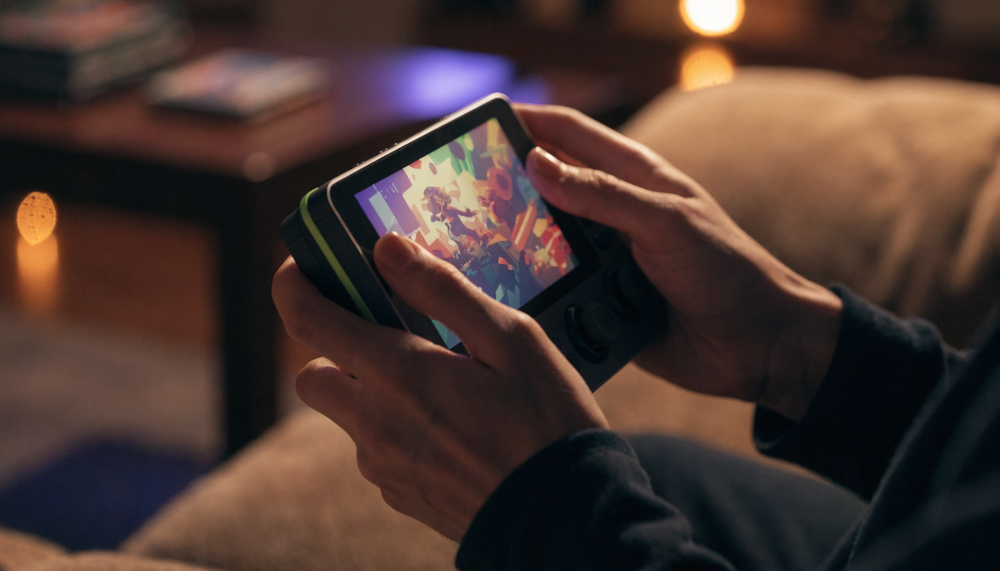

**닌텐도 스위치 2 게임 추천**을 검색하면 해외 기사 번역과 커뮤니티 한줄평이 뒤섞여 나오는데, 막상 본체를 산 사람이 궁금한 건 "그래서 처음에 뭘 사고, 갖고 있던 스위치 게임은 어떻게 되는가"죠. 저도 자료를 찾다가 독점작·에디션·하위호환 개념이 글마다 다르게 쓰여서 한참 헤맸어요. 결론부터 말하면요, 스위치 2 게임 구매는 **① 독점작 한두 개 → ② 갖고 있던 게임은 하위호환으로 → ③ 아끼는 명작만 스위치 2 에디션 업그레이드** 순서면 됩니다. 발매일과 개념은 전부 닌텐도 공식 자료로 검증했고, 2026년 하반기 기대작 캘린더까지 붙였습니다.

📌 3줄 요약
첫 게임은 <b>마리오 카트 월드</b>가 정석입니다. 본체와 함께 나온 대표작이자 공식 다운로드 랭킹 1위에 오른 국민 타이틀이에요.

갖고 있던 스위치 게임은 <b>1만 타이틀 이상이 하위호환</b>으로 돌아갑니다. 다만 완전 호환은 아니고, 링 피트처럼 <b>구형 조이콘이 필요한 게임 9종</b>이 있어요.

<b>스위치 2 에디션</b>은 기존 게임의 그래픽·프레임을 올려주는 유료 업그레이드입니다. 전부 살 필요 없고, 젤다처럼 다시 돌 명작만 고르면 됩니다.

## 스위치 2 게임, 뭐부터 사야 하나요?

**독점작부터 시작하는 게 정답입니다.** 스위치 2에서만 돌아가는 게임이 본체 성능을 온전히 보여주기 때문이에요. 여기서 많이들 헷갈리는데, 스위치 2용 게임은 세 종류로 나뉩니다. 스위치 2 전용(독점작), 기존 게임의 강화판(스위치 2 에디션), 그리고 기존 스위치 게임 그대로(하위호환). 이 세 개념만 잡으면 지갑 계획이 섭니다.

구매 순서는 이렇게 권합니다. 먼저 독점작에서 한두 개(취향 따라 레이싱·액션·FPS), 그다음 갖고 있던 게임은 하위호환으로 그냥 즐기고, 정말 아끼는 명작만 에디션 업그레이드를 고려하는 순서예요. 처음부터 에디션을 쓸어 담는 건 비용 대비 체감이 애매할 수 있습니다.

## 본체값 하는 독점작 — 뭐가 나와 있나요?

**2025년 6월 발매 이후 1년 사이에 간판 독점작이 줄줄이 쌓였습니다.** 제가 발매일을 공식 자료와 외신으로 교차 확인해 표로 묶어봤어요.

| 게임 | 발매 | 장르·포인트 |
| --- | --- | --- |
| 마리오 카트 월드 | 2025.6(런칭) | 오픈 구조로 진화한 국민 레이싱, 공식 랭킹 1위 |
| 동키콩 바난자 | 2025.7 | 지형 파괴 3D 액션, 해외 GOTY 후보로 거론된 화제작 |
| 커비 에어 라이더즈 | 2025.11 | 커비 레이싱 부활, 멀티플레이 강점 |
| 메트로이드 프라임 4 비욘드 | 2025.12.4 | 18년 만의 후속작, "시리즈의 정점" 평가(인벤 리뷰) |

이 밖에 젤다 무쌍 계열 신작 같은 독점 액션도 2025년 하반기에 합류해 있어요. 액션 쪽 취향이면 동키콩 바난자, FPS·탐험이면 메트로이드 프라임 4가 성능 체감이 크다는 평가가 많습니다. 특히 메트로이드는 스위치 2 에디션 기준 고해상도·HDR에 조이콘 2 마우스 조작까지 지원해서, 새 기기 기능을 가장 잘 보여주는 타이틀 중 하나예요.

## 스위치 2 에디션이 정확히 뭔가요?

**기존 스위치 게임에 그래픽·성능 강화를 얹은 유료 업그레이드판입니다.** 대표적으로 젤다의 전설 야생의 숨결·왕국의 눈물 두 편이 런칭 때부터 에디션으로 나왔고, 공식 다운로드 랭킹 상위권을 지켰어요. 원작을 갖고 있다면 업그레이드 패스만 구매해 에디션으로 올릴 수 있는 방식이라, 게임을 통째로 다시 살 필요는 없습니다.

에디션이 주는 건 게임마다 다르지만 대체로 해상도(독 모드 4K 대응 사례)·프레임·HDR 강화이고, 메트로이드 프라임 4처럼 퀄리티 모드/퍼포먼스 모드 선택이나 마우스 조작 같은 신기능이 붙기도 합니다. 반대로 에디션 없이도 스위치 2에서 그냥 좋아지는 경우가 있어요. 모여봐요 동물의 숲이 휴대 모드 1080p로 구동되는 것처럼 무료 개선을 받는 타이틀도 있으니, "에디션을 안 사면 손해"라고 단정할 필요는 없습니다.

💡 에디션 구매 기준 한 줄
<b>"이 게임을 처음부터 다시 돌 건가?"</b>에 예라고 답할 수 있는 명작만 업그레이드하세요. 젤다 2편을 안 해봤다면 에디션으로 입문하는 게 최고의 선택지가 됩니다.

## 하위호환 — 갖고 있던 게임은 어떻게 되나요?

**기존 스위치 소프트웨어를 포함해 1만 타이틀 이상을 그대로 플레이할 수 있습니다.** 패키지든 다운로드든 대응하고, 상당수 게임이 로딩 속도나 프레임 안정성 개선을 덤으로 받는다는 평가예요. 스위치 라이브러리를 쌓아온 사람일수록 스위치 2의 가치가 커지는 구조입니다.

다만 닌텐도 공식 안내대로 **완전 호환은 아닙니다.** 일부 타이틀은 하드웨어 차이로 문제가 있을 수 있고 검증·업데이트가 계속 진행 중이에요. 확실한 예외가 하나 있는데, 조이콘 2에는 모션 IR 카메라가 없어서 **구형 조이콘이 있어야 하는 게임이 9종** 있습니다. 링 피트 어드벤처, 1-2-스위치, 닌텐도 라보 시리즈 등이 여기 해당해요.

⚠️ 링 피트 하려면 구형 조이콘 챙기세요
스위치 2만 있고 구형 조이콘이 없으면 링 피트 어드벤처를 플레이할 수 없습니다. 기존 스위치를 중고로 처분할 계획이라면 <b>조이콘은 남겨두는 게</b> 안전합니다.

## 써드파티 대작 이식은 어느 수준인가요?

**"스위치에선 무리"였던 대작들이 실제로 돌아가는 게 스위치 2의 큰 변화입니다.** 공식 다운로드 랭킹에 사이버펑크 2077, 호그와트 레거시, 스트리트 파이터 6, 스플릿 픽션, 용과 같이 0, 문명 7 같은 타이틀이 나란히 올라 있어요. 랭킹은 실제 구매자들의 선택이라, 이식 수준이 "돌아만 가는" 정도가 아니라 살 만한 품질이라는 방증입니다.

협동 게임을 찾는다면 스플릿 픽션이 눈에 띕니다. 2인 전용 협동 어드벤처로 랭킹 상위에 오른 화제작이거든요. 둘이서 즐길 게임을 더 찾는다면 [스위치 2인 게임 추천 글](/switch-2player-games/)과 이어서 보시면 좋습니다.

## 2026년 하반기엔 뭐가 나오나요?

**하반기 캘린더가 꽉 차 있습니다.** 한국닌텐도 공식 라인업 페이지 기준으로 날짜가 확정된 주요 타이틀만 추리면 이렇습니다.

| 발매일 | 타이틀 |
| --- | --- |
| 7.23 | 스플래툰 레이더스 |
| 7.30 | 제노블레이드 크로니클스 2 — 스위치 2 에디션(DL) |
| 9.17 | 파이어 엠블렘 만자천홍 |
| 9.24 | 드래곤 퀘스트 XI S |
| 10.9 | 드래곤즈 도그마 2: 다크 어리즌 |
| 10.22 | Nintendo Switch Sports Resort / FINAL FANTASY RESONANCE |
| 11.12 | 메타포: 리판타지오 |
| 12.3 | 제노블레이드 크로니클스 3 — 스위치 2 에디션 / 드래곤 퀘스트 몬스터즈 4 |

상반기에도 바이오하자드 레퀴엠(2월), 파이널 판타지 7 리버스(6월) 같은 대작이 이미 합류했고, 캡콤 신작 프래그마타 같은 기대작도 라인업에 올라 있습니다. 발매일은 변동될 수 있으니 구매 직전엔 [한국닌텐도 공식 라인업](https://www.nintendo.com/kr/games/switch2/lineup)에서 확인하는 게 정확해요.

## 아직 스위치 2를 안 샀다면

**본체 구매 판단과 스위치 1 명작 정리는 별도 글에 있습니다.** 이 글은 스위치 2를 이미 샀거나 사기로 정한 분들을 위한 게임 가이드고, "스위치 1이면 충분한가, 지금 2를 사야 하나"의 저울질과 기존 스위치 명작 목록은 [닌텐도 스위치 게임 추천 2026 글](/switch-game-recommendations-2026/)에서 다뤘어요. 두 글을 짝으로 보면 본체부터 소프트까지 정리가 끝납니다.

## 한눈에 정리 — 상황별 스위치 2 게임 추천

**내 상황 줄만 찾으면 됩니다.**

| 상황 | 추천 |
| --- | --- |
| 첫 게임 하나만 | 마리오 카트 월드 |
| 성능 체감 최우선 | 메트로이드 프라임 4 비욘드(에디션), 동키콩 바난자 |
| 가족·친구와 함께 | 마리오 카트 월드, 커비 에어 라이더즈, 스플릿 픽션 |
| 젤다를 안 해봤다 | 야생의 숨결·왕국의 눈물 스위치 2 에디션 |
| 대작 RPG·오픈월드 | 사이버펑크 2077, 호그와트 레거시, 하반기 제노·메타포 |
| 갖고 있던 게임 위주 | 하위호환으로 충분(구형 조이콘 필요 9종만 주의) |

이거 하나만 기억하면 돼요. **독점작으로 시작하고, 하위호환으로 버티고, 에디션은 다시 돌 명작에만.** 저도 개념 셋을 정리하고 나서야 뭘 안 사도 되는지가 보이더라고요. 이 순서면 스위치 2 초반 지갑 관리가 깔끔해집니다.

## 자주 묻는 질문 (FAQ)

**Q. 스위치 2에서 기존 스위치 게임이 되나요?** 됩니다. 기존 스위치 소프트웨어를 포함해 1만 타이틀 이상을 플레이할 수 있고, 패키지·다운로드 모두 대응합니다. 다만 완전 호환은 아니어서 일부 타이틀은 검증·업데이트가 진행 중이고, 구형 조이콘이 필요한 9종의 예외가 있습니다.

**Q. 링 피트 어드벤처는 스위치 2에서 되나요?** 구형 조이콘이 있어야 합니다. 조이콘 2에는 모션 IR 카메라가 없어서, 링 피트를 포함한 9개 게임은 기존 스위치의 조이콘을 연결해야 플레이할 수 있어요. 스위치 2만 단독 구매했다면 이 게임들은 즐길 수 없습니다.

**Q. 스위치 2 에디션은 꼭 사야 하나요?** 아닙니다. 에디션은 그래픽·프레임을 올린 유료 업그레이드일 뿐이고, 원작 보유자는 업그레이드 패스만 사면 됩니다. 에디션 없이도 하위호환으로 개선을 받는 게임(동물의 숲 휴대 모드 1080p 등)이 있으니, 처음부터 다시 플레이할 명작에만 투자하는 걸 권해요.

**Q. 스위치 2 첫 게임으로 뭐가 좋나요?** 마리오 카트 월드가 가장 안전한 선택입니다. 본체와 함께 나온 대표작이자 공식 다운로드 랭킹 1위였고, 혼자서도 여럿이서도 즐길 수 있어요. 액션 취향이면 동키콩 바난자, 탐험·FPS 취향이면 메트로이드 프라임 4가 대안입니다.

**Q. 2026년 스위치 2 기대작은 뭐가 있나요?** 공식 라인업 기준으로 스플래툰 레이더스(7월), 파이어 엠블렘 만자천홍(9월), 메타포: 리판타지오(11월), 제노블레이드 3 에디션과 드래곤 퀘스트 몬스터즈 4(12월) 등이 하반기에 예정돼 있습니다. 발매일은 변동될 수 있으니 공식 페이지 확인을 권해요.

---

**관련 키워드** — #닌텐도스위치2 #스위치2게임추천 #스위치2독점작 #스위치2에디션 #스위치2하위호환 #마리오카트월드 #동키콩바난자 #메트로이드프라임4 #스위치2신작 #업그레이드패스 #스위치2기대작 #링피트스위치2
